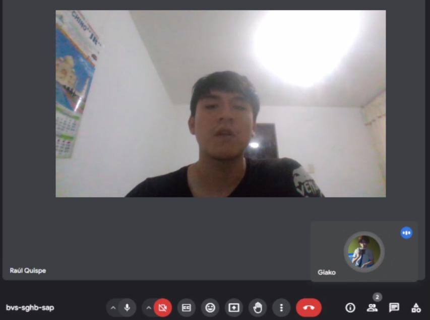
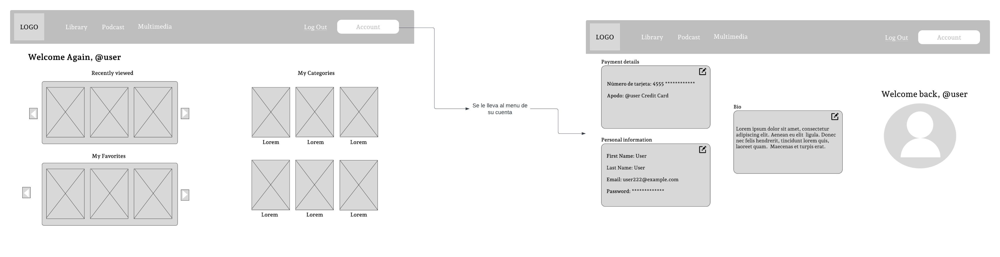
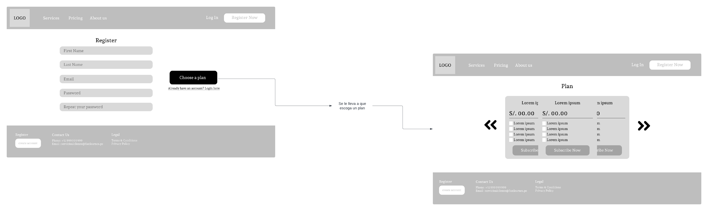
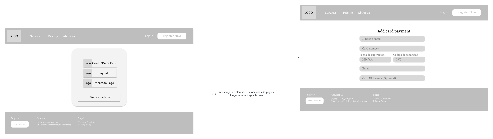
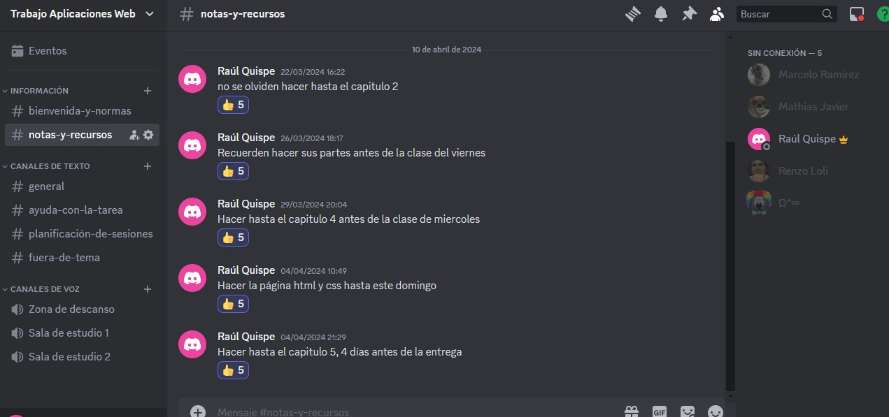
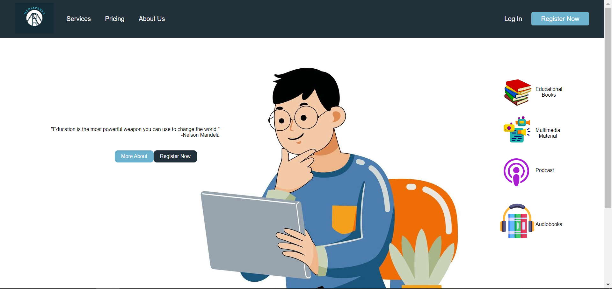
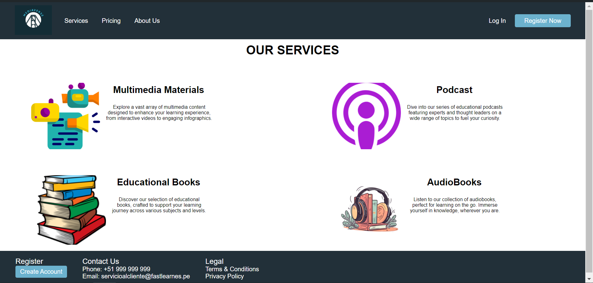
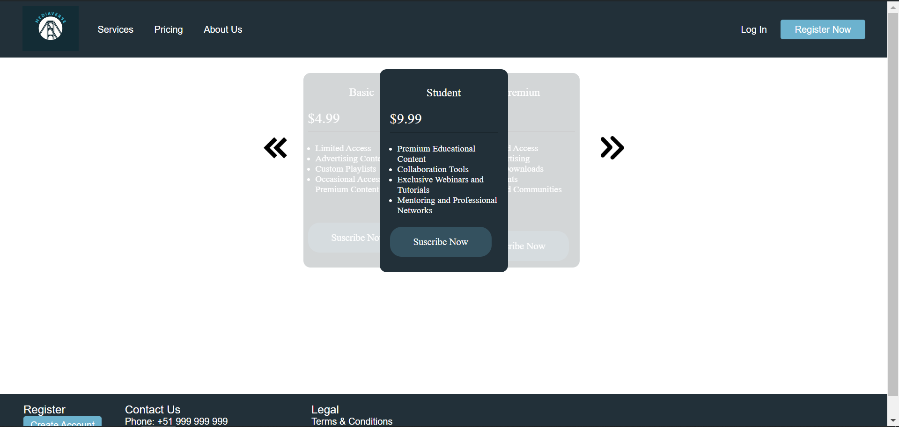
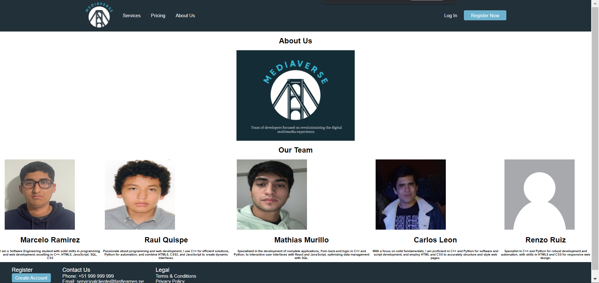
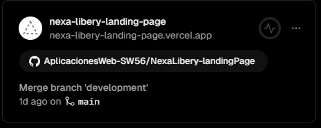

<p align="center">
    <strong>Universidad Peruana de Ciencias Aplicadas</strong><br>
    </img><br>
    <strong>INGENIERÍA DE SISTEMAS DE SOFTWARE</strong><br>
    <strong> SI730 - Aplicaciones Web SW56</strong><br>
    <strong>Profesor: Efrain Ricardo Bautista Ubillus </strong><br>
    <br>INFORME <br>
    "MediaVerse" | "NexaLibery"
</p>

### Integrantes:
- Loli Ruiz, Renzo Javier - U20161C993
- Quispe Erasmo, Raúl Ronaldo - U20211B682
- Ramirez Ramirez, Marcelo Sebastian - U202210582
- Javier Murillo, Mathias - U202022211
- Leon Rioja Carlos Andres - U202111451

---
# Registro de Versiones del Informe
| Version | Fecha | Autor | Descripcion de Modificacion |
| ----------- | ----------- | ----------- | ----------- |
| 0.0 | 24/03/2024 | Grupo 4 |Se crea el documento |
| 1.0 | 24/03/2024 | Grupo 4 | Se crean las ramas correspondientes |
| 1.1 | 24/03/2024 | Grupo 4 | Capitulo I |
| 1.1 | 24/03/2024 | Grupo 4 | Capitulo II |
| 1.1 | 24/03/2024 | Grupo 4 | Capitulo III |
| 1.1 | 29/03/2024 | Grupo 4 | Capitulo IV |
| 1.1 | 04/04/2024 | Grupo 4 | Landing Page |
| 1.1 | 04/04/2024 | Grupo 4 | Capitulo v |
# Project Report Collaboration Insights
[NexaLibery-Aplicaciones Web](https://github.com/AplicacionesWeb-SW56)

(Imagenes de los commits cada entrega)


# Student Outcome
| Criterio Específico                                          | Acciones Realizadas | Conclusiones          |
|--------------------------------------------------------------|---------------------|-----------------------|
| Participa en equipos multidisciplinarios con eficacia, eficiencia y objetividad, en el marco de un proyecto en soluciones de ingeniería de software.| Marcelo Ramirez:<br> *TB1:* Durante este proyecto, colaboré con compañeros de diferentes disciplinas. Mi contribución principal fue en el diseño de la arquitectura de software y la implementación de funcionalidades del lading page y primera version del proyecto<br> Raúl Quispe Erasmo:<br> *TB1:* Tras avanzar el proyecto con el equipo 4, colaboré los Lean UX, General Styles, la base de los códigos Html y CSS (Navbar y Footer), el primer Sprint y arreglando y analizando los errores del equipo.  | Su texto de conclusión |
| Conoce al menos un sector empresarial o dominio de aplicación de soluciones de software  | Marcelo Ramirez:<br> *TB1:* En mi quinto ciclo de Ingeniería de Software, desarrollé un sistema de una biblioteca virtual. Aunque recién estoy aprendiendo sobre aplicaciones web y .NET, utilizaremos C# y .NET Framework para este proyecto, aplicando mis conocimientos y enfrentándome a nuevos desafíos.<br> Raúl Quispe Erasmo:<br> *TB1:* En este ciclo de mi carrera, aprendí sobre las aplicaciones web y fortaleciendo el conocimiento sobre .NET, .NET Framework, Html y CSS para este proyecto | Su texto de conclusión |

# Capítulo I: Introducción
## 1.1. Startup Profile
### 1.1.1. Descripción de la Startup
#### NexaLibery
En NexaLibery, somos un equipo de desarrolladores enfocados en revolucionar la experiencia multimedia digital. Nuestra plataforma está diseñada para ofrecer una colección diversa de libros electrónicos, audiolibros, música y podcasts, enriqueciendo cada interacción con listas de reproducción a medida y recomendaciones basadas en tus intereses. Además, te brindamos el espacio para conectar y compartir en comunidades y grupos de discusión especializados. Con NexaLibery, explorar, descubrir y disfrutar de contenidos digitales nunca ha sido tan personalizado ni interactivo.

- **Misión:**
 Dar acceco a las personas que neseciten o quieran contenido multimedia esto incluye libros electrónicos, audiolibros, música, podcasts, etc.
- **Visión:**
 Diseñar una plataforma que da acceso a los usuarios a una gran biblioteca de contenido multimedia, ademas de la opcion de tener un perfil para personalizar el contenido que deseas y poder elegir los planes de membresia para poder desbloquear mas beneficios, contenido y funciones.
#### 1.1.2. Perfiles de integrantes del equipo
| Miembros del equipo | Código Estudiante | Carrera | Conocimientos / Habilidades |
|---------------------|-------------------|---------|-----------------------------|
| Loli Ruiz Renzo, Javier  | U20161C993 | Ingeniería de software | C++, Python, Javascript, C# |
| Ramirez Ramirez, Marcelo Sebastian  | U202210582 | Ingeniería de software | C++, HTML5, JavaScript, SQL,CSS |
| Quispe Erasmo, Raúl Ronaldo  | U20211B682 | Ingeniería de software | C++, python, HTML5, CSS3, JavaScript |
| Javier Murillo, Mathias  | U202022211 | Ingeniería de software | C++, SQL, React, Python, JavaScript |
| Leon Rioja, Carlos Andres  | U202111451 | Ingeniería de software | C++, Python, HTML, CSS |


## 1.2. Solution Profile
### 1.2.1 Antecedentes y problemática

- Las consecuencias de la pandemia del covid-19 son demasiadas y una de ellas es la nesecidad de tener informacion desde la comodidad del hogar y debido a la falta de dicha esta hemos planeado hacer una aplicacion que brinda toda la informacion que nesecites al alcance de tu mano donde sea y cuando sea. Nuestro equipo ha planeado diseñar una biblioteca que contanga mucho contenido de diferentes tipos y que este disponible cada vez que el usuario lo quiera, para asi contrarestar la nesecidad de informacion que trajo la crisis global que acaba de terminar (covid-19).

### 1.2.2 Lean UX Process.
#### 1.2.2.1. Lean UX Problem Statements.
##### Problem Statement:
Nuestra visión con NexaLibery, la plataforma de Biblioteca Digital de Contenidos Multimedia, es ofrecer a los usuarios una experiencia completa para acceder y disfrutar de una amplia variedad de contenido digital, que incluye libros electrónicos, audiolibros, música y podcasts. Sin embargo, nos enfrentamos a un desafío importante: los usuarios de la suscripción básica se encuentran limitados en la creación de listas de reproducción personalizadas, lo que dificulta su capacidad para organizar y acceder fácilmente al contenido multimedia. Esta restricción, junto con la falta de recomendaciones personalizadas basadas en el historial de consumo del usuario, limita la exploración de nuevo contenido relevante.
Estas limitaciones en la experiencia del usuario pueden conducir a la insatisfacción de los clientes en la suscripción básica. Además, la ausencia de interacción social, como la falta de comunidades o grupos de discusión, puede disminuir el compromiso del usuario con la plataforma y limitar su potencial de crecimiento.
Por lo tanto, nos enfrentamos a la pregunta de cómo podemos mejorar la experiencia del usuario en NexaLibrary, especialmente para los usuarios de la suscripción básica y los estudiantes, proporcionando opciones de personalización, promoviendo la interacción social y ofreciendo herramientas educativas y de investigación efectivas.
#### 1.2.2.2. Lean UX Assumptions.
|Business Assumptions|User Assumptions|
|-|-|
| 1. Creemos que los usuarios de NexaLibrary, especialmente aquellos que utilizan la suscripción básica, necesitan una forma más eficiente de descubrir y acceder al contenido multimedia relevante, como libros electrónicos, audiolibros, música y podcasts.| 1. ¿Quién es el usuario? Los usuarios son, en primera parte, aquellos que utilizan la suscripción básica de NexaLibrary, buscando acceder a una amplia variedad de contenido digital. Además, estudiantes que buscan apoyo en su aprendizaje e investigación podrían beneficiarse de características específicas.|
| 2. Estamos asumiendo que estas necesidades pueden satisfacerse mediante el desarrollo de características adicionales, como recomendaciones personalizadas basadas en el historial de consumo del usuario y una mayor capacidad de personalización en la creación de listas de reproducción.| 2. ¿Qué problemas tiene NexaLibrary? ¿Resolver? Un problema que enfrenta actualmente NexaLibrary es la dificultad para los usuarios de la suscripción básica de descubrir nuevo contenido y acceder a él de manera eficiente.|
| 3. Inicialmente, nuestros clientes principales serán los suscriptores de la suscripción básica de NexaLibrary, así como los estudiantes que buscan acceder a contenido educativo y de entretenimiento.| 3. ¿Qué características son importantes? Las características más importantes de NexaLibrary incluyen recomendaciones personalizadas, mayor capacidad de personalización en la creación de listas de reproducción y acceso a contenido educativo relevante para los estudiantes.|
| 4. Suponemos que el valor más importante que un cliente espera de nuestros servicios es la capacidad de descubrir nuevo contenido relevante de manera eficiente y personalizada, así como acceder a herramientas de estudio integradas para apoyar su aprendizaje e investigación. | 4. ¿Dónde encaja NexaLibrary en su trabajo o vida? NexaLibrary encaja en la vida de los usuarios al proporcionarles una plataforma centralizada para acceder y disfrutar de una amplia variedad de contenido digital, tanto para su entretenimiento como para su desarrollo académico.|
| 5. Asumimos que los clientes también valorarán la capacidad de participar en comunidades o grupos de discusión en la plataforma, lo que les permitirá conectarse con otros usuarios con intereses similares y compartir recomendaciones y opiniones sobre el contenido.| 5. ¿Cuándo y cómo es NexaLibrary? ¿Usado? NexaLibrary se utiliza cuando los usuarios buscan acceder a contenido digital, ya sea para su entretenimiento personal, estudio o investigación, en cualquier momento y lugar a través de dispositivos conectados a Internet.|
#### 1.2.2.3. Lean UX Hypothesis Statements.
- **Hypothesis Statement 01**:
Creemos que los usuarios de la suscripción básica estarán más dispuestos a actualizar a una suscripción premium si se les ofrece acceso exclusivo a lanzamientos anticipados de contenido multimedia y eventos en vivo. Sabremos que hemos tenido éxito cuando veamos un aumento del 20% en las conversiones de la suscripción básica a la suscripción premium en los primeros seis meses de implementación de esta característica.
- **Hypothesis Statement 02**:
Creemos que la integración de herramientas de estudio y la capacidad de formar grupos de estudio virtuales aumentará el compromiso de los usuarios de la suscripción para estudiantes con la plataforma.
Sabremos que hemos tenido éxito cuando veamos un aumento del 30% en el tiempo dedicado al estudio y la interacción en grupos de estudio dentro de la plataforma por parte de los usuarios de la suscripción para estudiantes en los primeros tres meses después de la implementación de estas características.
- **Hypothesis Statement 03**:
Creemos que la personalización de recomendaciones de contenido basadas en el historial de consumo del usuario aumentará la satisfacción y retención de los usuarios en la plataforma.
Sabremos que hemos tenido éxito cuando veamos una disminución del 15% en la tasa de abandono de la plataforma entre los usuarios de la suscripción básica después de implementar esta funcionalidad y realizar una encuesta de satisfacción del usuario seis meses después.
- **Hypothesis Statement 04**:
Creemos que la introducción de comunidades y grupos de discusión en la plataforma aumentará la interacción social entre los usuarios y promoverá un sentido de comunidad en torno a temas específicos.
Sabremos que hemos tenido éxito cuando veamos un aumento del 25% en la participación activa en grupos de discusión y una mayor retención de usuarios en la plataforma después de seis meses de implementar estas funciones.
#### 1.2.2.4. Lean UX Canvas.
El Lean UX Canvas es usado como un diseño para el usuario y de acuerdo a la medotología "Lean" sería para crear, desarrollar y generar elaboraciones de manera ordenada, eficiente y efectiva. Acá dejamos una visualización directa del Lean UX Canvas trabajad por el equipo con la herramienta Mural:
(imagen)
Si quieres ver más a detalle, acceder a [Canvas](https://app.mural.co/t/nexalibery5875/m/nexalibery5875/1711531230304/9cae9888df00da29e0a5dc996ce0e7484ff9da3d?sender=ud5867274f6e0f4e990f88500).
## 1.3. Segmentos objetivo.
Nos dimos cuenta que el estrés académico según Universidad de Chile (2023), es ocasionado por las pruebas, trabajos, exámenes, presentaciones, etc. Pueden ser subsanados por la música que según dice Campus Home (2020) puede ayudar a muchos estudiantes a superar el estrés y la ansiedad mientras estudian.
### 1.3.1. Stakeholders:
- **Stakelholder Internos**: Equipo de desarrollo y tecnología, equipo de contenido y curación, equipo de Marketing y ventas y equipo de soporte y atención al cliente.
- **Stakelholder Externos**: Usuarios Finales, sroveedores de contenido, socios comerciales, reguladores y autoridades.

### Capitulo II: Requirements Elicitation & Analysis

#### 2.1. Competidores

##### 2.1.1. Analisis Competitivo

</head>

<body dir="ltr">


<table border="0" cellspacing="0" cellpadding="0" class="table-ta1"><colgroup><col width="99"/><col width="99"/><col width="99"/><col width="200"/><col width="199"/><col width="196"/><col width="195"/></colgroup><tr class="row-ro1"><td colspan="6" style="text-align:left;width:2.258cm; " class="cell-ce1">
<p>Competitive Analysis Landscape</p>
</td><td style="text-align:left;width:4.456cm; " class="cell-Default"> </td></tr><tr class="row-ro2"><td colspan="2" rowspan="2" style="text-align:left;width:2.258cm; " class="cell-ce2">
<p>¿Por qué llevar a cabo este análisis?</p>
</td><td colspan="4" style="text-align:left;width:2.258cm; " class="cell-ce2">
<p>¿Como nuestros competidores impulsaron el rubro del multimedia dentro de sus productos/servicios? y ¿Como nos diferenciamos con ellos?</p>
</td><td style="text-align:left;width:4.456cm; " class="cell-Default"> </td></tr><tr class="row-ro2"><td colspan="4" style="text-align:left;width:2.258cm; " class="cell-ce2">
<p>Nos diferenciamos en cuanto a calidad, <span class="text-T1">personalización</span>, ofertas y crecimiento constante <span class="text-T1">según</span> las <span class="text-T1">estadísticas.</span> Nos enfocaremos principalmente en cada cliente.</p>
</td><td style="text-align:left;width:4.456cm; " class="cell-Default"> </td></tr><tr class="row-ro1"><td colspan="2" style="text-align:left;width:2.258cm; " class="cell-ce2">
<p>Competidores</p>
</td><td style="text-align:left;width:2.258cm; " class="cell-ce2">
<p>NexaLibery</p>
</td><td style="text-align:left;width:4.579cm; " class="cell-ce2">
<p>Amazon Kindle</p>
</td><td style="text-align:left;width:4.554cm; " class="cell-ce2">
<p>Google Play</p>
</td><td style="text-align:left;width:4.48cm; " class="cell-ce2">
<p>Spotify</p>
</td><td style="text-align:left;width:4.456cm; " class="cell-Default"> </td></tr><tr class="row-ro3"><td rowspan="2" style="text-align:left;width:2.258cm; " class="cell-ce2">
<p>Perfil</p>
</td><td style="text-align:left;width:2.258cm; " class="cell-ce2">
<p>Overview</p>
</td><td style="text-align:left;width:2.258cm; " class="cell-ce2">
<p>Plataforma de almacenamiento/<span class="text-T1">clasificación</span> de archivos multimedia</p>
</td><td style="text-align:left;width:4.579cm; " class="cell-ce2">
<p>Dispositivo/<span class="text-T1">aplicación</span> con un catalogo amplio de libros distribuido por amazon.</p>
</td><td style="text-align:left;width:4.554cm; " class="cell-ce2">
<p>Catalogo de aplicaciones, <span class="text-T1">música</span>, libros, podcasts etc con una vasta cantidad de variedad.</p>
</td><td style="text-align:left;width:4.48cm; " class="cell-ce2">
<p>Plataforma de <span class="text-T1">reproducción</span> de <span class="text-T1">música</span> por streaming. Dispone de otros servicios como los podcast y <span class="text-T1">membresías.</span></p>
</td><td style="text-align:left;width:4.456cm; " class="cell-Default"> </td></tr><tr class="row-ro4"><td style="text-align:left;width:2.258cm; " class="cell-ce2">
<p>Ventaja competitiva ¿Qué valor ofrece al cliente?</p>
</td><td style="text-align:left;width:2.258cm; " class="cell-ce2">
<p>Ofrecemos “<span class="text-T1">PERSONALIZACIÓN</span>” adecuada a  cada uno de nuestros clientes y <span class="text-T1">membresías</span> accesibles según tu frecuencia de uso. </p>
</td><td colspan="2" style="text-align:left;width:4.579cm; " class="cell-ce2">
<p>Disponibilidad 24/7 y una interfaz <span class="text-T1">dinámica</span> para la <span class="text-T1">búsqueda</span> y descarga de medios digitales. Vasta cantidad de <span class="text-T1">música</span>, libros, podcast de talla mundial.</p>
</td><td style="text-align:left;width:4.48cm; " class="cell-ce3">
<p>Amplia gama de canciones reconocidas mundialmente, disponibilidad 24/7 y modo offline. Ademas, de <span class="text-T1">personalización</span> y <span class="text-T1">compartimentar</span> de listas, y recomendaciones musicales personalizadas.</p>
</td><td style="text-align:left;width:4.456cm; " class="cell-Default"> </td></tr><tr class="row-ro5"><td rowspan="2" style="text-align:left;width:2.258cm; " class="cell-ce2">
<p>Perfil de marketing</p>
</td><td style="text-align:left;width:2.258cm; " class="cell-ce2">
<p>Mercado objetivo</p>
</td><td style="text-align:left;width:2.258cm; " class="cell-ce2">
<p><span class="text-T1">Jóvenes</span> y estudiantes entre 16 y 45 años</p>
</td><td style="text-align:left;width:4.579cm; " class="cell-ce2">
<p>Desde <span class="text-T1">jóvenes</span> de 18 años hasta adultos de 60 años.</p>
</td><td style="text-align:left;width:4.554cm; " class="cell-ce3">
<p>Desde niños de 7 años por las apps de juegos que abundan mucho hasta adultos de hasta 50 años por las apps de streaming/<span class="text-T1">música</span>/libros.</p>
</td><td style="text-align:left;width:4.48cm; " class="cell-ce3">
<p>Actualmente se <span class="text-T1">podría</span> decir que entre <span class="text-T1">jóvenes</span> y adultos entre 16 y 45 años . Esto depende mucho de las tendencias y gustos, las cuales, en estos años no han cambiado demasiado</p>
</td><td style="text-align:left;width:4.456cm; " class="cell-Default"> </td></tr><tr class="row-ro6"><td style="text-align:left;width:2.258cm; " class="cell-ce2">
<p>Estrategias de marketing</p>
</td><td style="text-align:left;width:2.258cm; " class="cell-ce2">
<p>Brindar un extenso catalogo, servicio freemium, disponibilidad total según <span class="text-T1">suscripción</span>, <span class="text-T1">personalización</span> de playlist y recomendación según tendencias</p>
</td><td style="text-align:left;width:4.579cm; " class="cell-ce2">
<p>Brindar un dispositivo y plataforma <span class="text-T1">económico</span>, duradero y de uso intuitivo con un catalogo atractivo preciso para sus clientes.</p>
</td><td style="text-align:left;width:4.554cm; " class="cell-ce2">
<p>* Seguridad a sus clientes por medio de sus filtros y <span class="text-T1">análisis</span> de virus.</p>

<p>* Amplia cantidad de temas a abordar: Juegos, Apps, Libros, Podcast</p>

<p>* Reconocimiento en la <span class="text-T1">mayoría</span> de dispositivos celulares (viene por defecto)</p>
</td><td style="text-align:left;width:4.48cm; " class="cell-ce2">
<p>Uso de “freemium” el cual brinda servicios <span class="text-T1">básicos</span> gratuitos hasta que se haga una <span class="text-T1">incorporación</span> de un servicio avanzado de pago con planes adaptables. Ademas, de <span class="text-T1">personalización</span> y trends para recomendaciones.</p>
</td><td style="text-align:left;width:4.456cm; " class="cell-Default"> </td></tr><tr class="row-ro7"><td rowspan="4" style="text-align:left;width:2.258cm; " class="cell-ce2">
<p>Perfil del producto</p>
</td><td style="text-align:left;width:2.258cm; " class="cell-ce2">
<p>Productos y servicios</p>
</td><td style="text-align:left;width:2.258cm; " class="cell-ce2">
<p>App web y mobile con un diseño interactivo y moderno, ademas de inclusivo</p>
</td><td style="text-align:left;width:4.579cm; " class="cell-ce2">
<p>App multiplataforma, Dispositivo de lectura, Catalogo de libros</p>
</td><td style="text-align:left;width:4.554cm; " class="cell-ce2">
<p>Catalogo de aplicaciones, <span class="text-T1">música</span>, libros, podcasts etc.</p>

<p>App compatible con android.</p>

<p>Cuenta para guardado de estados de juegos/apps/<span class="text-T1">música</span> etc</p>
</td><td style="text-align:left;width:4.48cm; " class="cell-ce2">
<p>Catalogo de canciones.</p>

<p>Playlist recomendadas y  compartibles</p>

<p>Freemium</p>

<p>Podcasts</p>

<p><span class="text-T1">Membresías</span> <span class="text-T1">económicas</span></p>

<p>Soporte web</p>
</td><td style="text-align:left;width:4.456cm; " class="cell-Default"> </td></tr><tr class="row-ro3"><td style="text-align:left;width:2.258cm; " class="cell-ce2">
<p>Precios y costos</p>
</td><td style="text-align:left;width:2.258cm; " class="cell-ce2">
<p>* <span class="text-T1">Básico</span>: 10 soles</p>

<p>* Estudiantil: 8 soles</p>

<p>* Premium: 20 soles</p>
</td><td style="text-align:left;width:4.579cm; " class="cell-ce2">
<p>$9.99 al mes</p>
</td><td style="text-align:left;width:4.554cm; " class="cell-ce3">
<p>Playstore maneja la <span class="text-T1">suscripción</span> de las apps como tal no tiene <span class="text-T1">membresías</span>, aunque si para juegos, lo <span class="text-T1">demás</span> es pagar por libros por ejemplo</p>
</td><td style="text-align:left;width:4.48cm; " class="cell-ce3">
<p>* Individual: 21 soles al mes</p>

<p>* Estudiantes: 12 soles al mes</p>

<p>* Duo: 27 soles al mes</p>

<p>* Familiar: 33 soles al mes</p>
</td><td style="text-align:left;width:4.456cm; " class="cell-Default"> </td></tr><tr class="row-ro2"><td style="text-align:left;width:2.258cm; " class="cell-ce2">
<p>Canales de distribución</p>
</td><td style="text-align:left;width:2.258cm; " class="cell-ce2">
<p>Web</p>
</td><td style="text-align:left;width:4.579cm; " class="cell-ce2">
<p>Kindle, Kindle App</p>
</td><td style="text-align:left;width:4.554cm; " class="cell-ce2">
<p>Mobile, Web</p>
</td><td style="text-align:left;width:4.48cm; " class="cell-ce2">
<p>Mobile, Web</p>
</td><td style="text-align:left;width:4.456cm; " class="cell-Default"> </td></tr><tr class="row-ro8"><td style="text-align:left;width:2.258cm; " class="cell-ce2">
<p>Tecnologías usadas</p>
</td><td style="text-align:left;width:2.258cm; " class="cell-ce2">
<p><span class="text-T1">C</span>#, .NET </p>
</td><td style="text-align:left;width:4.579cm; " class="cell-ce2">
<p>Propio hardware de amazon. Posiblemente con sistemas basados en linux.</p>
</td><td style="text-align:left;width:4.554cm; " class="cell-ce2">
<p>Java, Android</p>
</td><td style="text-align:left;width:4.48cm; " class="cell-ce2">
<p>Python, Javascript, React</p>
</td><td style="text-align:left;width:4.456cm; " class="cell-Default"> </td></tr><tr class="row-ro9"><td rowspan="4" style="text-align:left;width:2.258cm; " class="cell-ce2">
<p>Análisis SWOT</p>
</td><td style="text-align:left;width:2.258cm; " class="cell-ce2">
<p>Fortalezas</p>
</td><td style="text-align:left;width:2.258cm; " class="cell-ce2">
<p>* Capacidad de aprender <span class="text-T1">rápidamente</span></p>

<p>* Personal capacitado</p>

<p>* organización y responsabilidad</p>
</td><td style="text-align:left;width:4.579cm; " class="cell-ce2">
<p>* Personal con experiencia de renombre</p>

<p>* Constantes capacitaciones</p>
</td><td style="text-align:left;width:4.554cm; " class="cell-ce2">
<p>* Personal capacitada a nivel de seguridad</p>
<p> </p></td><td style="text-align:left;width:4.48cm; " class="cell-ce2">
<p>* Personal joven </p>

<p>* conocimiento en trends y actualidad</p>
</td><td style="text-align:left;width:4.456cm; " class="cell-Default"> </td></tr><tr class="row-ro10"><td style="text-align:left;width:2.258cm; " class="cell-ce2">
<p>Debilidades</p>
</td><td style="text-align:left;width:2.258cm; " class="cell-ce2">
<p>* Falta de experiencia en ciertas <span class="text-T1">áreas</span></p>

<p>* Poco conocimiento entre los miembros del grupo</p>
</td><td style="text-align:left;width:4.579cm; " class="cell-ce2">
<p>* Idea imitable</p>
</td><td style="text-align:left;width:4.554cm; " class="cell-ce2">
<p>* Apps maliciosas aceptadas a pesar de estar infectadas</p>
</td><td style="text-align:left;width:4.48cm; " class="cell-ce2">
<p>* Necesario uso de internet</p>

<p>* Publicidad molesta en servicio gratuito</p>
<p> </p></td><td style="text-align:left;width:4.456cm; " class="cell-Default"> </td></tr><tr class="row-ro11"><td style="text-align:left;width:2.258cm; " class="cell-ce2">
<p>Oportunidades</p>
</td><td style="text-align:left;width:2.258cm; " class="cell-ce2">
<p>* <span class="text-T1">Únicos</span>, según reconocimientos de otras apps, en el mercado que tengan variedad (<span class="text-T1">música</span>, libros, podcasts)</p>
</td><td style="text-align:left;width:4.579cm; " class="cell-ce2">
<p>* <span class="text-T1">Internacionalización</span> </p>

<p>* Confianza del publico</p>

<p>* <span class="text-T1">Fácil</span> apertura de tiendas <span class="text-T1">físicas</span> internacionales</p>
</td><td style="text-align:left;width:4.554cm; " class="cell-ce2">
<p>* Multiplataforma</p>

<p>* Ser una de las apps por defecto mas usadas y escuchadas en el mundo</p>
</td><td style="text-align:left;width:4.48cm; " class="cell-ce2">
<p>* Estamos en una <span class="text-T1">época</span> de los trends </p>

<p>* <span class="text-T1">Aceptación</span> de los artistas</p>
</td><td style="text-align:left;width:4.456cm; " class="cell-Default"> </td></tr><tr class="row-ro12"><td style="text-align:left;width:2.258cm; " class="cell-ce2">
<p>Amenazas</p>
</td><td style="text-align:left;width:2.258cm; " class="cell-ce2">
<p>* Regulaciones con los artistas/autores</p>
</td><td style="text-align:left;width:4.579cm; " class="cell-ce2">
<p>* Alta competitividad nacional e internacional</p>

<p>* Ciberdelincuencia</p>
</td><td style="text-align:left;width:4.554cm; " class="cell-ce2">
<p>* Competencia con otras tiendas de apps</p>

<p>* Restricciones de los <span class="text-T1">países</span></p>
</td><td style="text-align:left;width:4.48cm; " class="cell-ce2">
<p>* Contradicciones y quejas con artistas </p>

<p>* Alta competencia</p>
</td></table>

##### 2.1.2. Estrategias y tacticas frente a competidores

**Estrategias**:    
**Posicionamiento en el mercado**: Buscamos meternos en un rubro demasiado competitivo. Esto nos lleva a enfocarnos en las tendencias del dia a dia; ya que, estas estan en constante cambio. Darle prioridad al cliente, sus gustos e intereses nos brindara un poscionamiento tanto en usuarios como en marcas y artistas.    
**Impulso de la inclusividad**: Las personas con una discapasidad visual y auditiva tambien son un publico a tener en cuenta. Se impulsara el uso de audiolibros y una guia para movilisarse dentro de la aplicacion.

**Tácticas**:  
**Listas Personalizadas**: Los usuarios podran disponer de listas creadas segun sus gustos y añadirlas a sus playlist. No solo listas tambien canciones/libros/podcast. Todo para ofrecer variedad.    
**Vita Support**: Sera un guia para las personas con alguna discapacidad que se personaliza automaticamente segun lo que quieras leer,buscar, oir o comprar.  

#### 2.2. Entrevistas

##### 2.2.1. Diseño de entrevistas

**Estructura de la entrevista**:  

- Presentacion de la tematica y entrevistado  
- Preguntas sobre el rubro de la persona  
- Preguntas previas introduciendo la necesidad a solucionar al entrevistado.  
- Preguntas sobre la idea a evaluar  
- Preguntas de retroalimentacion y seguimiento de agrado del entrevistado  

**Lista de preguntas:**  

*Preguntas introductorias:* 

- ¿Cuál es su nombre?
- ¿Que edad tiene?
- ¿Cuál es su ocupación? ¿Estudia o trabaja?
- Si estudia, ¿Que carrera esta cursando?
- Si trabaja, ¿Que ambito laboral sigue?

- ¿Tiene un dispositivo movil o una computadora/laptop?
- ¿Con qué regularidad hace compras por internet?
- ¿Cuál es el tipo de artículos que suele comprar?
- ¿Alguna vez ha comprado musica o libros a través de internet? ¿Le fue util o prefiere tenerlos en fisico?
- ¿Alguna vez se ha frustrado por no encontrar un recurso (cancion/libro) que deseaba?

------ Aqui le hablamos un poco de la solucion. -------

- ¿Cree que esta aplicacion seria util o solo una mas de las que pudo haber probado?
- ¿Como se siente al tener que usar diferentes apps para basicamente el mismo proposito, el cual, es tener sus recursos digitales en un solo lugar, ordenados y a su disposicion todo el dia?
- ¿Cree que sería práctico el uso de esta o es muy complejo para su propósito? 

------ Explicamos los beneficios segun la membresia -------
- ¿Que opina de estos beneficios?
- ¿Pagaría usted por el uso de la aplicación? ¿Cuánto?  
- ¿Tiene familiares que hagan uso de herramientas parecidas? 

### 2.2.2. Registro de entrevistas.
**Segmento 1**  
Nombre: Maria Teresa Ramirez
Edad: 52 años 
Ocupación: Administradora de emrpesas 

Maria Teresa Ramirez, una profesional de 52 años en el área de ventas y estudiante de Administración de Empresas, utiliza tecnología diariamente para trabajo y estudios. Aunque compra en línea solo ocasionalmente debido a la complejidad del proceso, está abierta a la tecnología y reconoce su utilidad. Maria Teresa ha tenido experiencias frustrantes al buscar recursos en línea, especialmente libros, y prefiere las compras físicas por la simplicidad que ofrecen. La idea de una aplicación unificada que centralice las funciones de varias otras aplicaciones le parece útil y cree que simplificaría significativamente su experiencia en línea. Está dispuesta a pagar por una suscripción si el servicio proporciona valor claro y mejora su eficiencia. Además, menciona que su familia también ha utilizado y beneficiado de herramientas de suscripción, lo que indica una familiaridad y aceptación de soluciones digitales en su entorno cercano. 

**Segmento 2**  
Nombre: Giakomo Causso
Edad: 19 años 
Ocupación: Estudiante de UPC

Giakomo, un estudiante de 19 años de la Universidad Peruana de Ciencias Aplicadas (UPC), se encuentra en el séptimo ciclo de la carrera de Ingeniería de Software. Siempre está equipado con dispositivos móviles y computadoras, los cuales utiliza tanto para fines académicos como para entretenimiento. Aunque no tiene un horario fijo para las compras en línea, suele realizar alrededor de 2 a 3 compras por internet al mes, principalmente de artículos relacionados con juegos, música y otros de su interés personal. Si bien prefiere los libros en formato físico, en ocasiones adquiere música digitalmente cuando le atrae mucho un álbum. En cuanto a la utilidad de una aplicación que reúna todos sus recursos digitales en un solo lugar, Giakomo ve esta idea como muy conveniente y práctica, ya que actualmente utiliza múltiples aplicaciones para acceder a contenido similar. Considera que una suscripción básica sería un buen punto de partida, aunque está abierto a probar una suscripción premium si la aplicación demuestra ser efectiva. Giakomo también identifica el potencial de la aplicación para ser utilizada por sus familiares, especialmente por sus primos y hermano, quienes también están en la universidad y podrían beneficiarse de una plataforma que organice y proporcione acceso fácil a recursos digitales relevantes para sus estudios.

### 2.2.3. Análisis de entrevistas.
**Segmento 1:**
- Maria Teresa trabaja en el área de ventas en una empresa de importación de pescado congelado y simultáneamente estudia Administración de Empresas.

- A pesar de su familiaridad con dispositivos tecnológicos como celular, computadora y laptop, muestra cierta reticencia hacia las compras en línea debido a su complejidad.

- Prefiere realizar compras físicas para artículos de casa y libros, aunque ha realizado compras en línea ocasionalmente.

- Tiene una clara preferencia por los libros en formato físico, basada en una experiencia negativa con la descarga y uso de un libro digital.

- Se siente frustrada por la dificultad de encontrar y manejar recursos en línea, y por la necesidad de utilizar múltiples aplicaciones para acceder a contenido similar.

- Considera que la aplicación centralizada para gestionar recursos digitales sería muy útil y práctica, facilitando su experiencia en línea.

- Está dispuesta a pagar por una suscripción si esta proporciona un valor claro y mejora su eficiencia al acceder a recursos necesarios.

- Nota que tanto su hijo como sus hermanos han utilizado herramientas de suscripción similares, lo que indica un posible interés y aceptación general en su entorno familiar hacia soluciones tecnológicas eficientes.

**Segmento 2:**
- Giakomo está en su séptimo ciclo en la UPC, indicando que está bastante avanzado en su carrera y probablemente tiene habilidades técnicas desarrolladas.

- Utiliza dispositivos móviles y computadoras diariamente, tanto para fines académicos como de entretenimiento, lo que implica una alta integración de la tecnología en su rutina diaria.

- Realiza compras en internet regularmente (2-3 veces al mes), interesado principalmente en juegos y música. Esto sugiere que es un consumidor digital activo y familiarizado con el comercio electrónico.

- Prefiere libros físicos pero no duda en adquirir música digitalmente si un álbum es especialmente atractivo, lo que muestra una apertura hacia los formatos digitales cuando ofrecen un valor añadido.

- La idea de una aplicación que centralice recursos digitales es atractiva para él, resaltando un interés en soluciones que simplifiquen y organicen el acceso a sus herramientas y contenido digital.

- Está dispuesto a comenzar con una suscripción básica y considerar opciones más avanzadas si la efectividad del servicio lo justifica, demostrando una actitud práctica hacia nuevas soluciones digitales.

- Reconoce el potencial de la aplicación para ser utilizada también por familiares en la universidad, lo que indica que piensa en soluciones escalables y aplicables a un grupo más amplio de usuarios.

- Prefiere probar primero la eficacia de un servicio antes de comprometerse a niveles más altos de suscripción, lo que sugiere una aproximación cuidadosa y basada en resultados a la adopción de nuevas tecnologías.

## 2.3. Needfinding.
### 2.3.1. User Personas. 


### 2.3.2. User Task Matrix.
**Estudiantes colegiales, universitarios o tecnicos:** 
| Task Matrix                            | Frecuencia | Importancia |
|----------------------------------------|------------|-------------|
| Registrarse                            | Siempre    | Alta        |
| Completar perfil                       | Siempre    | Alta        |
| Descargar libros electrónicos          | Frecuente  | Alta        |
| Escuchar audiolibros                   | Frecuente  | Alta        |
| Escuchar música                        | Muy frecuente | Alta    |
| Escuchar podcasts                      | Frecuente  | Alta        |
| Crear y personalizar listas de reproducción | Frecuente | Alta    |
| Recibir recomendaciones personalizadas | Siempre    | Alta        |
| Participar en comunidades y grupos de discusión | Ocasional | Media   |
| Seleccionar y cambiar planes de membresía | Ocasional | Media     |


**Egresados de carreras universitarias y/o tecnicas:** 
| Task Matrix                                  | Frecuencia    | Importancia |
|----------------------------------------------|---------------|-------------|
| Registrarse en la plataforma                 | Siempre       | Alta        |
| Completar y actualizar perfil profesional    | Siempre       | Alta        |
| Buscar libros electrónicos especializados    | Muy frecuente | Alta        |
| Escuchar y descargar podcasts educativos     | Frecuente     | Alta        |
| Acceder a audiolibros de desarrollo profesional | Frecuente   | Alta        |
| Crear listas de reproducción para clases     | Ocasional     | Media       |
| Participar en foros de discusión académica   | Frecuente     | Alta        |
| Recomendar contenidos a estudiantes          | Frecuente     | Alta        |
| Descargar material para clases               | Muy frecuente | Alta        |
| Actualizar preferencias de contenido         | Ocasional     | Media       |
### 2.3.3. User Journey Mapping.
**Registration:**
Why would they trust us?
- Investiga sobre la reputacion y confiabilidad de la plataforma
- Lee reseñas o testimonios
- Revisa politicas de privacidad y medidas de seguridad de la plataforma
  
**Onboarding and first use:**
How can they feel successful?
- Completa el proceso de registro sin problemas
- Navega por la plataforma facilmente y encuentra contenido de manera facil y eficiente
- Recibe orientacion sobre como usar diferentes caracteristicas
  
**Sharing:**
Why would they invite others?
- Encuentra valor sobre las caracteristicas que ofrecemos y el contenido publicado
- Recibe incentivos o recompensas por invitar a otros
- Participa en discusiones o grupos comunitarios

### 2.3.4. Empathy Mapping.
**Estudiante Universitario:**


**Egresado Universitario:**

### 2.3.5. As-is Scenario Mapping.

**Segmento 1**  
Escenario: Un estudiante universitario se inscribe en la aplicacion de contenido multimedia para acceder a una extensa variedad de recursos educativos y de entretenimiento 

As Is:
| Fases| Fase 1 | Fase 2| Fase 3| Fase 4|
| -------- | --------- | --------- | ------- | --------- |
| Doing | Explora la interfaz de la aplicacion| Busca contenido relevante en la seccion de libros | Intenta crea su propia lista de reproduccion | Proporciona una reseña de la app |
| Thinking | "¿Como puedo encontrar lo que necesito?" | "¿Por que no puedo crear una lista de reproduccion?" | "¿Hay alguna forma de organizar mejor mi contenido?" | "¿Mi reseña será considerada?"  |
| Feeling  | Curiosidad por explorar las caracteristicas de la app | Frustracion por la limitacion de crear listas | Confusion sobre como organizar mi contenido | Esperando que sus comentarios mejoren la aplicacion |

**Segmento 2**  
Escenario: Un egresado universitario utiliza la aplicacion para acceder a recursos educativos y de entretenimiento mientras busca oportunidades de crecimiento profesional

As Is:
| Fases| Fase 1 | Fase 2| Fase 3| Fase 4|
| -------- | --------- | --------- | ------- | --------- |
| Doing | Explora la interfaz de la aplicacion| Busca contenido relevante en la seccion de libros | Intenta crea su propia lista de reproduccion | Proporciona una reseña de la app |
| Thinking | "¿Como puedo encontrar lo que necesito?" | "¿Por que no puedo crear una lista de reproduccion?" | "¿Hay alguna forma de organizar mejor mi contenido?" | "¿Mi reseña será considerada?"  |
| Feeling  | Curiosidad por explorar las caracteristicas de la app | Frustracion por la limitacion de crear listas | Confusion sobre como organizar mi contenido | Esperando que sus comentarios mejoren la aplicacion |
## 2.4. Ubiquitous Language.

| **Terms and Definitions** | **Términos y Definiciones** |
|---------------------------|-----------------------------|
| Estudiante                | Persona la cual busca nuestra aplicacion por medio de la suscripcion para estudiantes,. |
| Usuario                   | Cualquier persona o entidad que utiliza la plataforma para solicitar o proveer servicios técnicos. |
| Plan de suscripcion       | Modelo de pago que permite a los usuarios acceder a servicios específicos durante un periodo determinado. |
| Lista de reproduccion     | Lista el cual puede organizar sus preferencias y descubrimientos |

---

# Capítulo III: Requirements Specification
## 3.1. To-Be Scenario Mapping.

| Fases    | Descubrimiento  | Evaluación    | Suscripción    |  Uso Intensivo   | Participación Comunitaria |
|----------|--------------------------|-----------------------|------------------------|-------------------------|-----------------------------------|
| Doing    | Los usuarios exploran la oferta inicial de contenidos y las funcionalidades básicas de la plataforma. | Los usuarios comparan las opciones de suscripción y evalúan los beneficios. | Los usuarios se suscriben al nivel que mejor se ajusta a sus necesidades, completando el registro y la configuración de preferencias. | Los usuarios consumen contenido, crean listas de reproducción y utilizan herramientas de estudio. | Los usuarios participan en comunidades, eventos en vivo, y crean grupos de estudio o discusión. |
| Thinking | "¿Qué tipo de contenido puedo encontrar aquí?" | "¿Qué plan de suscripción ofrece el mejor valor para mí?" | "Espero que el proceso de suscripción sea sencillo." | "Hay tanto contenido interesante; ¿por dónde empiezo?" | "Quiero compartir mis ideas y obtener nuevas perspectivas de otros usuarios." |
| Feeling  | Curiosidad por la nueva plataforma y sus ofertas. | Consideración cuidadosa y tal vez algo de indecisión sobre las opciones. | Satisfacción al unirse fácilmente y anticipación por explorar el contenido. | Entusiasmo y placer al descubrir y consumir contenido que les gusta. | Sentido de comunidad y conexión al interactuar con otros usuarios con intereses similares. |


## 3.2. User Stories.

| Epic ID | Titulo                                                      | Descripción de Historias de Usuario Asociadas                                                                              |
|---------|-------------------------------------------------------------|----------------------------------------------------------------------------------------------------------------------------|
| EP01    | Experiencias de Suscripción                                 | Como usuario con diferentes niveles de suscripción, quiero beneficios adecuados para maximizar mi experiencia en la plataforma. |
| EP02    | Personalización y Organización de Contenidos                | Como usuario, quiero personalizar y organizar mis contenidos para mejorar mi acceso y disfrute.                             |
| EP03    | Comunidades y Conectividad                                  | Como usuario interesado en la interacción, quiero conectarme con comunidades y grupos para enriquecer mi experiencia.        |
| EP04    | Herramientas y Beneficios para Estudiantes                  | Como estudiante, quiero herramientas de estudio y beneficios de suscripción para potenciar mi aprendizaje.                   |
| EP05    | Gestión y Seguridad Familiar                                | Como cabeza de familia o padre/madre, quiero gestionar el acceso y la seguridad del contenido familiar.                       |
| EP06    | Opciones de Consumo de Contenido Avanzado y Experimental    | Como usuario de suscripción básica, quiero explorar ocasionalmente contenido premium para conocer la oferta completa.        |

| USER STORY ID | TITULO | DESCRIPCION | CRITERIO DE ACEPTACIÓN | EPIC USER RELACIONADO |
|---------------|----------------------------------|-------------------------------------------------------------------------------------------------------------------------------------------------------------|--------------------------------------------------------------------------------------------------------------|-------------------------|
| HU01  | Acceso a contenido básico | "Como usuario con suscripción básica, deseo tener acceso a una selección limitada de contenidos multimedia para disfrutar de variedad sin un costo elevado." | "Dado que soy un usuario básico, cuando inicio sesión, entonces debo tener acceso solo a contenido limitado." | EP01                    |
| HU02  | Publicidad a cambio de premium | "Como usuario de suscripción básica, deseo la opción de ver o escuchar anuncios a cambio de acceso ocasional a contenido premium, para explorar contenido de mayor valor sin costo adicional." | "Dado que acepto ver anuncios, cuando elijo esta opción, entonces tengo acceso temporal a contenido premium." | EP01, EP06             |
| HU03  | Crear listas de reproducción personalizadas | "Como usuario, deseo crear listas de reproducción personalizadas para organizar mis contenidos favoritos y acceder a ellos fácilmente." | "Dado que soy usuario registrado, cuando intento crear una lista, entonces debo poder seleccionar y guardar mis contenidos favoritos." | EP02                    |
| HU04  | Acceder a comunidades | "Como usuario con suscripción estándar o premium, deseo acceder a comunidades y grupos de discusión para conectar con otros usuarios con intereses similares." | "Dado que tengo suscripción estándar o premium, cuando busco grupos, entonces puedo unirme y participar en comunidades." | EP03                    |
| HU05          | Recibir recomendaciones personalizadas | "Como usuario, deseo recibir recomendaciones basadas en mi historial de consumo para descubrir nuevos contenidos que se ajusten a mis gustos." | "Dado que tengo un historial de consumo, cuando inicio sesión, entonces debo recibir recomendaciones personalizadas." | EP02                    |
| HU06          | Acceso exclusivo a lanzamientos anticipados | "Como usuario con suscripción premium, deseo tener acceso exclusivo a lanzamientos anticipados para disfrutar del contenido antes que nadie." | "Dado que soy un usuario premium, cuando hay lanzamientos nuevos, entonces debo tener acceso antes que otros usuarios." | EP01                    |
| HU07          | Descargar contenido para consumo sin conexión | "Como usuario premium, deseo descargar contenido para consumirlo sin necesidad de una conexión a internet, ideal para viajes o zonas sin cobertura." | "Dado que soy usuario premium, cuando selecciono contenido, entonces puedo descargarlo para acceso offline." | EP01                    |
| HU08          | Participar en eventos en vivo | "Como usuario premium, deseo participar en eventos en vivo con creadores de contenido para enriquecer mi experiencia con la plataforma." | "Dado que soy usuario premium, cuando hay eventos en vivo, entonces puedo acceder y participar en ellos." | EP01                    |
| HU09          | Beneficios de suscripción para estudiantes | "Como estudiante, deseo acceder a un descuento en la suscripción estándar o premium para aprovechar al máximo los recursos educativos ofrecidos." | "Dado que soy estudiante, cuando verifico mi estatus, entonces recibo un descuento en mi suscripción." | EP01                    |
| HU10          | Herramientas de estudio integradas | "Como usuario estudiante, deseo herramientas de estudio integradas en la plataforma para mejorar mi aprendizaje y organización." | "Dado que soy estudiante, cuando accedo a la plataforma, entonces tengo herramientas de estudio disponibles." | EP04                    |
| HU11          | Acceso familiar bajo una sola suscripción | "Como cabeza de familia, deseo adquirir una suscripción familiar que permita a varios miembros acceder a contenido con perfiles individuales, para satisfacer los gustos de todos en casa." | "Dado que tengo una suscripción familiar, cuando mis familiares intentan acceder, entonces cada uno tiene su perfil individual." | EP01                    |
| HU12          | Controles parentales | "Como padre/madre, deseo establecer controles parentales para asegurar que mis hijos accedan solo a contenido apropiado para su edad." | "Dado que soy padre/madre, cuando configuro controles parentales, entonces puedo restringir el contenido según la edad." | EP05                    |
| HU13          | Listas de reproducción familiares | "Como usuario con suscripción familiar, deseo crear listas de reproducción que reflejen los gustos de toda la familia, para disfrutar juntos." | "Dado que tengo suscripción familiar, cuando creo una lista de reproducción, entonces puede ser disfrutada por todos los miembros de la familia." | EP05                    |
| HU14          | Explorar contenido premium ocasionalmente | "Como usuario de suscripción básica, deseo la opción de explorar contenido premium ocasionalmente para conocer la oferta completa de la plataforma." | "Dado que soy usuario básico, cuando elijo explorar contenido premium ocasionalmente, entonces tengo acceso temporal a este contenido." | EP06                    |
| HU15          | Crear grupos de estudio virtuales | "Como estudiante, deseo la capacidad de formar grupos de estudio virtuales con otros usuarios, para colaborar y aprender juntos de manera más eficaz." | "Dado que soy estudiante, cuando quiero formar un grupo de estudio, entonces puedo invitar a otros usuarios y colaborar virtualmente." | EP03, EP04              |


## 3.3. Impact Mapping.


## 3.4. Product Backlog.

| #Orden | User Story ID | Titulo  | Descripción | Story Points (1/2/3/5/8) |
| ------ | ------------- | -------------------------------------------- | ----------------------------------------------------------------------------------------------------------------------- | ------------------------|
| 1 | HU01 | Acceso a contenido básico  | "Como usuario con suscripción básica, deseo tener acceso a una selección limitada de contenidos multimedia." | 2 |
| 2 | HU02 | Publicidad a cambio de premium               | "Como usuario de suscripción básica, deseo la opción de ver o escuchar anuncios a cambio de acceso ocasional a contenido premium." | 3 |
| 3 | HU03 | Crear listas de reproducción personalizadas | "Como usuario, deseo crear listas de reproducción personalizadas para organizar mis contenidos favoritos."              | 3 |
| 4 | HU04 | Acceder a comunidades                        | "Como usuario con suscripción estándar o premium, deseo acceder a comunidades y grupos de discusión."                   | 4 |
| 5 | HU05 | Recibir recomendaciones personalizadas      | "Como usuario, deseo recibir recomendaciones basadas en mi historial de consumo."                                       | 5 |
| 6 | HU06 | Acceso exclusivo a lanzamientos anticipados | "Como usuario con suscripción premium, deseo tener acceso exclusivo a lanzamientos anticipados."                        | 2 |
| 7 | HU07 | Descargar contenido para consumo sin conexión | "Como usuario premium, deseo descargar contenido para consumirlo sin conexión a internet."                              | 4 |
| 8 | HU08 | Participar en eventos en vivo               | "Como usuario premium, deseo participar en eventos en vivo con creadores de contenido."                                 | 4 |
| 9 | HU09 | Beneficios de suscripción para estudiantes  | "Como estudiante, deseo acceder a un descuento en la suscripción estándar o premium."                                   | 3 |
| 10 | HU10 | Herramientas de estudio integradas          | "Como usuario estudiante, deseo herramientas de estudio integradas en la plataforma."                                   | 4 |
| 11 | HU11 | Acceso familiar bajo una sola suscripción   | "Como cabeza de familia, deseo adquirir una suscripción familiar que permita a varios miembros acceder con perfiles individuales." | 3 |
| 12 | HU12 | Controles parentales                        | "Como padre/madre, deseo establecer controles parentales para asegurar que mis hijos accedan solo a contenido apropiado."| 3 |
| 13 | HU13 | Listas de reproducción familiares           | "Como usuario con suscripción familiar, deseo crear listas de reproducción que reflejen los gustos de toda la familia." | 2 |
| 14 | HU14 | Explorar contenido premium ocasionalmente   | "Como usuario de suscripción básica, deseo la opción de explorar contenido premium ocasionalmente."                     | 3 |
| 15 | HU15 | Crear grupos de estudio virtuales           | "Como estudiante, deseo la capacidad de formar grupos de estudio virtuales con otros usuarios."                         | 4 |

# Capítulo IV: Product Design
## 4.1. Style Guidelines.
### 4.1.1. General Style Guidelines.
Un "Style Guideline" es un conjunto de reglas para escribir y diseñar cosas como documentos, páginas web y más. Incluye cosas como gramática, cómo se ven las palabras y las imágenes, y cómo se organizan las cosas.

**Branding**:
- **Brand Overview**:
NexaLibrary es una plataforma líder en la industria de bibliotecas digitales, comprometida en proporcionar acceso fácil y conveniente a una amplia gama de contenido multimedia de alta calidad. Con una interfaz intuitiva y funciones innovadoras, NexaLibrary se esfuerza por ofrecer una experiencia de usuario excepcional que satisfaga las necesidades y expectativas de sus usuarios.
Con una extensa colección de libros electrónicos, audiolibros, música y podcasts, NexaLibrary se posiciona como la elección preferida para aquellos que buscan explorar, descubrir y disfrutar de contenido multimedia en línea. Además, NexaLibrary se distingue por su enfoque en la personalización y la comunidad, ofreciendo características como recomendaciones personalizadas, listas de reproducción curadas y comunidades de usuarios para fomentar la interacción y el compromiso.
- **Misión**:
Conectar a las personas con el contenido que aman, promoviendo la educación, el aprendizaje continuo, el enriquecimiento personal y la reducción del estrés.
- **Visión**: MediaVerse se desea convertirse en la plataforma líder en la entrega de contenido multimedia personalizado, transformando la manera en que las personas exploran, descubren y se conectan con el contenido digital y entre sí. MediaVerse aspira a ser el puente entre el vasto mundo del contenido digital y las preferencias únicas de cada usuario, ofreciendo una experiencia inmersiva y enriquecedora que va más allá de la simple consumición de contenido.        
  
  
- **Brand Name**: El nombre "MediaVerse" se nos ocurrieron al formar 2 palabras "Medios"(Media) y "Universo"(Verse). La palabra Media nos referimos a la gran variedad de medios de comunicación y contenido. Y la palabra Verse nos idealizamos eem que se trata un extenso y expansivo mundo del contenido digital, dando entender que MediaVerse tiene como objetivo abarcar todo este universo de medios digitales.                                
  
- **Colores**:Los colores toman un papel muy importante para la plataforma al momento de hablar sobre captar la atención y dar comodidad a los usuarios, es alli lo que buscábamos un color específico en el que transmita paz y calma para combinar con nuestros contenidos, el azul, que es bien indicado por los expertos para enfrentar al insomnio o estrés de los estudiantes.
- Primary Colors:                                                             
    
    
    
- Secondary Colors:                                                             
    
    
    
    
- Wireframe Colors:                                                                             
    
    
    
    
    
    
    
- Text Colors:                                                         
    
    
- Tipografía:
  La tipografía representa el orden y jerarquía. Toma un cumplimiento muy importante para la perspectiva de los usuarios al navegar por la interfaz. El tipo de letra de nuestro proyecto es "Andada Pro"
### 4.1.2. Web Style Guidelines.
El panorama de "MediaVerse" en la perspectiva de la aplicación web es de sencillez, facilidad y comodidad para los ususarios realizar sus navegaciones. Para llenar los procedimientos, procesos y las planillas, están siendo mostrado como formularios que se visualiza en la perspectiva del ususario.
* **Tarjetas:** Solamente usamos el "card" para incluir titulos, subtitulos, información y vinculación para más información.
* **Imágenes:** Aqui se incluyen imágenes decorativas, descriptivas con sus respectivo objetivo de significado. Incluso las imagenes como las fotos personales de los usuarios que se mostrarían despies de ingresar sesión en la parte superior y derecha.
* **Botones:** Solamente se utilizan los botones de acuerdo al General Style Guidelines. Para aplicaciones web, muchas veces se encuentran en la parte inferior de la sección principal de la pantalla. Los botones es importante para los usuarios, ya que al seleccionar esos botones, genera nuevos procesos que toma nuevamente para registrar, términos y políticas.
* **Tablas:** Las tablas toman los colores diferentes de la aplicación, celeste y azul oscuro.
* **Pantallas Emergentes:** Estos avisos están diseñadas para confirmar acciones críticas para el negocio y con un gran impacto en su funcionamiento. Se destacan por colores más vibrantes que el resto de la aplicación web y oscurecen la pantalla para generar contraste. Este efecto busca resaltar la importancia de abordar el asunto antes de continuar navegando en la aplicación.

### 4.1.2. Mobile Style Guidelines.
La experiencia de "MediaVerse" en dispositivos móviles se enfoca en la simplicidad, la facilidad y la comodidad para que los usuarios realicen sus navegaciones. Los procedimientos, procesos y formularios se presentan de manera clara y accesible en la pantalla del celular.
* **Tarjetas:** En las tarjetas se organizan utilizando el componente "card". Estas tarjetas presentan un título, un subtítulo, un párrafo descriptivo y proporcionan un enlace para acceder a más información.
* **Imágenes:** Aqui se incluyen imágenes decorativas, descriptivas con sus respectivo objetivo de significado. Incluso las imagenes como las fotos personales de los usuarios que se mostrarían despies de ingresar sesión en la parte superior y derecha.
* **Botones:** Solamente se utilizan los botones de acuerdo al General Style Guidelines. Para aplicaciones web, muchas veces se encuentran en la parte inferior de la sección principal de la pantalla. Los botones es importante para los usuarios, ya que al seleccionar esos botones, genera nuevos procesos que toma nuevamente para registrar, términos y políticas.
* **Tablas:** Las tablas toman los colores diferentes de la aplicación, celeste y azul oscuro.
* **Pantallas Emergentes:** Estos avisos están diseñadas para confirmar acciones críticas para el negocio y con un gran impacto en su funcionamiento. Se destacan por colores más vibrantes que el resto de la aplicación web y oscurecen la pantalla para generar contraste. Este efecto busca resaltar la importancia de abordar el asunto antes de continuar navegando en la aplicación.

## 4.2. Information Architecture.
La estructura de MediaVerse está diseñada para ofrecer una experiencia fluida y enriquecedora a los usuarios, permitiéndoles explorar y descubrir contenido multimedia de manera intuitiva y personalizada. Desde la página de inicio, los usuarios pueden sumergirse en un vasto universo de medios digitales, navegando a través de diversas categorías como libros electrónicos, audiolibros, música, podcasts y videos.
Cada categoría presenta una amplia gama de opciones, organizadas de manera clara y accesible para facilitar la búsqueda y selección de contenido. Los detalles de cada elemento, incluyendo descripciones, reseñas y opciones de reproducción, se presentan de manera concisa y fácil de entender, brindando a los usuarios la información necesaria para tomar decisiones informadas sobre lo que desean consumir.
### 4.2.1. Organization Systems.
La organización visual de nuestro contenido consta de 3 formas distintas, Hierarchical, Sequential y Matrix. La organización de forma jerárquica puede reflejarse en la organización de archivos y directorios en el repositorio del proyecto, La organización secuencial de la información, podría ayudar a los nuevos colaboradores a familiarizarse con el flujo de trabajo del proyecto y a contribuir de manera efectiva, y por último, La organización matricial, puede permitir a los usuarios explorar el proyecto según sus preferencias de navegación.
### 4.2.2. Labeling Systems.
Las partes de arriba (los encabezados) siempre se va a encontrar en las pantallas, se mantiene el "Services", "Pricing", "About us", "iniciar sesión" y "registrarse" para los ususarios. Además de imágenes, los paneles de controles que están asociadas con labels que informan al usuario del contenido que puede visualizar si llegan a acceder a los mencionados. También mencionar que todas las tarjetas que se ve en esa presentación cuentan con sus respectivos títulos. En "about us" se muestra más detallado en todos mencionados.

### 4.2.3. SEO Tags and Meta Tags
Las metas etiquetas nos facilitan en el análisis de los archivos HTML. Es decir, posiciona nuestro página web en los navegadores webs y muestra de manera llamativa con información breve de la plataforma a los usuarios que aún no entraron.
Las metas etiquetas que usaremos son:
* Titulo: Esa etiqueta es la cabeza principal técnicamente ya que se pone primero antes dque cualquier metaetiqueta, es decir, sería leida por todos los motores de búsqueda (SERP) como encabezado.                                                                                
  ```<title> Register your processes with MediaVerse </title> ```
* Codificación de carácteres: Esta etiqueta básicamente solo mostrará de manera correcta los carácteres especiales en la plataforma.                    
  ```<meta charset="utf-8"> ```
* Descripcion: En esa meta etiqueta sirve para llamar la atención a los usuarios con u resumen de lo que se trata la página web. Solamente un pequeño información sobre cómo sería la perspectiva dentro de la plataforma.                                    
  ```<meta name = "description" content = "MediaVerse is a web application focused so that users can browse and have the multimedia they want to reduce their stress."/> ```
* Palabras Clave: En esa etiqueta solamente se pone palabras claves con el que tiene que ver con la página web.                    
  ```<meta name = "keyword" content = "Music, Library, songs, media, video, stress"/> ```
* Autor y Derechos de Autor: Básicamente se usa para registrar y mostrar información del autor original y sus derechos de autor.                
  ```<meta name="author" content="NexaLibery"/>``` ```<meta name="copyright" content="Copyright NexaLibery team" />```

### 4.2.4. Searching Systems.

Los usuarios podrán encontrar todo el contenido que necesiten saber sobre nuestra plataforma por medio de un menu que se presentará en la pagina principal del sitio web, despues de haberse registrado y/o iniciado sesion, podrán encontrar opciones de filtrado por categorias para los temas de su interes, podrán ingresar a material multimedia de su preferencia y de igual modo podrán cambiar informacion o editar su perfil de cuenta. Dentro de cada material seleccionado, podrán visualizar, autor, comentarios y valoracion por estrellas o puntuacion, realizados por el publico.

### 4.2.5. Navigation Systems.

El sistema de navegacion de nuestro sitio web consta de menus de navegacion, en los cuales el usuario elegir entre diferentes opciones como: iniciar sesion, registrarse, leer sobre el equipo de desarrollo y las diferentes suscripciones que le ofrecemos a los usuarios. De la misma manera podrá desplazarse verticalmente y poder visualizar la informacion dentro de los menus. Luego de haber iniciado sesion/registrarse, el usuario tendrá acceso a la seccion de los caracteres de su interes, como pueden ser ciertos temas de programacion, lecturas, videos, etc. Cada opcion permitirá que el usuario pueda visualizar archivos multimedia sobre el tema elegido. Todas las interfaces son sencilla, para un mayor entendimiento de nuestros usuarios y no complicarles el recorrido por nuestra plataforma.

## 4.3. Landing Page UI Design.
### 4.3.1. Landing Page Wireframe.


<https://www.figma.com/file/jnpsfeSHPNGP0YjRKdvbLH/NexaLibery?type=design&node-id=0%3A1&mode=design&t=XxmpBXkzUHrLgWYU-1>
### 4.3.2. Landing Page Mock-up.


<https://www.figma.com/file/jnpsfeSHPNGP0YjRKdvbLH/NexaLibery?type=design&node-id=0%3A1&mode=design&t=XxmpBXkzUHrLgWYU-1>
## 4.4. Web Applications UX/UI Design.
### 4.4.1. Web Applications Wireframes.


<https://www.figma.com/file/jnpsfeSHPNGP0YjRKdvbLH/NexaLibery?type=design&node-id=0%3A1&mode=design&t=XxmpBXkzUHrLgWYU-1>

### 4.4.2. Web Applications Wireflow Diagrams.


### 4.4.2. Web Applications Mock-ups.


### 4.4.3. Web Applications User Flow Diagrams.








## 4.5. Web Applications Prototyping.
[URL del Prototipo](https://www.figma.com/proto/DQZF3nJxK7cw7GN6apwKpf/Untitled?type=design&node-id=4-2&t=QfKgCRHjJFZCpUX2-8&scaling=contain&page-id=0%3A1&starting-point-node-id=4%3A2&hide-ui=1)

## 4.6. Domain-Driven Software Architecture.
### 4.6.1. Software Architecture Context Diagram.
1. System Context Diagram: Diagrama que muestra la relacion del aplicativo con los usuarios
se incluyen servicios externos (si hay pocos bounded context se incluyen ahi)
 
### 4.6.2. Software Architecture Container Diagrams.
1. Bounded Context Deployable / Container Diagrams. Sirve para entender como funciona y el proceso, Se especifican DB's, indexers, Search engine, las Apis que usen los bounded context y se conectan por flechas, las cuales tienen como objetivo explicar la direcion y relacion junto a que se esta enviando/comunicando (TCP) 
 
### 4.6.3. Software Architecture Components Diagrams.
1. Component diagrams: Estos van a mostrar las ordenes, procesos, mensajes y componentes utilizados en el uso del aplicativo, claro se deben hacer diferentes de estos para cada bounded o USER GOALS
 
   
## 4.7. Software Object-Oriented Design.
### 4.7.1. Class Diagrams.
Esta yaselasaben (diagrama de clases)
Clases(name), objetos(nombre-objeto [como objeto]), metodos("Accion") y atributos(Correo, edad,nombre como valor, ID)

### 4.7.2. Class Dictionary.
## 1. Usuarios
**Descripción**: Representa a cada persona que se registra y utiliza la plataforma. Incluye información personal básica, así como detalles de su cuenta como el email y contraseña.

| Atributo           | Tipo de Dato | Descripción                                          |
|--------------------|--------------|------------------------------------------------------|
| UserID             | INT (PK)     | Identificador único para cada usuario.               |
| Nombre             | VARCHAR      | Nombre completo del usuario.                         |
| Email              | VARCHAR      | Dirección de correo electrónico del usuario.         |
| Contraseña         | VARCHAR      | Contraseña de acceso del usuario.                    |
| FechaDeNacimiento  | DATE         | Fecha de nacimiento del usuario.                     |
| FechaDeRegistro    | DATETIME     | Fecha en la que el usuario se registró en la plataforma. |

## 2. Suscripciones
**Descripción**: Gestiona las suscripciones de los usuarios a la plataforma. Cada suscripción está vinculada a un usuario y un tipo de suscripción, y tiene un período de validez.

| Atributo           | Tipo de Dato  | Descripción                                             |
|--------------------|---------------|---------------------------------------------------------|
| SuscripcionID      | INT (PK)      | Identificador único de cada suscripción.                |
| TipoDeSuscripcionID| INT (FK)      | Clave foránea que enlaza al tipo de suscripción elegido.|
| UserID             | INT (FK)      | Clave foránea que enlaza al usuario suscrito.           |
| FechaInicio        | DATE          | Fecha de inicio de la suscripción.                      |
| FechaFin           | DATE          | Fecha de fin de la suscripción.                         |

## 3. TipoDeSuscripcion
**Descripción**: Define los diferentes planes o tipos de suscripción que los usuarios pueden adquirir. Esto puede incluir diferentes niveles de acceso a contenidos, precios, y beneficios.

| Atributo           | Tipo de Dato | Descripción                                          |
|--------------------|--------------|------------------------------------------------------|
| TipoDeSuscripcionID| INT (PK)     | Identificador único para cada tipo de suscripción.   |
| Nombre             | VARCHAR      | Nombre del tipo de suscripción (ej. Básica, Premium).|
| PrecioMensual      | DECIMAL      | Costo mensual de la suscripción.                     |
| Descripción        | VARCHAR      | Descripción breve de lo que incluye la suscripción.  |

## 4. ContenidosMultimedia
**Descripción**: Gestiona el contenido multimedia disponible en la plataforma, categorizado por tipo y accesibilidad.

| Atributo           | Tipo de Dato | Descripción                                          |
|--------------------|--------------|------------------------------------------------------|
| ContenidoID        | INT (PK)     | Identificador único de cada contenido multimedia.    |
| Título             | VARCHAR      | Título del contenido.                                |
| Tipo               | VARCHAR      | Categoría del contenido (ej. Libro electrónico).     |
| Descripción        | VARCHAR      | Breve descripción del contenido.                     |
| FechaDeLanzamiento | DATE         | Fecha en que el contenido fue lanzado o publicado.   |
| Premium            | BOOLEAN      | Indica si el contenido es exclusivo para suscriptores premium. |
| URL                | VARCHAR      | Dirección URL donde se encuentra alojado el contenido. |

## 5. Autores
**Descripción**: Contiene información sobre los autores de los contenidos disponibles en la plataforma.

| Atributo           | Tipo de Dato | Descripción                                   |
|--------------------|--------------|-----------------------------------------------|
| AutorID            | INT (PK)     | Identificador único de cada autor.            |
| Nombre             | VARCHAR      | Nombre completo del autor.                    |
| Biografía          | TEXT         | Breve biografía del autor.                    |

## 6. ListasDeReproduccion
**Descripción**: Permite a los usuarios crear y gestionar listas personalizadas de contenidos multimedia.

| Atributo           | Tipo de Dato | Descripción                                        |
|--------------------|--------------|----------------------------------------------------|
| ListaID            | INT (PK)     | Identificador único de cada lista de reproducción. |
| UserID             | INT (FK)     | Clave foránea que enlaza al usuario creador.       |
| Nombre             | VARCHAR      | Nombre de la lista de reproducción.                |
| Descripción        | VARCHAR      | Descripción breve de la lista.                     |
| FechaCreación      | DATETIME     | Fecha en que la lista fue creada.                  |

## 7. ContenidoLista
**Descripción**: Define la pertenencia de contenidos a listas de reproducción específicas.

| Atributo           | Tipo de Dato | Descripción                                          |
|--------------------|--------------|------------------------------------------------------|
| ContenidoListaID   | INT (PK)     | Identificador único de la relación entre contenido y lista. |
| ListaID            | INT (FK)     | Clave foránea que enlaza a la lista de reproducción. |
| ContenidoID        | INT (FK)     | Clave foránea que enlaza al contenido en la lista.   |

## 8. Comunidades
**Descripción**: Facilita la creación y gestión de comunidades dentro de la plataforma para fomentar la interacción entre usuarios.

| Atributo           | Tipo de Dato | Descripción                                 |
|--------------------|--------------|---------------------------------------------|
| ComunidadID        | INT (PK)     | Identificador único de cada comunidad.      |
| Nombre             | VARCHAR      | Nombre de la comunidad.                     |
| Descripción        | VARCHAR      | Descripción breve de la comunidad.          |
| FechaCreación      | DATETIME     | Fecha en que la comunidad fue creada.       |

## 9. MiembrosComunidad
**Descripción**: Gestiona la membresía de usuarios en las comunidades, incluyendo la cantidad de usuarios por comunidad.

| Atributo           | Tipo de Dato | Descripción                                       |
|--------------------|--------------|---------------------------------------------------|
| MiembroID          | INT (PK)     | Identificador único de cada miembro de comunidad. |
| ComunidadID        | INT (FK)     | Clave foránea que enlaza a la comunidad.          |
| UserID             | INT (FK)     | Clave foránea que enlaza al usuario miembro.      |
| Cant               | INT          | Cantidad de usuarios de comunidades.   |

## 10. PerfilEstudiante
**Descripción**: Asocia a los usuarios con sus respectivas instituciones educativas, posibilitando ofertas o contenidos exclusivos para estudiantes.

| Atributo              | Tipo de Dato | Descripción                                            |
|-----------------------|--------------|--------------------------------------------------------|
| PerfilEstudianteID    | INT (PK)     | Identificador único del perfil de estudiante.         |
| UserID                | INT (FK)     | Clave foránea que enlaza al usuario con estatus de estudiante. |
| InstituciónEducativa  | VARCHAR      | Nombre de la institución educativa del estudiante.    |

## 11. HistorialDeAccesos
**Descripción**: Registra cada vez que un usuario accede a un contenido, permitiendo seguimiento de lo que los usuarios ven o escuchan en la plataforma.

| Atributo       | Tipo de Dato | Descripción                                                    |
|----------------|--------------|----------------------------------------------------------------|
| HistorialID    | INT (PK)     | Identificador único del historial de acceso a contenidos.     |
| UserID         | INT (FK)     | Clave foránea que enlaza al usuario.                           |
| ContenidoID    | INT (FK)     | Clave foránea que enlaza al contenido accedido.                |
| FechaDeAcceso  | DATETIME     | Fecha y hora en que el contenido fue accedido.                 |

## 12. Valoraciones
**Descripción**: Permite a los usuarios valorar y comentar sobre los contenidos que consumen, ofreciendo feedback y recomendaciones a otros usuarios.

| Atributo        | Tipo de Dato | Descripción                                                     |
|-----------------|--------------|-----------------------------------------------------------------|
| ValoracionID    | INT (PK)     | Identificador único de cada valoración.                        |
| ContenidoID     | INT (FK)     | Clave foránea que enlaza al contenido valorado.                 |
| UserID          | INT (FK)     | Clave foránea que enlaza al usuario que realiza la valoración. |
| Puntuación      | INT          | Puntuación otorgada al contenido.                               |
| Comentario      | VARCHAR      | Comentario sobre el contenido.                                  |
| FechaValoracion | DATE         | Fecha en que se realizó la valoración.                          |

## 13. EventosEspeciales
**Descripción**: Administra eventos especiales o promociones en la plataforma, los cuales pueden ser accesibles para todos los usuarios o exclusivos para suscriptores premium.

| Atributo       | Tipo de Dato | Descripción                                           |
|----------------|--------------|-------------------------------------------------------|
| EventoID       | INT (PK)     | Identificador único de cada evento especial.         |
| Nombre         | VARCHAR      | Nombre del evento.                                    |
| Descripción    | VARCHAR      | Descripción breve del evento.                         |
| FechaInicio    | DATE         | Fecha de inicio del evento.                           |
| FechaFin       | DATE         | Fecha de fin del evento.                              |
| Premium        | BOOLEAN      | Indica si el evento es exclusivo para suscriptores premium. |

## 14. AsistenciaEventos
**Descripción**: Registra la asistencia de usuarios a eventos especiales, lo que podría ser usado para ofrecer contenidos exclusivos o beneficios a los asistentes.

| Atributo         | Tipo de Dato | Descripción                                           |
|------------------|--------------|-------------------------------------------------------|
| AsistenciaID     | INT (PK)     | Identificador único de la asistencia a eventos.      |
| EventoID         | INT (FK)     | Clave foránea que enlaza al evento.                   |
| UserID           | INT (FK)     | Clave foránea que enlaza al usuario asistente.        |
| FechaAsistencia  | DATE         | Fecha en que el usuario asistió al evento.            |


## 4.8. Database Design.
### 4.8.1. Database Diagram.


# Capítulo V: Product Implementation, Validation & Deployment
## 5.1. Software Configuration Management.
### 5.1.1. Software Development Environment Configuration.

## Requirements Management
1. Figma: Figma es una herramienta de diseño, la cual la implementamos para llevar a cabo el prototipado de nuestra landing page y coordinar el desarrollo de la misma, de igual manera para nuestra plataforma final, tanto en movil como en web. Ruta de referencia: <https://www.figma.com/files/recents-and-sharing?fuid=1157140311282758154>
2. Canva: Canva es una plataforma que usamos para el diseño de los user persona para ambos segmentos detectados en nuestro publico y tambien fue usado para los Empathy Map para los mismos. Ruta de referencia: <https://www.canva.com/>

## Software Development
1. WebStorm: IDE desarrollado por JetBrain, creado para la elaboracion y compilacion de los codigos, esto lo empleamos para el desarrollo de nuestra Landing Page y de igual manera lo usaremos para el desarrollo de la plataforma.
2. HTML5: HTML5 o tambien HyperText Markup Language, es un lenguaje de etiquetado empleado en paginas webs y será usado por nuestro equipo durante el proceso de nuestro proyecto.
3. CSS: Cascading Style Sheets, es un lenguaje de programacion para el manejo y estetica de la pagina web, de igual manera será empleado durante todo el transcurso del proyecto.

## Software Deployment
1. Git: Control de versiones, el cual nos facilita el desarrollo del proyecto, ya que podemos ver el avance y participacion de los participantes del proyecto.

## Software Documentation and Project Management
1. Github: Plataforma en la cual hemos alojado nuestro proyecto por su dinamica y facil colaboracion entre colaboradores.

### 5.1.2. Source Code Management.
Nuestro proyecto mantiene las convenciones de flujo implementadas por el modelo GitFlow para el control de versiones en GitHub como plataforma. Compartiremos nuestras URLs de nuestra Landing Page y seguiremos implementando nuestros proximos productos.

## Repositorio de Github:
URL para acceder a nuestra organizacion de GitHub <https://github.com/AplicacionesWeb-SW56> <br>
URL para acceder a nuestra Landing Page <https://github.com/AplicacionesWeb-SW56/NexaLibery-landingPage>

### 5.1.3. Source Code Style Guide & Conventions.
Que usamos con css (en caso usemos software para SASS)
supongo q tmbn cositas de como hacemo el code capas algun tipo de codigo para comunicarse entre comments
### 5.1.4. Software Deployment Configuration.
Configuraciones de donde y como deployeamos el proyecto
## 5.2. Landing Page, Services & Applications Implementation.
### 5.2.1. Sprint 1
#### 5.2.1.1. Sprint Planning 1.
Dentro del marco de trabajo Scrum, un Sprint representa un período de tiempo definido y limitado en el que un equipo se dedica a completar todas las tareas necesarias para alcanzar el objetivo final del proyecto. En el caso del desarrollo de la aplicación MediaVerse, se optó por dividir el proyecto en tres sprints, cada uno con una duración de dieciocho días. El Sprint #1, que comienza el 21/03/2024, tiene como objetivo principal la creación de una página de inicio atractiva para MediaVerse, destinada a captar la atención de los usuarios y comunicar claramente los beneficios del producto.

| Sprint # | Date       | Time  | Location        | Prepared By | Attendees |
|----------|------------|-------|-----------------|-------------|-----------|
| 1        | 21/03/2024 | 5:00pm| Reunión virtual a través de Discord | Raúl Quispe | Loli Ruiz, Renzo Javier; Quispe Erasmo, Raúl Ronaldo; Ramirez Ramirez, Marcelo Sebastian; Javier Murillo, Mathias; Leon Rioja Carlos Andres |

| Sprint 1 Goal                                        | Sprint 1 Velocity | Sum of Story Points |
|------------------------------------------------------|-------------------|---------------------|
| Elaborar y crear la página MediaVerse con HTML y CSS |      13           |      40             |

#### 5.2.1.2. Sprint Backlog 1.
Durante el primer sprint backlog, el equipo tenía la intención de iniciar y terminar la creación de la página de inicio. La herramienta Discord se utilizó para organizar y gestionar a los miembros del equipo, lo que facilitó la asignación de tareas basadas en las habilidades individuales de cada uno. El objetivo principal del sprint era completar completamente la página de inicio, asegurando que fuera atractiva y funcional. Sin embargo, debido a problemas de tiempo y asuntos familiares, el proceso de creación se retrasó, dejando solo tres días antes de la fecha límite.


| SPRINT 1 |  | SPRINT N |      |       |             |        
|---------|---|---------|------|-------|-------------|
| USER STORY | | Work-item/task |       |             |        |
| **ID** | **Title** | **Description** | **Estimation** | **Assigned To** | **Status** |
| HU01  | Acceso a contenido básico | "Como usuario con suscripción básica, deseo tener acceso a una selección limitada de contenidos multimedia." | 2 | Marcelo Ramirez | Done |
| HU02  | Publicidad a cambio de premium | "Como usuario de suscripción básica, deseo la opción de ver o escuchar anuncios a cambio de acceso ocasional a contenido premium." | 3 | Raul Quispe | TO DO |
| HU03  | Crear listas de reproducción personalizadas | "Como usuario, deseo crear listas de reproducción personalizadas para organizar mis contenidos favoritos." | 3 | Renzo Javier | Done |
| HU04  | Acceder a comunidades | "Como usuario con suscripción estándar o premium, deseo acceder a comunidades y grupos de discusión." | 4 | Carlos Andres | Done |
| HU05  | Recibir recomendaciones personalizadas | "Como usuario, deseo recibir recomendaciones basadas en mi historial de consumo." | 5 | Marcelo Ramirez | TO DO |
| HU06  | Acceso exclusivo a lanzamientos anticipados | "Como usuario con suscripción premium, deseo tener acceso exclusivo a lanzamientos anticipados." | 2 | Raul Quispe | TO DO |
| HU07  | Descargar contenido para consumo sin conexión | "Como usuario premium, deseo descargar contenido para consumirlo sin conexión a internet." | 4 | Renzo Javier | TO DO |
| HU08  | Participar en eventos en vivo | "Como usuario premium, deseo participar en eventos en vivo con creadores de contenido." | 4 | Carlos Andres | TO DO |
| HU09  | Beneficios de suscripción para estudiantes | "Como estudiante, deseo acceder a un descuento en la suscripción estándar o premium." | 3 | Marcelo Ramirez | TO DO |
| HU10  | Herramientas de estudio integradas | "Como usuario estudiante, deseo herramientas de estudio integradas en la plataforma." | 4 | Raul Quispe | TO DO |
| HU11  | Acceso familiar bajo una sola suscripción | "Como cabeza de familia, deseo adquirir una suscripción familiar que permita a varios miembros acceder con perfiles individuales." | 3 | Renzo Javier | TO DO |
| HU12  | Controles parentales | "Como padre/madre, deseo establecer controles parentales para asegurar que mis hijos accedan solo a contenido apropiado." | 3 | Carlos Andres | TO DO |
| HU13  | Listas de reproducción familiares | "Como usuario con suscripción familiar, deseo crear listas de reproducción que reflejen los gustos de toda la familia." | 2 | Marcelo Ramirez | TO DO |
| HU14  | Explorar contenido premium ocasionalmente | "Como usuario de suscripción básica, deseo la opción de explorar contenido premium ocasionalmente." | 3 | Raul Quispe | TO DO |
| HU15  | Crear grupos de estudio virtuales | "Como estudiante, deseo la capacidad de formar grupos de estudio virtuales con otros usuarios." | 4 | Renzo Javier | Done |


#### 5.2.1.3. Development Evidence for Sprint Review.
Se descompuso cada vista del landing page para realizar el trabajo. Estos son los principales commits que ayudan a entender de manera indivirual cada vista.
| Repository                             | Branch                     | Commit ID  | Commit Message             | Committed on(date) |
|----------------------------------------|----------------------------|-----------------------------------------|---------------------------|--------------------|
| NexaLibery-landingPage                 | feature/navbar-footer      | af09715    | Update Navbar_Footer.html  | 05/04/2024         |
| NexaLibery-landingPage                 | feature/home               | d09b222    | Add files via upload       | 07/04/2024         |
| NexaLibery-landingPage                 | feature/home               | 4466239    | Update Home                | 10/04/2024         |
| NexaLibery-landingPage                 | feature/Services           | ce2e91b    | Add files via upload       | 07/04/2024         |
| NexaLibery-landingPage                 | feature/Pricing            | 484f5c0    | Added pricing section      | 09/04/2024         |
| NexaLibery-landingPage                 | feature/About-us           | 8d2dd57    | Add files via upload       | 10/04/2024         |
| NexaLibery-landingPage                 | feature/Development        | 8d2dd57    | Update Development         | 10/04/2024         |
| NexaLibery-landingPage                 | feature/main               | 4debb6f    | Merge branch 'development' | 10/04/2024         |

#### 5.2.1.4. Testing Suite Evidence for Sprint Review.
La ejecucion de la pagina fue atraves de la ram main en el repositorio NexaLibery-landingPage  donde main es la base principal que da funcionamiento a la pagina
| Repository                             | Branch                     | Commit ID                                  | Commit Message            | Committed on(date) | 
|----------------------------------------|----------------------------|--------------------------------------------|---------------------------|--------------------| 
|  NexaLibery-landingPage                |  main                      |  4debb6f                                   |  Merge branch 'development |   10/02/24                 | 


#### 5.2.1.5. Execution Evidence for Sprint Review. 
Se hace referencia del link del [Landing Page](https://nexa-libery-landing-page.vercel.app) en funcionamiento.
Luego se referencian las vistas del landing page:

- Home

 

- Services

 

- Pricing

 

- AboutUs

 

#### 5.2.1.6. Services Documentation Evidence for Sprint Review.
En este sprint, el equipo de NexaLiberty alcanzó con éxito las metas establecidas. Durante este período, se enfocaron en complementar las tareas previamente propuestas sin la necesidad de añadir nuevas. El proceso se caracterizó por un flujo de trabajo constante y eficiente, demostrando la capacidad del equipo para manejar y ejecutar el proyecto de manera efectiva.

#### 5.2.1.7. Software Deployment Evidence for Sprint Review.
## Herramientas Utilizadas en el Desarrollo y Despliegue de la Landing Page

- **Git**
  - **Uso:** Control de versiones del código fuente.
  - **Beneficio:** Permite la gestión eficiente de las versiones y cambios en el código.

- **GitFlow**
  - **Uso:** Gestión del avance y colaboración del equipo.
  - **Beneficio:** Facilita el seguimiento de las contribuciones individuales y la organización del trabajo en ramas dedicadas.

- **GitHub**
  - **Uso:** Hosting del repositorio del proyecto.
  - **Beneficio:** Centraliza el almacenamiento del código fuente y facilita la colaboración y el control de versiones.

- **Vercel**
  - **Uso:** Despliegue de la página web.
  - **Beneficio:** Ofrece un servicio de despliegue rápido y gratuito, integrado directamente con GitHub, lo que simplifica la publicación de actualizaciones.

 

#### 5.2.1.8. Team Collaboration Insights during Sprint.
| Alumno                           | Actividad                                  |          
|----------------------------------|--------------------------------------------|
|Loli Ruiz, Renzo Javier           | Implementacion de la seccion Pricing       |                                           
|Quispe Erasmo, Raúl Ronaldo       | Implementacion de la seccion NavBar-Footer |    
|Ramirez Ramirez, Marcelo Sebastian| Implementacion de la seccion Service       |    
|Javier Murillo, Mathias           | Implementacion de la seccion Home          |    
|Leon Rioja Carlos Andres          | Implementacion de la seccion About us      |

 

 

# Conclusiones y recomendaciones.
**Conclusiones**
- **Enfoque Personalizado en Multimedia Digital:** La especialización en una experiencia multimedia rica y personalizada ha permitido que NexaLibery se destaque en el mercado digital, ofreciendo una plataforma donde los usuarios no solo consumen contenido, sino que también interactúan y comparten experiencias.
- **Innovación en Recomendaciones y Listas de Reproducción:** Gracias a nuestro enfoque en recomendaciones personalizadas y listas de reproducción a medida, los usuarios pueden descubrir contenido que realmente resuena con sus intereses personales, mejorando significativamente su interacción con nuestra plataforma.
- **Creación de Comunidades:** Proporcionar espacios para que los usuarios conecten en grupos de discusión y comunidades especializadas ha enriquecido la experiencia de usuario, haciendo de NexaLibery no solo una plataforma de contenido, sino un espacio de encuentro para aficionados y expertos por igual.
- **Adopción de Tecnología de Vanguardia:** El uso continuo de tecnología avanzada para facilitar el acceso y la gestión de contenido asegura que nuestra plataforma se mantenga competitiva y relevante en un mercado en constante evolución.
  
**Recomendaciones:**
- **Fortalecimiento de Competencias en HTML y CSS:** Antes de empezar el desarrollo, es crucial tener un conocimiento sólido de HTML y CSS para garantizar que la estructura de cada página sea eficaz y estable.
- **Participación y Comunicación del Equipo:** Mantener una comunicación constante y efectiva dentro del equipo es vital para sincronizar esfuerzos y evitar desfases en la entrega del proyecto.
- **Ciclos Continuos de Feedback y Pruebas:** Integrar períodos regulares de retroalimentación y pruebas de usuario durante las etapas de desarrollo asegura que el producto final responda verdaderamente a las necesidades del usuario.
- **Aplicación de Prácticas Ágiles:** La adopción de prácticas ágiles como Scrum o Kanban facilita una gestión de proyecto dinámica y flexible, permitiendo ajustes rápidos y eficientes según las necesidades del proyecto.
- **Implementación de Herramientas de Prototipado:** Recomendamos el uso de herramientas avanzadas de diseño de prototipos, como Figma, para previsualizar y ajustar diseños antes de la codificación, lo que mejora significativamente la calidad y la usabilidad del producto final.
# Bibliografía
``` 
formato

Eslava, D. C. (2024, 14 marzo). Las bibliotecas digitales y sus esfuerzos por reducir brechas.
       ELESPECTADOR.COM. https://www.elespectador.com/el-magazin-cultural/bibliotecas-digitales-un-nuevo-acceso-a-la-educacion-y-al-patrimonio-de-colombia-noticias-hoy/

De Quijano, F. D. (2024, 2 abril). La venta de libros digitales creció un 9% en 2023 y se duplicó la destinada a préstamos en bibliotecas. El Español. https://www.elespanol.com/el-cultural/letras/20240402/venta-libros-digitales-crecio-duplico-destinada-prestamos-bibliotecas/844665801_0.html

```
# Anexos

Video Grbacion TB1:
[Video Grbacion TB1](XXXXXX)
