<p align="center">
    <strong>Universidad Peruana de Ciencias Aplicadas</strong><br>
    </img><br>
    <strong>INGENIERÍA DE SOFTWARE</strong><br>
    <strong> SI730 - Aplicaciones Web SW56</strong><br>
    <strong>Profesor: Efrain Ricardo Bautista Ubillus </strong><br>
    <br>INFORME <br>
    "MediaVerse" | "NexaLibery"
</p>

### Integrantes:
- Loli Ruiz, Renzo Javier - U20161C993
- Quispe Erasmo, Raúl Ronaldo - U20211B682
- Ramirez Ramirez, Marcelo Sebastian - U202210582
- Javier Murillo, Mathias - U202022211
- Leon Rioja Carlos Andres - U202111451

---
# Registro de Versiones del Informe
| Version | Fecha | Autor | Descripcion de Modificacion |
| ----------- | ----------- | ----------- | ----------- |
| 0.0 | 24/03/2024 | Grupo 4 |Se crea el documento |
| 1.0 | 24/03/2024 | Grupo 4 | Se crean las ramas correspondientes |
| 1.1 | 24/03/2024 | Grupo 4 | Capitulo I |
| 1.2 | 24/03/2024 | Grupo 4 | Capitulo II |
| 1.3 | 24/03/2024 | Grupo 4 | Capitulo III |
| 1.4 | 29/03/2024 | Grupo 4 | Capitulo IV |
| 1.5 | 04/04/2024 | Grupo 4 | Landing Page |
| 1.6 | 04/04/2024 | Grupo 4 | Capitulo v |
| 1.7 | 22/04/2024 | Grupo 4 | Reparticpion de componentes |
| 1.8 | 04/04/2024 | Grupo 4 | Avance Frontend |
| 1.9 | 04/04/2024 | Grupo 4 | Inform Sprint 2 |
| 2.0 | 20/05/2024 | Grupo 4 | Avance informe Sprint 3 |
| 2.1 | 27/05/2024 | Grupo 4 | Backend |
| 2.2 | 25/06/2024 | Grupo 4 | IAM y Tokens Backend |

# Project Report Collaboration Insights
Repositorio del reporte:
[https://github.com/AplicacionesWeb-SW56/upc-pre-202401-si730-SW56-NexaLibery-report](https://github.com/AplicacionesWeb-SW56/upc-pre-202401-si730-SW56-NexaLibery-report)

Repositorio del Landing Page:
[https://github.com/AplicacionesWeb-SW56/NexaLibery-landingPage](https://github.com/AplicacionesWeb-SW56/NexaLibery-landingPage)
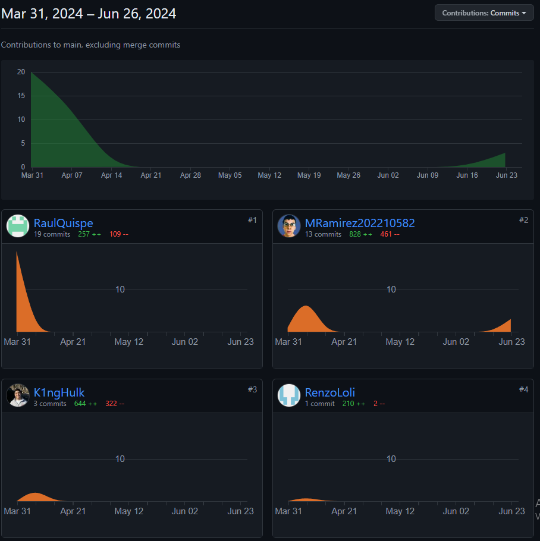 

Repositorio del db.json en github:
[https://github.com/MRamirez202210582/NexaLiberyApi](https://github.com/MRamirez202210582/NexaLiberyApi)

Repositorio del Frontend Web Apliccations:
[https://github.com/AplicacionesWeb-SW56/NexaLibery-Frontend](https://github.com/AplicacionesWeb-SW56/NexaLibery-Frontend)
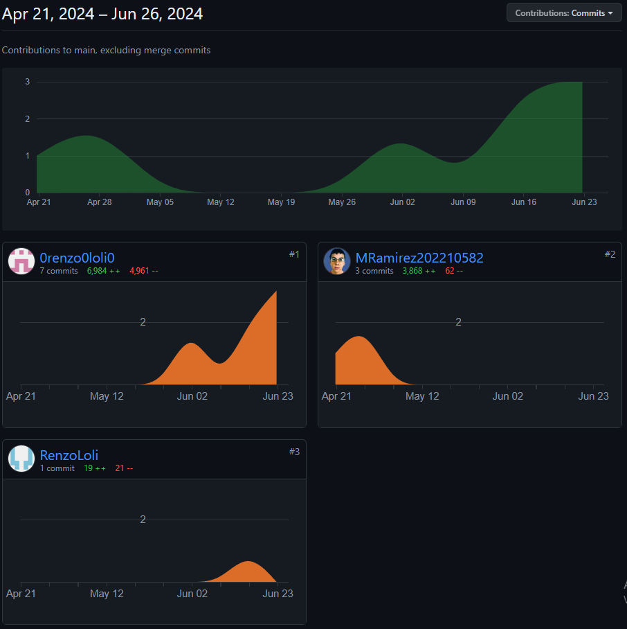 

Repositorio del Backend:
[https://github.com/AplicacionesWeb-SW56/NexaLibery-Backend](https://github.com/AplicacionesWeb-SW56/NexaLibery-Backend)
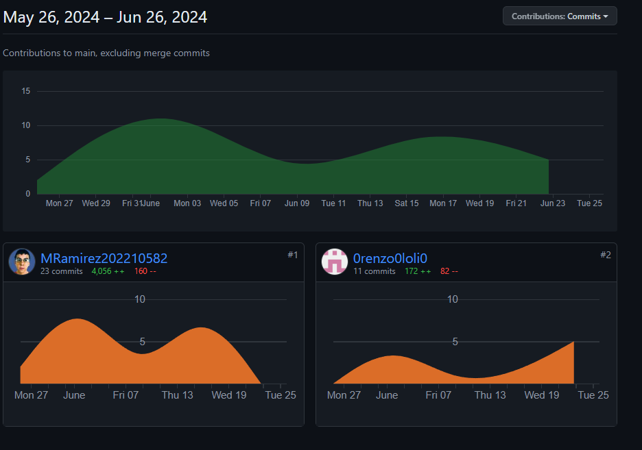 

# Student Outcome
| Criterio Específico                                          | Acciones Realizadas | Conclusiones          |
|--------------------------------------------------------------|---------------------|-----------------------|
| Participa en equipos multidisciplinarios con eficacia, eficiencia y objetividad, en el marco de un proyecto en soluciones de ingeniería de software.| **Marcelo Ramirez:** <br> *TB1:* Durante este proyecto, colaboré con compañeros de diferentes disciplinas. Mi contribución principal fue en el diseño de la arquitectura de software y la implementación de funcionalidades del lading page y primera version del proyecto <br> *TP1:* Para esta entrega aproveche  todo lo aprendido en aplicacciones web para la reazlicon de esta entrega  <br> *TB2:* Para esta entrega fue necesario aplicar lo aprendido en clase sobre el tema de los bacneds y la organizacion de cada archivo <br> *TF1:* Aplicar el uso de los tokens con la carpeta IAM el cual le da seguridad a nuestro repositorio backend. <br> **Raúl Quispe Erasmo:** <br> *TB1:* Tras avanzar el proyecto con el equipo 4, colaboré los Lean UX, General Styles, la base de los códigos Html y CSS (Navbar y Footer), el primer Sprint y arreglando y analizando los errores del equipo.<br>*TP1:* Hice el desarrollo de la web application con los métodos de pagos y añadir tipo de pago de la aplicación, tomando una gran importancia de la página.<br>*TB2:* En pleno proceso del trabajo, complementé en el capitulo 5 y mejorando anteriores capitulos. <br>*TF1:* Para completar este último trabajo, fue indispensable motivar y arreglar muchas cosas a mis compañeros. <br> **Mathias Javier:** <br> *TB1:* Mi participacion en el trabajo fue en la realizacion de los user personas,la realizacion de los landing pages y explicacion de esta en el codigo <br> *TP1:* Apoye en el desarrollo de la web application con la seccion de Libreria, la cual representa un gran interes en el desarrollo para la parte de nuestros usuarios <br>*TB2:* Desarrollé en el backend el feature del podcast para la vista de los mismos. <br> *TF1:* Para esta ultima entrega fue necesario aplicar todo lo aprendido en clase para el desarrollo final del backend. <br>**Carlos Andres:** <br> *TB1:* Ayude en explicar la problematica del nuestro producto, hacer los wireflow mock ups user flow y prototyping del web appplications. <br> *TP1:* Para esta entrega ayude a diseñar las rutas de la pagina multimedia y la del perfil del usuario a igual como el diseño de las mismas. <br> *TB2:* Desarrolle lo que vendria ser el DBContext y el Source del "Library" en el proyecto. <br> *TF1:* Para la entrega final nos sirvio todos los conocimientos adquiridos a lo largo del curso. <br> **Renzo Javier:** <br> *TB1:* Analise los sectores competitvos qeu pueden ser rivales contra nosotros y crear los diagramas c4 <br> *TP1:* Se aplican habilidades de responsive y maquetado de paginas web con vuejs <br> *TB2:* Se aplicaron habilidades tecnicas de deployment y configurations <br> *TF1:* Se pudo cumplir con el objectivo de poder implementar un servico backend en el cual almacenamos todos nuestros datos y protegida por el authentic para luego desplegarlo en un front | Se logró una colaboración efectiva en el proyecto de ingeniería de software, destacando por la eficacia, eficiencia y objetividad en la contribución de habilidades técnicas como el diseño de software, implementación de funcionalidades clave, y análisis del mercado, lo cual fue crucial para el progreso y éxito del proyecto. <br> *TP1:* Aplique todo lo aprendido en clase sobre los componentes vue y el uso de los json services <br> *TF1:* Se evidencia la mejora continua con convenciones en comits estandarizados de manera grupal para un flujo mantenible. |
| Conoce al menos un sector empresarial o dominio de aplicación de soluciones de software  | **Marcelo Ramirez:** <br> *TB1:* En mi quinto ciclo de Ingeniería de Software, desarrollé un sistema de una biblioteca virtual. Aunque recién estoy aprendiendo sobre aplicaciones web y .NET, utilizaremos C# y .NET Framework para este proyecto, aplicando mis conocimientos y enfrentándome a nuevos desafíos. <br> *TP1:* Durante esta entrega mejore muchos mis conocimientos en la creacion de componentes vue y creacion de servidores usando json y fake api <br> *TB2:* Esta entrega me hizo mejorar mucho mi aprendizje sobre los endpoints y creacion de clases lo cual hizo que el trabjo sea facil de hacer<br> *TF1:* Todo este trabajo me ha ayudado mucho a poder aplicar todo mi conocimiento sobre la creacion de los repositorios backend y poder unirlos al front y tambien sobre el uso de los tokens. <br> **Raúl Quispe Erasmo:** <br> *TB1:* En este ciclo de mi carrera, aprendí sobre las aplicaciones web y fortaleciendo el conocimiento sobre .NET, .NET Framework, Html y CSS para este proyecto. <br> *TP1:* Durante el trabajo de la entrega, he aprendido el uso de Vue y lo importante que fue realizarlo.<br>*TB2:* En esa finalización del trabajo, aprendí lo importante que es mejorar la base para tener lo mejor en la final de la entrega. <br>*TF1:* Para completar este último trabajo, fue indispensable utilizar todos los conocimientos adquiridos en clase para analizar el desarrollo del backend y agregar ultimos puntos que se solicitaba. <br> **Mathias Javier:** <br> *TB1:* Este ciclo me permitió involucrarme en el desarrollo de documentación técnica y en el diseño de interfaces, específicamente en el desarrollo del landing page. Apliqué mis conocimientos en HTML y CSS, mejorando mi técnica y entendimiento del desarrollo front-end.<br> *TP1:* Durante el desarrollo del proyecto he mejorado en mis habilidades en desarrollo web como es el tema de Vue. <br> *TB2:* En esta entrega pude mejorar mis conocimientos de C# y .NET gracias al desarrollo del backend <br> *TF1:* Durante todo el proyecto he adquirido conocimientos sobre el desarrollo tanto del front como backend y haber podido practicarlo mediante el proyecto realizado. <br>**Carlos Andres:** <br> *TB1:* En mi reciente proyecto académico, me concentré en mejorar mi manejo de .NET y C#, trabajando en el backend de una aplicación web. Este desafío fue una oportunidad para aplicar teoría en práctica real, aumentando mi fluidez en estas tecnologías. <br> *TP1:* En el ultimo avanze del proyecto academico maneje Vue y Vite asi como PrimeVue. Tuve la oportunidad de aplicar lo aprendido y ponerlo a prueba. <br> *TB2:* En esta entrega aplique los conocimientos que obtuve en C# y .NET desarrollando el DBContex del BackEnd desarrollando asi mis habilidades. <br> *TF1:* A lo largo del trabajo logre adquirir habilidades importantes que me serviran mucho para mi desarrollo en el campo profesional. <br> **Renzo Javier:** <br> *TB1:* Participé activamente en el diseño y desarrollo frontend de nuestra última aplicación web. Mi rol involucró la aplicación de HTML, CSS y JavaScript, permitiéndome contribuir significativamente al aspecto visual y la usabilidad del proyecto. <br> *TP1:* Reconozco los dominios de multimedia y services que estaran separados en outcomes y en environments. <br> *TB2:* Reconozco que la organizacion es crucial dento del dominio para seguir los estandares pre programados <br> *TF1:* Aplique todos mis conocimientos y aprendizajes del curso para poder aplicar la seguridad del backend y aplicarlos para el futuro | Los miembros del equipo han aplicado y ampliado sus conocimientos en tecnologías y métodos relevantes para el desarrollo de aplicaciones web, como .NET, HTML y CSS. El trabajo realizado en el proyecto de una biblioteca virtual y otras aplicaciones web subraya su comprensión práctica y la capacidad para enfrentar desafíos en el ámbito de la ingeniería de software. <br> *TP1:* Mejore mis habilidades y metodologia sobre los componentes vue y como applicarlos en futuros proyectos <br> *TF1:* Se hace uso de tecnologias frontend y backend de manera estandarizada, como vuejs y asp net core.|

# Capítulo I: Introducción
## 1.1. Startup Profile
### 1.1.1. Descripción de la Startup
#### NexaLibery
En NexaLibery, somos un equipo de desarrolladores enfocados en revolucionar la experiencia multimedia digital. Nuestra plataforma está diseñada para ofrecer una colección diversa de libros electrónicos, audiolibros, música y podcasts, enriqueciendo cada interacción con listas de reproducción a medida y recomendaciones basadas en tus intereses. Además, te brindamos el espacio para conectar y compartir en comunidades y grupos de discusión especializados. Con NexaLibery, explorar, descubrir y disfrutar de contenidos digitales nunca ha sido tan personalizado ni interactivo.

- **Misión:**
 Dar acceco a las personas que neseciten o quieran contenido multimedia esto incluye libros electrónicos, audiolibros, música, podcasts, etc.
- **Visión:**
 Diseñar una plataforma que da acceso a los usuarios a una gran biblioteca de contenido multimedia, ademas de la opcion de tener un perfil para personalizar el contenido que deseas y poder elegir los planes de membresia para poder desbloquear mas beneficios, contenido y funciones.
#### 1.1.2. Perfiles de integrantes del equipo
| Miembros del equipo | Código Estudiante | Carrera | Conocimientos / Habilidades |
|---------------------|-------------------|---------|-----------------------------|
| Loli Ruiz Renzo, Javier <br>   | U20161C993 | Ingeniería de software | C++, Python, Javascript, C# |
| Ramirez Ramirez, Marcelo Sebastian <br>  | U202210582 | Ingeniería de software | C++, HTML5, JavaScript, SQL,CSS |
| Quispe Erasmo, Raúl Ronaldo <br> | U20211B682 | Ingeniería de software | C++, python, HTML5, CSS3, JavaScript |
| Javier Murillo, Mathias <br>  | U202022211 | Ingeniería de software | C++, SQL, React, Python, JavaScript |
| Leon Rioja, Carlos Andres <br>   | U202111451 | Ingeniería de software | C++, Python, HTML, CSS |


## 1.2. Solution Profile
### 1.2.1 Antecedentes y problemática

- Las consecuencias de la pandemia del covid-19 son demasiadas y una de ellas es la nesecidad de tener informacion desde la comodidad del hogar y debido a la falta de dicha esta hemos planeado hacer una aplicacion que brinda toda la informacion que nesecites al alcance de tu mano donde sea y cuando sea. Nuestro equipo ha planeado diseñar una biblioteca que contanga mucho contenido de diferentes tipos y que este disponible cada vez que el usuario lo quiera, para asi contrarestar la nesecidad de informacion que trajo la crisis global que acaba de terminar (covid-19).

### 1.2.2 Lean UX Process.
#### 1.2.2.1. Lean UX Problem Statements.
##### Problem Statement:
Nuestra visión con NexaLibery, la plataforma de Biblioteca Digital de Contenidos Multimedia, es ofrecer a los usuarios una experiencia completa para acceder y disfrutar de una amplia variedad de contenido digital, que incluye libros electrónicos, audiolibros, música y podcasts. Sin embargo, nos enfrentamos a un desafío importante: los usuarios de la suscripción básica se encuentran limitados en la creación de listas de reproducción personalizadas, lo que dificulta su capacidad para organizar y acceder fácilmente al contenido multimedia. Esta restricción, junto con la falta de recomendaciones personalizadas basadas en el historial de consumo del usuario, limita la exploración de nuevo contenido relevante.
Estas limitaciones en la experiencia del usuario pueden conducir a la insatisfacción de los clientes en la suscripción básica. Además, la ausencia de interacción social, como la falta de comunidades o grupos de discusión, puede disminuir el compromiso del usuario con la plataforma y limitar su potencial de crecimiento.
Por lo tanto, nos enfrentamos a la pregunta de cómo podemos mejorar la experiencia del usuario en NexaLibrary, especialmente para los usuarios de la suscripción básica y los estudiantes, proporcionando opciones de personalización, promoviendo la interacción social y ofreciendo herramientas educativas y de investigación efectivas.
#### 1.2.2.2. Lean UX Assumptions.
|Business Assumptions|User Assumptions|
|-|-|
| 1. Creemos que los usuarios de NexaLibrary, especialmente aquellos que utilizan la suscripción básica, necesitan una forma más eficiente de descubrir y acceder al contenido multimedia relevante, como libros electrónicos, audiolibros, música y podcasts.| 1. ¿Quién es el usuario? Los usuarios son, en primera parte, aquellos que utilizan la suscripción básica de NexaLibrary, buscando acceder a una amplia variedad de contenido digital. Además, estudiantes que buscan apoyo en su aprendizaje e investigación podrían beneficiarse de características específicas.|
| 2. Estamos asumiendo que estas necesidades pueden satisfacerse mediante el desarrollo de características adicionales, como recomendaciones personalizadas basadas en el historial de consumo del usuario y una mayor capacidad de personalización en la creación de listas de reproducción.| 2. ¿Qué problemas tiene NexaLibrary? ¿Resolver? Un problema que enfrenta actualmente NexaLibrary es la dificultad para los usuarios de la suscripción básica de descubrir nuevo contenido y acceder a él de manera eficiente.|
| 3. Inicialmente, nuestros clientes principales serán los suscriptores de la suscripción básica de NexaLibrary, así como los estudiantes que buscan acceder a contenido educativo y de entretenimiento.| 3. ¿Qué características son importantes? Las características más importantes de NexaLibrary incluyen recomendaciones personalizadas, mayor capacidad de personalización en la creación de listas de reproducción y acceso a contenido educativo relevante para los estudiantes.|
| 4. Suponemos que el valor más importante que un cliente espera de nuestros servicios es la capacidad de descubrir nuevo contenido relevante de manera eficiente y personalizada, así como acceder a herramientas de estudio integradas para apoyar su aprendizaje e investigación. | 4. ¿Dónde encaja NexaLibrary en su trabajo o vida? NexaLibrary encaja en la vida de los usuarios al proporcionarles una plataforma centralizada para acceder y disfrutar de una amplia variedad de contenido digital, tanto para su entretenimiento como para su desarrollo académico.|
| 5. Asumimos que los clientes también valorarán la capacidad de participar en comunidades o grupos de discusión en la plataforma, lo que les permitirá conectarse con otros usuarios con intereses similares y compartir recomendaciones y opiniones sobre el contenido.| 5. ¿Cuándo y cómo es NexaLibrary? ¿Usado? NexaLibrary se utiliza cuando los usuarios buscan acceder a contenido digital, ya sea para su entretenimiento personal, estudio o investigación, en cualquier momento y lugar a través de dispositivos conectados a Internet.|
#### 1.2.2.3. Lean UX Hypothesis Statements.
- **Hypothesis Statement 01**:
Creemos que los usuarios de la suscripción básica estarán más dispuestos a actualizar a una suscripción premium si se les ofrece acceso exclusivo a lanzamientos anticipados de contenido multimedia y eventos en vivo. Sabremos que hemos tenido éxito cuando veamos un aumento del 20% en las conversiones de la suscripción básica a la suscripción premium en los primeros seis meses de implementación de esta característica.
- **Hypothesis Statement 02**:
Creemos que la integración de herramientas de estudio y la capacidad de formar grupos de estudio virtuales aumentará el compromiso de los usuarios de la suscripción para estudiantes con la plataforma.
Sabremos que hemos tenido éxito cuando veamos un aumento del 30% en el tiempo dedicado al estudio y la interacción en grupos de estudio dentro de la plataforma por parte de los usuarios de la suscripción para estudiantes en los primeros tres meses después de la implementación de estas características.
- **Hypothesis Statement 03**:
Creemos que la personalización de recomendaciones de contenido basadas en el historial de consumo del usuario aumentará la satisfacción y retención de los usuarios en la plataforma.
Sabremos que hemos tenido éxito cuando veamos una disminución del 15% en la tasa de abandono de la plataforma entre los usuarios de la suscripción básica después de implementar esta funcionalidad y realizar una encuesta de satisfacción del usuario seis meses después.
- **Hypothesis Statement 04**:
Creemos que la introducción de comunidades y grupos de discusión en la plataforma aumentará la interacción social entre los usuarios y promoverá un sentido de comunidad en torno a temas específicos.
Sabremos que hemos tenido éxito cuando veamos un aumento del 25% en la participación activa en grupos de discusión y una mayor retención de usuarios en la plataforma después de seis meses de implementar estas funciones.
#### 1.2.2.4. Lean UX Canvas.
El Lean UX Canvas es usado como un diseño para el usuario y de acuerdo a la medotología "Lean" sería para crear, desarrollar y generar elaboraciones de manera ordenada, eficiente y efectiva. Acá dejamos una visualización directa del Lean UX Canvas trabajad por el equipo con la herramienta Mural:
 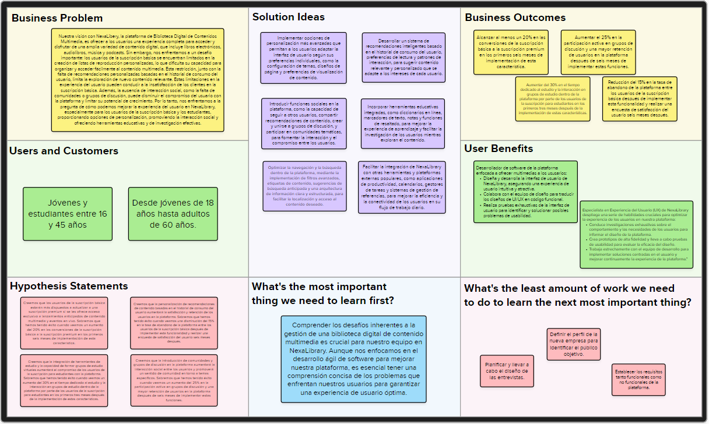
 
Si quieres ver más a detalle, acceder a [Canvas](https://app.mural.co/t/nexalibery5875/m/nexalibery5875/1711531230304/9cae9888df00da29e0a5dc996ce0e7484ff9da3d?sender=ud5867274f6e0f4e990f88500).
## 1.3. Segmentos objetivo.
**Segmento 1**
<br> Usuarios Generales:
Este segmento incluye individuos que buscan entretenimiento y enriquecimiento personal a través del acceso a una amplia gama de contenidos digitales. Los usuarios generales de NexaLibrary utilizan la plataforma principalmente para disfrutar de libros electrónicos, audiolibros, música y podcasts. Buscan una experiencia de usuario fluida y conveniente que les permita explorar y consumir contenido digital de forma casual, mejorando así su tiempo libre y proporcionando una fuente continua de entretenimiento y aprendizaje autodidacta.

**Segmento 2**
<br>
Este grupo está compuesto por estudiantes que utilizan NexaLibrary como una herramienta esencial en su educación y desarrollo académico. Los estudiantes recurren a la biblioteca digital para acceder a materiales educativos específicos, incluyendo libros de texto, recursos de investigación y contenidos multimedia que apoyan sus estudios universitarios y proyectos de investigación. NexaLibrary sirve como un recurso valioso para estos usuarios, proporcionando acceso a información actualizada y relevante que es crucial para su éxito académico y profesional. Además, la plataforma puede ofrecer funcionalidades de estudio personalizadas y herramientas de colaboración que enriquecen su experiencia de aprendizaje.

### Capitulo II: Requirements Elicitation & Analysis

#### 2.1. Competidores

##### 2.1.1. Analisis Competitivo

</head>
<body dir="ltr">
<table border="3" cellspacing="0" cellpadding="0" class="table-ta1"><colgroup><col width="99"/><col width="99"/><col width="99"/><col width="200"/><col width="199"/><col width="196"/><col width="195"/></colgroup><tr class="row-ro1"><td colspan="6" style="text-align:left;width:2.258cm; " class="cell-ce1">
<p>Competitive Analysis Landscape</p>
</td><td style="text-align:left;width:4.456cm; " class="cell-Default"> </td></tr><tr class="row-ro2"><td colspan="2" rowspan="2" style="text-align:left;width:2.258cm; " class="cell-ce2">
<p>¿Por qué llevar a cabo este análisis?</p>
</td><td colspan="4" style="text-align:left;width:2.258cm; " class="cell-ce2">
<p>¿Como nuestros competidores impulsaron el rubro del multimedia dentro de sus productos/servicios? y ¿Como nos diferenciamos con ellos?</p>
</td><td style="text-align:left;width:4.456cm; " class="cell-Default"> </td></tr><tr class="row-ro2"><td colspan="4" style="text-align:left;width:2.258cm; " class="cell-ce2">
<p>Nos diferenciamos en cuanto a calidad, <span class="text-T1">personalización</span>, ofertas y crecimiento constante <span class="text-T1">según</span> las <span class="text-T1">estadísticas.</span> Nos enfocaremos principalmente en cada cliente.</p>
</td><td style="text-align:left;width:4.456cm; " class="cell-Default"> </td></tr><tr class="row-ro1"><td colspan="2" style="text-align:left;width:2.258cm; " class="cell-ce2">
<p>Competidores</p>
</td><td style="text-align:left;width:2.258cm; " class="cell-ce2">
<p>NexaLibery</p>
</td><td style="text-align:left;width:4.579cm; " class="cell-ce2">
<p>Amazon Kindle</p>
</td><td style="text-align:left;width:4.554cm; " class="cell-ce2">
<p>Google Play</p>
</td><td style="text-align:left;width:4.48cm; " class="cell-ce2">
<p>Spotify</p>
</td><td style="text-align:left;width:4.456cm; " class="cell-Default"> </td></tr><tr class="row-ro3"><td rowspan="2" style="text-align:left;width:2.258cm; " class="cell-ce2">
<p>Perfil</p>
</td><td style="text-align:left;width:2.258cm; " class="cell-ce2">
<p>Overview</p>
</td><td style="text-align:left;width:2.258cm; " class="cell-ce2">
<p>Plataforma de almacenamiento/<span class="text-T1">clasificación</span> de archivos multimedia</p>
</td><td style="text-align:left;width:4.579cm; " class="cell-ce2">
<p>Dispositivo/<span class="text-T1">aplicación</span> con un catalogo amplio de libros distribuido por amazon.</p>
</td><td style="text-align:left;width:4.554cm; " class="cell-ce2">
<p>Catalogo de aplicaciones, <span class="text-T1">música</span>, libros, podcasts etc con una vasta cantidad de variedad.</p>
</td><td style="text-align:left;width:4.48cm; " class="cell-ce2">
<p>Plataforma de <span class="text-T1">reproducción</span> de <span class="text-T1">música</span> por streaming. Dispone de otros servicios como los podcast y <span class="text-T1">membresías.</span></p>
</td><td style="text-align:left;width:4.456cm; " class="cell-Default"> </td></tr><tr class="row-ro4"><td style="text-align:left;width:2.258cm; " class="cell-ce2">
<p>Ventaja competitiva ¿Qué valor ofrece al cliente?</p>
</td><td style="text-align:left;width:2.258cm; " class="cell-ce2">
<p>Ofrecemos “<span class="text-T1">PERSONALIZACIÓN</span>” adecuada a  cada uno de nuestros clientes y <span class="text-T1">membresías</span> accesibles según tu frecuencia de uso. </p>
</td><td colspan="2" style="text-align:left;width:4.579cm; " class="cell-ce2">
<p>Disponibilidad 24/7 y una interfaz <span class="text-T1">dinámica</span> para la <span class="text-T1">búsqueda</span> y descarga de medios digitales. Vasta cantidad de <span class="text-T1">música</span>, libros, podcast de talla mundial.</p>
</td><td style="text-align:left;width:4.48cm; " class="cell-ce3">
<p>Amplia gama de canciones reconocidas mundialmente, disponibilidad 24/7 y modo offline. Ademas, de <span class="text-T1">personalización</span> y <span class="text-T1">compartimentar</span> de listas, y recomendaciones musicales personalizadas.</p>
</td><td style="text-align:left;width:4.456cm; " class="cell-Default"> </td></tr><tr class="row-ro5"><td rowspan="2" style="text-align:left;width:2.258cm; " class="cell-ce2">
<p>Perfil de marketing</p>
</td><td style="text-align:left;width:2.258cm; " class="cell-ce2">
<p>Mercado objetivo</p>
</td><td style="text-align:left;width:2.258cm; " class="cell-ce2">
<p><span class="text-T1">Jóvenes</span> y estudiantes entre 16 y 45 años</p>
</td><td style="text-align:left;width:4.579cm; " class="cell-ce2">
<p>Desde <span class="text-T1">jóvenes</span> de 18 años hasta adultos de 60 años.</p>
</td><td style="text-align:left;width:4.554cm; " class="cell-ce3">
<p>Desde niños de 7 años por las apps de juegos que abundan mucho hasta adultos de hasta 50 años por las apps de streaming/<span class="text-T1">música</span>/libros.</p>
</td><td style="text-align:left;width:4.48cm; " class="cell-ce3">
<p>Actualmente se <span class="text-T1">podría</span> decir que entre <span class="text-T1">jóvenes</span> y adultos entre 16 y 45 años . Esto depende mucho de las tendencias y gustos, las cuales, en estos años no han cambiado demasiado</p>
</td><td style="text-align:left;width:4.456cm; " class="cell-Default"> </td></tr><tr class="row-ro6"><td style="text-align:left;width:2.258cm; " class="cell-ce2">
<p>Estrategias de marketing</p>
</td><td style="text-align:left;width:2.258cm; " class="cell-ce2">
<p>Brindar un extenso catalogo, servicio freemium, disponibilidad total según <span class="text-T1">suscripción</span>, <span class="text-T1">personalización</span> de playlist y recomendación según tendencias</p>
</td><td style="text-align:left;width:4.579cm; " class="cell-ce2">
<p>Brindar un dispositivo y plataforma <span class="text-T1">económico</span>, duradero y de uso intuitivo con un catalogo atractivo preciso para sus clientes.</p>
</td><td style="text-align:left;width:4.554cm; " class="cell-ce2">
<p>* Seguridad a sus clientes por medio de sus filtros y <span class="text-T1">análisis</span> de virus.</p>
<p>* Amplia cantidad de temas a abordar: Juegos, Apps, Libros, Podcast</p>
<p>* Reconocimiento en la <span class="text-T1">mayoría</span> de dispositivos celulares (viene por defecto)</p>
</td><td style="text-align:left;width:4.48cm; " class="cell-ce2">
<p>Uso de “freemium” el cual brinda servicios <span class="text-T1">básicos</span> gratuitos hasta que se haga una <span class="text-T1">incorporación</span> de un servicio avanzado de pago con planes adaptables. Ademas, de <span class="text-T1">personalización</span> y trends para recomendaciones.</p>
</td><td style="text-align:left;width:4.456cm; " class="cell-Default"> </td></tr><tr class="row-ro7"><td rowspan="4" style="text-align:left;width:2.258cm; " class="cell-ce2">
<p>Perfil del producto</p>
</td><td style="text-align:left;width:2.258cm; " class="cell-ce2">
<p>Productos y servicios</p>
</td><td style="text-align:left;width:2.258cm; " class="cell-ce2">
<p>App web y mobile con un diseño interactivo y moderno, ademas de inclusivo</p>
</td><td style="text-align:left;width:4.579cm; " class="cell-ce2">
<p>App multiplataforma, Dispositivo de lectura, Catalogo de libros</p>
</td><td style="text-align:left;width:4.554cm; " class="cell-ce2">
<p>Catalogo de aplicaciones, <span class="text-T1">música</span>, libros, podcasts etc.</p>
<p>App compatible con android.</p>
<p>Cuenta para guardado de estados de juegos/apps/<span class="text-T1">música</span> etc</p>
</td><td style="text-align:left;width:4.48cm; " class="cell-ce2">
<p>Catalogo de canciones.</p>
<p>Playlist recomendadas y  compartibles</p>
<p>Freemium</p>
<p>Podcasts</p>
<p><span class="text-T1">Membresías</span> <span class="text-T1">económicas</span></p>
<p>Soporte web</p>
</td><td style="text-align:left;width:4.456cm; " class="cell-Default"> </td></tr><tr class="row-ro3"><td style="text-align:left;width:2.258cm; " class="cell-ce2">
<p>Precios y costos</p>
</td><td style="text-align:left;width:2.258cm; " class="cell-ce2">
<p>* <span class="text-T1">Básico</span>: 10 soles</p>
<p>* Estudiantil: 8 soles</p>
<p>* Premium: 20 soles</p>
</td><td style="text-align:left;width:4.579cm; " class="cell-ce2">
<p>$9.99 al mes</p>
</td><td style="text-align:left;width:4.554cm; " class="cell-ce3">
<p>Playstore maneja la <span class="text-T1">suscripción</span> de las apps como tal no tiene <span class="text-T1">membresías</span>, aunque si para juegos, lo <span class="text-T1">demás</span> es pagar por libros por ejemplo</p>
</td><td style="text-align:left;width:4.48cm; " class="cell-ce3">
<p>* Individual: 21 soles al mes</p>
<p>* Estudiantes: 12 soles al mes</p>
<p>* Duo: 27 soles al mes</p>
<p>* Familiar: 33 soles al mes</p>
</td><td style="text-align:left;width:4.456cm; " class="cell-Default"> </td></tr><tr class="row-ro2"><td style="text-align:left;width:2.258cm; " class="cell-ce2">
<p>Canales de distribución</p>
</td><td style="text-align:left;width:2.258cm; " class="cell-ce2">
<p>Web</p>
</td><td style="text-align:left;width:4.579cm; " class="cell-ce2">
<p>Kindle, Kindle App</p>
</td><td style="text-align:left;width:4.554cm; " class="cell-ce2">
<p>Mobile, Web</p>
</td><td style="text-align:left;width:4.48cm; " class="cell-ce2">
<p>Mobile, Web</p>
</td><td style="text-align:left;width:4.456cm; " class="cell-Default"> </td></tr><tr class="row-ro8"><td style="text-align:left;width:2.258cm; " class="cell-ce2">
<p>Tecnologías usadas</p>
</td><td style="text-align:left;width:2.258cm; " class="cell-ce2">
<p><span class="text-T1">C</span>#, .NET </p>
</td><td style="text-align:left;width:4.579cm; " class="cell-ce2">
<p>Propio hardware de amazon. Posiblemente con sistemas basados en linux.</p>
</td><td style="text-align:left;width:4.554cm; " class="cell-ce2">
<p>Java, Android</p>
</td><td style="text-align:left;width:4.48cm; " class="cell-ce2">
<p>Python, Javascript, React</p>
</td><td style="text-align:left;width:4.456cm; " class="cell-Default"> </td></tr><tr class="row-ro9"><td rowspan="4" style="text-align:left;width:2.258cm; " class="cell-ce2">
<p>Análisis SWOT</p>
</td><td style="text-align:left;width:2.258cm; " class="cell-ce2">
<p>Fortalezas</p>
</td><td style="text-align:left;width:2.258cm; " class="cell-ce2">
<p>* Capacidad de aprender <span class="text-T1">rápidamente</span></p>
<p>* Personal capacitado</p>
<p>* organización y responsabilidad</p>
</td><td style="text-align:left;width:4.579cm; " class="cell-ce2">
<p>* Personal con experiencia de renombre</p>
<p>* Constantes capacitaciones</p>
</td><td style="text-align:left;width:4.554cm; " class="cell-ce2">
<p>* Personal capacitada a nivel de seguridad</p>
<p> </p></td><td style="text-align:left;width:4.48cm; " class="cell-ce2">
<p>* Personal joven </p>
<p>* conocimiento en trends y actualidad</p>
</td><td style="text-align:left;width:4.456cm; " class="cell-Default"> </td></tr><tr class="row-ro10"><td style="text-align:left;width:2.258cm; " class="cell-ce2">
<p>Debilidades</p>
</td><td style="text-align:left;width:2.258cm; " class="cell-ce2">
<p>* Falta de experiencia en ciertas <span class="text-T1">áreas</span></p>
<p>* Poco conocimiento entre los miembros del grupo</p>
</td><td style="text-align:left;width:4.579cm; " class="cell-ce2">
<p>* Idea imitable</p>
</td><td style="text-align:left;width:4.554cm; " class="cell-ce2">
<p>* Apps maliciosas aceptadas a pesar de estar infectadas</p>
</td><td style="text-align:left;width:4.48cm; " class="cell-ce2">
<p>* Necesario uso de internet</p>
<p>* Publicidad molesta en servicio gratuito</p>
<p> </p></td><td style="text-align:left;width:4.456cm; " class="cell-Default"> </td></tr><tr class="row-ro11"><td style="text-align:left;width:2.258cm; " class="cell-ce2">
<p>Oportunidades</p>
</td><td style="text-align:left;width:2.258cm; " class="cell-ce2">
<p>* <span class="text-T1">Únicos</span>, según reconocimientos de otras apps, en el mercado que tengan variedad (<span class="text-T1">música</span>, libros, podcasts)</p>
</td><td style="text-align:left;width:4.579cm; " class="cell-ce2">
<p>* <span class="text-T1">Internacionalización</span> </p>
<p>* Confianza del publico</p>
<p>* <span class="text-T1">Fácil</span> apertura de tiendas <span class="text-T1">físicas</span> internacionales</p>
</td><td style="text-align:left;width:4.554cm; " class="cell-ce2">
<p>* Multiplataforma</p>
<p>* Ser una de las apps por defecto mas usadas y escuchadas en el mundo</p>
</td><td style="text-align:left;width:4.48cm; " class="cell-ce2">
<p>* Estamos en una <span class="text-T1">época</span> de los trends </p>
<p>* <span class="text-T1">Aceptación</span> de los artistas</p>
</td><td style="text-align:left;width:4.456cm; " class="cell-Default"> </td></tr><tr class="row-ro12"><td style="text-align:left;width:2.258cm; " class="cell-ce2">
<p>Amenazas</p>
</td><td style="text-align:left;width:2.258cm; " class="cell-ce2">
<p>* Regulaciones con los artistas/autores</p>
</td><td style="text-align:left;width:4.579cm; " class="cell-ce2">
<p>* Alta competitividad nacional e internacional</p>
<p>* Ciberdelincuencia</p>
</td><td style="text-align:left;width:4.554cm; " class="cell-ce2">
<p>* Competencia con otras tiendas de apps</p>
<p>* Restricciones de los <span class="text-T1">países</span></p>
</td><td style="text-align:left;width:4.48cm; " class="cell-ce2">
<p>* Contradicciones y quejas con artistas </p>
<p>* Alta competencia</p>
</td></table>

##### 2.1.2. Estrategias y tacticas frente a competidores

**Estrategias**:    
**Posicionamiento en el mercado**: Buscamos meternos en un rubro demasiado competitivo. Esto nos lleva a enfocarnos en las tendencias del dia a dia; ya que, estas estan en constante cambio. Darle prioridad al cliente, sus gustos e intereses nos brindara un poscionamiento tanto en usuarios como en marcas y artistas.    
**Impulso de la inclusividad**: Las personas con una discapasidad visual y auditiva tambien son un publico a tener en cuenta. Se impulsara el uso de audiolibros y una guia para movilisarse dentro de la aplicacion.

**Tácticas**:  
**Listas Personalizadas**: Los usuarios podran disponer de listas creadas segun sus gustos y añadirlas a sus playlist. No solo listas tambien canciones/libros/podcast. Todo para ofrecer variedad.    
**Vita Support**: Sera un guia para las personas con alguna discapacidad que se personaliza automaticamente segun lo que quieras leer,buscar, oir o comprar.  

#### 2.2. Entrevistas

##### 2.2.1. Diseño de entrevistas

**Estructura de la entrevista**:  

- Presentacion de la tematica y entrevistado  
- Preguntas sobre el rubro de la persona  
- Preguntas previas introduciendo la necesidad a solucionar al entrevistado.  
- Preguntas sobre la idea a evaluar  
- Preguntas de retroalimentacion y seguimiento de agrado del entrevistado  

**Lista de preguntas:**  

*Preguntas introductorias:* 

- ¿Cuál es su nombre?
- ¿Que edad tiene?
- ¿Cuál es su ocupación? ¿Estudia o trabaja?
- Si estudia, ¿Que carrera esta cursando?
- Si trabaja, ¿Que ambito laboral sigue?

- ¿Tiene un dispositivo movil o una computadora/laptop?
- ¿Con qué regularidad hace compras por internet?
- ¿Cuál es el tipo de artículos que suele comprar?
- ¿Alguna vez ha comprado musica o libros a través de internet? ¿Le fue util o prefiere tenerlos en fisico?
- ¿Alguna vez se ha frustrado por no encontrar un recurso (cancion/libro) que deseaba?

------ Aqui le hablamos un poco de la solucion. -------

- ¿Cree que esta aplicacion seria util o solo una mas de las que pudo haber probado?
- ¿Como se siente al tener que usar diferentes apps para basicamente el mismo proposito, el cual, es tener sus recursos digitales en un solo lugar, ordenados y a su disposicion todo el dia?
- ¿Cree que sería práctico el uso de esta o es muy complejo para su propósito? 

------ Explicamos los beneficios segun la membresia -------
- ¿Que opina de estos beneficios?
- ¿Pagaría usted por el uso de la aplicación? ¿Cuánto?  
- ¿Tiene familiares que hagan uso de herramientas parecidas? 

### 2.2.2. Registro de entrevistas.
**Segmento 1**  
Nombre: Maria Teresa Ramirez
Edad: 52 años 
Ocupación: Administradora de emrpesas 

Maria Teresa Ramirez, una profesional de 52 años en el área de ventas y estudiante de Administración de Empresas, utiliza tecnología diariamente para trabajo y estudios. Aunque compra en línea solo ocasionalmente debido a la complejidad del proceso, está abierta a la tecnología y reconoce su utilidad. Maria Teresa ha tenido experiencias frustrantes al buscar recursos en línea, especialmente libros, y prefiere las compras físicas por la simplicidad que ofrecen. La idea de una aplicación unificada que centralice las funciones de varias otras aplicaciones le parece útil y cree que simplificaría significativamente su experiencia en línea. Está dispuesta a pagar por una suscripción si el servicio proporciona valor claro y mejora su eficiencia. Además, menciona que su familia también ha utilizado y beneficiado de herramientas de suscripción, lo que indica una familiaridad y aceptación de soluciones digitales en su entorno cercano. 

**Segmento 2**  
Nombre: Giakomo Causso
Edad: 19 años 
Ocupación: Estudiante de UPC
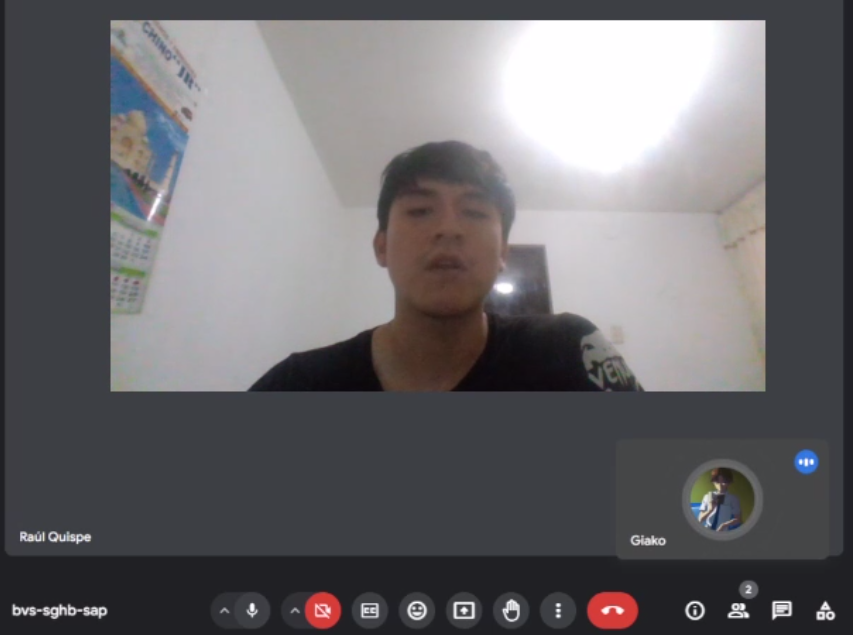
Giakomo, un estudiante de 19 años de la Universidad Peruana de Ciencias Aplicadas (UPC), se encuentra en el séptimo ciclo de la carrera de Ingeniería de Software. Siempre está equipado con dispositivos móviles y computadoras, los cuales utiliza tanto para fines académicos como para entretenimiento. Aunque no tiene un horario fijo para las compras en línea, suele realizar alrededor de 2 a 3 compras por internet al mes, principalmente de artículos relacionados con juegos, música y otros de su interés personal. Si bien prefiere los libros en formato físico, en ocasiones adquiere música digitalmente cuando le atrae mucho un álbum. En cuanto a la utilidad de una aplicación que reúna todos sus recursos digitales en un solo lugar, Giakomo ve esta idea como muy conveniente y práctica, ya que actualmente utiliza múltiples aplicaciones para acceder a contenido similar. Considera que una suscripción básica sería un buen punto de partida, aunque está abierto a probar una suscripción premium si la aplicación demuestra ser efectiva. Giakomo también identifica el potencial de la aplicación para ser utilizada por sus familiares, especialmente por sus primos y hermano, quienes también están en la universidad y podrían beneficiarse de una plataforma que organice y proporcione acceso fácil a recursos digitales relevantes para sus estudios.

### 2.2.3. Análisis de entrevistas.
**Segmento 1:**
- Maria Teresa trabaja en el área de ventas en una empresa de importación de pescado congelado y simultáneamente estudia Administración de Empresas.

- A pesar de su familiaridad con dispositivos tecnológicos como celular, computadora y laptop, muestra cierta reticencia hacia las compras en línea debido a su complejidad.

- Prefiere realizar compras físicas para artículos de casa y libros, aunque ha realizado compras en línea ocasionalmente.

- Tiene una clara preferencia por los libros en formato físico, basada en una experiencia negativa con la descarga y uso de un libro digital.

- Se siente frustrada por la dificultad de encontrar y manejar recursos en línea, y por la necesidad de utilizar múltiples aplicaciones para acceder a contenido similar.

- Considera que la aplicación centralizada para gestionar recursos digitales sería muy útil y práctica, facilitando su experiencia en línea.

- Está dispuesta a pagar por una suscripción si esta proporciona un valor claro y mejora su eficiencia al acceder a recursos necesarios.

- Nota que tanto su hijo como sus hermanos han utilizado herramientas de suscripción similares, lo que indica un posible interés y aceptación general en su entorno familiar hacia soluciones tecnológicas eficientes.

**Segmento 2:**
- Giakomo está en su séptimo ciclo en la UPC, indicando que está bastante avanzado en su carrera y probablemente tiene habilidades técnicas desarrolladas.

- Utiliza dispositivos móviles y computadoras diariamente, tanto para fines académicos como de entretenimiento, lo que implica una alta integración de la tecnología en su rutina diaria.

- Realiza compras en internet regularmente (2-3 veces al mes), interesado principalmente en juegos y música. Esto sugiere que es un consumidor digital activo y familiarizado con el comercio electrónico.

- Prefiere libros físicos pero no duda en adquirir música digitalmente si un álbum es especialmente atractivo, lo que muestra una apertura hacia los formatos digitales cuando ofrecen un valor añadido.

- La idea de una aplicación que centralice recursos digitales es atractiva para él, resaltando un interés en soluciones que simplifiquen y organicen el acceso a sus herramientas y contenido digital.

- Está dispuesto a comenzar con una suscripción básica y considerar opciones más avanzadas si la efectividad del servicio lo justifica, demostrando una actitud práctica hacia nuevas soluciones digitales.

- Reconoce el potencial de la aplicación para ser utilizada también por familiares en la universidad, lo que indica que piensa en soluciones escalables y aplicables a un grupo más amplio de usuarios.

- Prefiere probar primero la eficacia de un servicio antes de comprometerse a niveles más altos de suscripción, lo que sugiere una aproximación cuidadosa y basada en resultados a la adopción de nuevas tecnologías.

## 2.3. Needfinding.
### 2.3.1. User Personas. 


### 2.3.2. User Task Matrix.
**Estudiantes colegiales, universitarios o tecnicos:** 
| Task Matrix                            | Frecuencia | Importancia |
|----------------------------------------|------------|-------------|
| Registrarse                            | Siempre    | Alta        |
| Completar perfil                       | Siempre    | Alta        |
| Descargar libros electrónicos          | Frecuente  | Alta        |
| Escuchar audiolibros                   | Frecuente  | Alta        |
| Escuchar música                        | Muy frecuente | Alta    |
| Escuchar podcasts                      | Frecuente  | Alta        |
| Crear y personalizar listas de reproducción | Frecuente | Alta    |
| Recibir recomendaciones personalizadas | Siempre    | Alta        |
| Participar en comunidades y grupos de discusión | Ocasional | Media   |
| Seleccionar y cambiar planes de membresía | Ocasional | Media     |


**Egresados de carreras universitarias y/o tecnicas:** 
| Task Matrix                                  | Frecuencia    | Importancia |
|----------------------------------------------|---------------|-------------|
| Registrarse en la plataforma                 | Siempre       | Alta        |
| Completar y actualizar perfil profesional    | Siempre       | Alta        |
| Buscar libros electrónicos especializados    | Muy frecuente | Alta        |
| Escuchar y descargar podcasts educativos     | Frecuente     | Alta        |
| Acceder a audiolibros de desarrollo profesional | Frecuente   | Alta        |
| Crear listas de reproducción para clases     | Ocasional     | Media       |
| Participar en foros de discusión académica   | Frecuente     | Alta        |
| Recomendar contenidos a estudiantes          | Frecuente     | Alta        |
| Descargar material para clases               | Muy frecuente | Alta        |
| Actualizar preferencias de contenido         | Ocasional     | Media       |
### 2.3.3. User Journey Mapping.
**Registration:**
Why would they trust us?
- Investiga sobre la reputacion y confiabilidad de la plataforma
- Lee reseñas o testimonios
- Revisa politicas de privacidad y medidas de seguridad de la plataforma
  
**Onboarding and first use:**
How can they feel successful?
- Completa el proceso de registro sin problemas
- Navega por la plataforma facilmente y encuentra contenido de manera facil y eficiente
- Recibe orientacion sobre como usar diferentes caracteristicas
  
**Sharing:**
Why would they invite others?
- Encuentra valor sobre las caracteristicas que ofrecemos y el contenido publicado
- Recibe incentivos o recompensas por invitar a otros
- Participa en discusiones o grupos comunitarios

 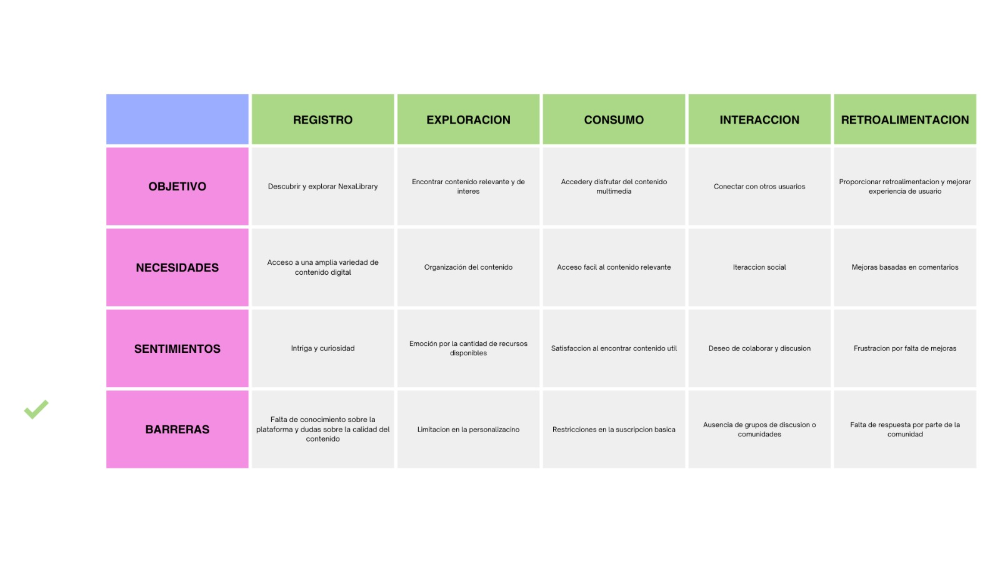

### 2.3.4. Empathy Mapping.
**Estudiante Universitario:**


**Egresado Universitario:**

### 2.3.5. As-is Scenario Mapping.

**Segmento 1**  
Escenario: Un estudiante universitario se inscribe en la aplicacion de contenido multimedia para acceder a una extensa variedad de recursos educativos y de entretenimiento 

As Is:
| Fases| Fase 1 | Fase 2| Fase 3| Fase 4|
| -------- | --------- | --------- | ------- | --------- |
| Doing | Explora la interfaz de la aplicacion| Busca contenido relevante en la seccion de libros | Intenta crea su propia lista de reproduccion | Proporciona una reseña de la app |
| Thinking | "¿Como puedo encontrar lo que necesito?" | "¿Por que no puedo crear una lista de reproduccion?" | "¿Hay alguna forma de organizar mejor mi contenido?" | "¿Mi reseña será considerada?"  |
| Feeling  | Curiosidad por explorar las caracteristicas de la app | Frustracion por la limitacion de crear listas | Confusion sobre como organizar mi contenido | Esperando que sus comentarios mejoren la aplicacion |

**Segmento 2**  
Escenario: Un egresado universitario utiliza la aplicacion para acceder a recursos educativos y de entretenimiento mientras busca oportunidades de crecimiento profesional

As Is:
| Fases| Fase 1 | Fase 2| Fase 3| Fase 4|
| -------- | --------- | --------- | ------- | --------- |
| Doing | Explora la interfaz de la aplicacion| Busca contenido relevante en la seccion de libros | Intenta crea su propia lista de reproduccion | Proporciona una reseña de la app |
| Thinking | "¿Como puedo encontrar lo que necesito?" | "¿Por que no puedo crear una lista de reproduccion?" | "¿Hay alguna forma de organizar mejor mi contenido?" | "¿Mi reseña será considerada?"  |
| Feeling  | Curiosidad por explorar las caracteristicas de la app | Frustracion por la limitacion de crear listas | Confusion sobre como organizar mi contenido | Esperando que sus comentarios mejoren la aplicacion |
## 2.4. Ubiquitous Language.

| **Terms and Definitions** | **Términos y Definiciones** |
|---------------------------|-----------------------------|
| Estudiante                | Persona la cual busca nuestra aplicacion por medio de la suscripcion para estudiantes,. |
| Usuario                   | Cualquier persona o entidad que utiliza la plataforma s. |
| Plan de suscripcion       | Modelo de pago que permite a los usuarios acceder a servicios específicos durante un periodo determinado. |
| Lista de reproduccion     | Lista el cual puede organizar sus preferencias y descubrimientos |
| Contenido multimedia      | Repertorio de todos los materiales de la plataforma |
| Premiun                   | Contenido exclusivo de la suscripcion Premiun |
| Library                   | Contenido de lectura digital, incluyendo libros electrónicos y otros recursos textuales. |
| Multimedia                | Contenido multimedia, como música, videos y otros formatos audiovisuales. |
| Podcast                   | Contenido de podcasts, incluyendo episodios de audio sobre diversos temas y programas. |
| Descripcion               | Explicacion breve y clara del tipo de material que se esta utilizando |
| Authentication            | Auteticacion de usuario con el que se genera una clave para el uso del backend |
| Upload                    | Funcion del sistema donde los usuarios pueden subir contenido multimedia a la plataforma |
| I18n                      | Implementación de soporte multilingüe y adaptación cultural para usuarios de diferentes regiones. |
---

# Capítulo III: Requirements Specification
## 3.1. To-Be Scenario Mapping.

| Fases    | Descubrimiento  | Evaluación    | Suscripción    |  Uso Intensivo   | Participación Comunitaria |
|----------|--------------------------|-----------------------|------------------------|-------------------------|-----------------------------------|
| Doing    | Los usuarios exploran la oferta inicial de contenidos y las funcionalidades básicas de la plataforma. | Los usuarios comparan las opciones de suscripción y evalúan los beneficios. | Los usuarios se suscriben al nivel que mejor se ajusta a sus necesidades, completando el registro y la configuración de preferencias. | Los usuarios consumen contenido, crean listas de reproducción y utilizan herramientas de estudio. | Los usuarios participan en comunidades, eventos en vivo, y crean grupos de estudio o discusión. |
| Thinking | "¿Qué tipo de contenido puedo encontrar aquí?" | "¿Qué plan de suscripción ofrece el mejor valor para mí?" | "Espero que el proceso de suscripción sea sencillo." | "Hay tanto contenido interesante; ¿por dónde empiezo?" | "Quiero compartir mis ideas y obtener nuevas perspectivas de otros usuarios." |
| Feeling  | Curiosidad por la nueva plataforma y sus ofertas. | Consideración cuidadosa y tal vez algo de indecisión sobre las opciones. | Satisfacción al unirse fácilmente y anticipación por explorar el contenido. | Entusiasmo y placer al descubrir y consumir contenido que les gusta. | Sentido de comunidad y conexión al interactuar con otros usuarios con intereses similares. |


## 3.2. User Stories.

| Epic ID | Titulo                                                      | Descripción de Historias de Usuario Asociadas                                                                              |
|---------|-------------------------------------------------------------|----------------------------------------------------------------------------------------------------------------------------|
| EP01    | Experiencias de Suscripción                                 | Como usuario con diferentes niveles de suscripción, quiero beneficios adecuados para maximizar mi experiencia en la plataforma. |
| EP02    | Personalización y Organización de Contenidos                | Como usuario, quiero personalizar y organizar mis contenidos para mejorar mi acceso y disfrute.                             |
| EP03    | Comunidades y Conectividad                                  | Como usuario interesado en la interacción, quiero conectarme con comunidades y grupos para enriquecer mi experiencia.        |
| EP04    | Herramientas y Beneficios para Estudiantes                  | Como estudiante, quiero herramientas de estudio y beneficios de suscripción para potenciar mi aprendizaje.                   |
| EP05    | Gestión y Seguridad Familiar                                | Como cabeza de familia o padre/madre, quiero gestionar el acceso y la seguridad del contenido familiar.                       |
| EP06    | Opciones de Consumo de Contenido Avanzado y Experimental    | Como usuario de suscripción básica, quiero explorar ocasionalmente contenido premium para conocer la oferta completa.        |

| USER STORY ID | TÍTULO                                          | DESCRIPCIÓN                                                                                                                                                     | CRITERIO DE ACEPTACIÓN                                                                                                                                                                                                      | EPIC USER RELACIONADO |
|---------------|------------------------------------------------|-----------------------------------------------------------------------------------------------------------------------------------------------------------------|----------------------------------------------------------------------------------------------------------------------------------------------------------------------------------------------------------------------------|-----------------------|
| HU01          | Acceso a contenido básico                      | "Como usuario con suscripción básica, deseo tener acceso a una selección limitada de contenidos multimedia para disfrutar de variedad sin un costo elevado."    | "Escenario : Verificación de suscripción. Dado que soy un usuario básico, cuando inicio sesión, entonces debo tener acceso solo a contenido limitado."                                                                     | EP01                  |
| HU02          | Publicidad a cambio de premium                 | "Como usuario de suscripción básica, deseo la opción de ver o escuchar anuncios a cambio de acceso ocasional a contenido premium, para explorar contenido de mayor valor sin costo adicional." | "Escenario : Acceso a premium por anuncios. Dado que acepto ver anuncios, cuando elijo esta opción, entonces tengo acceso temporal a contenido premium."                                                                   | EP01, EP06           |
| HU03          | Crear listas de reproducción personalizadas    | "Como usuario, deseo crear listas de reproducción personalizadas para organizar mis contenidos favoritos y acceder a ellos fácilmente."                           | "Escenario : Creación de listas personalizadas. Dado que soy usuario registrado, cuando intento crear una lista, entonces debo poder seleccionar y guardar mis contenidos favoritos."                                      | EP02                  |
| HU04          | Acceder a comunidades                          | "Como usuario con suscripción estándar o premium, deseo acceder a comunidades y grupos de discusión para conectar con otros usuarios con intereses similares."  | "Escenario : Acceso a comunidades. Dado que tengo suscripción estándar o premium, cuando busco grupos, entonces puedo unirme y participar en comunidades."                                                                | EP03                  |
| HU05          | Recibir recomendaciones personalizadas         | "Como usuario, deseo recibir recomendaciones basadas en mi historial de consumo para descubrir nuevos contenidos que se ajusten a mis gustos."                   | "Escenario : Recomendaciones basadas en historial. Dado que tengo un historial de consumo, cuando inicio sesión, entonces debo recibir recomendaciones personalizadas."                                                    | EP02                  |
| HU06          | Descargar contenido para consumo sin conexión  | "Como usuario premium, deseo descargar contenido para consumirlo sin necesidad de una conexión a internet, ideal para viajes o zonas sin cobertura."             | "Escenario : Descargas para acceso offline. Dado que soy usuario premium, cuando selecciono contenido, entonces puedo descargarlo para acceso offline."                                                                  | EP01                  |
| HU07          | Participar en eventos en vivo                  | "Como usuario premium, deseo participar en eventos en vivo con creadores de contenido para enriquecer mi experiencia con la plataforma."                        | "Escenario : Participación en eventos en vivo. Dado que soy usuario premium, cuando hay eventos en vivo, entonces puedo acceder y participar en ellos."                                                                   | EP01                  |
| HU08          | Beneficios de suscripción para estudiantes     | "Como estudiante, deseo acceder a un descuento en la suscripción estándar o premium para aprovechar al máximo los recursos educativos ofrecidos."                | "Escenario : Descuentos para estudiantes. Dado que soy estudiante, cuando verifico mi estatus, entonces recibo un descuento en mi suscripción."                                                                          | EP01                  |
| HU09          | Herramientas de estudio integradas             | "Como usuario estudiante, deseo herramientas de estudio integradas en la plataforma para mejorar mi aprendizaje y organización."                                 | "Escenario : Acceso a herramientas de estudio. Dado que soy estudiante, cuando accedo a la plataforma, entonces tengo herramientas de estudio disponibles."                                                              | EP04       |
| HU10          | Metodos de pagos      | Como usuario , deseo tener múltiples opciones de métodos de pago para gestionar fácilmente mi suscripción personal, permitiéndome mantener el control total sobre mis gastos y preferencias de pago. | "Escenario: Gestión de Métodos de Pagos.Dado que un usuario es el único responsable de los pagos de su suscripción, cuando configura o actualiza los métodos de pago de su suscripción personal, entonces puede seleccionar entre varias opciones como tarjeta de crédito, débito, PayPal, o dividir el pago entre diferentes métodos para su conveniencia. Y puede asegurarse de que su método de pago preferido esté activo y correctamente configurado, evitando interrupciones en el acceso a su contenido. Y recibe confirmación de que el método de pago ha sido configurado o actualizado correctamente.."                                                     | EP01                  |
| HU11          | Listas de reproducción            | "Como usuario, deseo crear listas de reproducción que reflejen mis gustos persoanles , para disfrutar sin la necesidad de tener que buscar denuevo el nombre en la navegacion."   | "Escenario : Creación de listas de reporduccion. Dado que un usuario registrado disfruta de personalizar su experiencia, cuando selecciona sus contenidos favoritos para crear una nueva lista de reproducción personal, entonces organiza estos elementos en una lista que refleja exclusivamente sus gustos personales. Y puede guardar esta lista para su uso personal, asegurándose de que no sea visible ni accesible para otros miembros de la familia o usuarios externos. Y recibe una confirmación de que la lista de reproducción ha sido creada con éxito y está disponible solo para él."                             | EP05                  |
| HU12          | Explorar contenido premium ocasionalmente      | "Como usuario de suscripción básica, deseo la opción de explorar contenido premium ocasionalmente para conocer la oferta completa de la plataforma."           | "Escenario 14: Exploración ocasional de contenido premium. Dado que soy un usuario básico, cuando exploro contenido, entonces tengo acceso a contenido premium de forma ocasional."                           | EP01                  |
| HU13 | Crear grupos de estudio virtuales | "Como estudiante, deseo la capacidad de formar grupos de estudio virtuales con otros usuarios, para colaborar y aprender juntos de manera más eficaz." | "Escenario: Estudiante crea grupo de estudio.  Dado que un estudiante desea colaborar, cuando forma un grupo de estudio, entonces puede invitar a otros usuarios y usar herramientas colaborativas en la plataforma." | EP03, EP04  |
| HU14 | Acceso a las suscripciones        | "Como usuario interesado, deseo conocer los detalles de las diferentes suscripciones para elegir la que mejor se ajuste a mis necesidades." | "Escenario: Usuario consulta suscripciones. Dado que estoy evaluando las opciones, cuando accedo a la sección de suscripciones, entonces puedo ver información detallada de cada plan incluyendo beneficios y costos." | EP01  |
| HU15 | Descubrir servicios adicionales   | "Como usuario, deseo descubrir los servicios adicionales que ofrece la plataforma para maximizar mi experiencia." | "Escenario: Usuario explora servicios adicionales. Dado que busco aprovechar al máximo la plataforma, cuando navego por el sitio, entonces descubro nuevas secciones y servicios detallados ofrecidos." | EP01  |
| HU16 | Conocer autores de la página      | "Como usuario curioso, deseo conocer más sobre los creadores y el equipo detrás de la plataforma para sentir una conexión más personal con el servicio." | "Escenario: Usuario conoce al equipo. Dado que un usuario valora el esfuerzo humano detrás de los servicios, cuando explora la sección 'Acerca de', entonces puede leer perfiles y historias del equipo de desarrollo." | EP03  |
| HU17 | Información de contacto           | "Como usuario, deseo tener acceso fácil a opciones de contacto para resolver dudas o gestionar problemas rápidamente." | "Escenario: Usuario necesita contactar. Dado que un usuario necesita ayuda o quiere hacer una consulta, cuando busca opciones de contacto, entonces encuentra múltiples maneras de comunicarse con soporte incluyendo teléfono, email y chat en vivo." | EP03  |
| HU18 | Registro de usuario                | "Como potencial usuario, deseo registrarme en la plataforma para crear mi perfil y acceder a los servicios ofrecidos."          | "Escenario: Nuevo usuario se registra. Dado que el usuario no tiene una cuenta, cuando completa el formulario de registro, entonces su perfil se crea exitosamente." | EP06  |
| HU19 | Añadir tarjeta de crédito          | "Como usuario, deseo añadir mi tarjeta de crédito para gestionar mis pagos y suscripciones de manera eficiente."                 | "Escenario: Usuario añade tarjeta de crédito. Dado que un usuario está en su perfil, cuando ingresa los datos de su tarjeta y confirma, entonces la tarjeta se añade a su cuenta para futuros pagos." | EP01  |
| HU20 | Opción de recuperar contraseña     | "Como usuario, deseo tener la opción de recuperar mi contraseña olvidada para poder acceder nuevamente a mi cuenta."             | "Escenario: Usuario olvida contraseña. Dado que un usuario no recuerda su contraseña, cuando selecciona 'Recuperar contraseña' y sigue las instrucciones, entonces recibe un enlace para restablecerla por correo electrónico." | EP06  |
| HU21 | Acceso al material de biblioteca   | "Como usuario, deseo acceder a materiales de la biblioteca para aprovechar los recursos educativos y de entretenimiento."        | "Escenario: Usuario accede a la biblioteca. Dado que el usuario busca materiales específicos, cuando navega por la sección de biblioteca, entonces puede visualizar y acceder a los recursos disponibles." | EP02  |
| HU22 | Acceso a multimedia y podcasts     | "Como usuario, deseo acceder a contenido multimedia y podcasts para disfrutar de una variedad de formatos de entretenimiento."   | "Escenario: Usuario accede a contenido multimedia. Dado que el usuario desea explorar diversos formatos, cuando selecciona la sección multimedia y podcasts, entonces puede visualizar y reproducir los contenidos disponibles." | EP02  |
| HU23 | Registrar nuevo contenido en la biblioteca multimedia     | "Como administrador del sistema, deseo poder registrar nuevo contenido multimedia y podcasts en la biblioteca para mantenerla actualizada y ofrecer una amplia variedad de opciones a los usuarios."   | "Escenario : Registro de nuevo contenido. Dado que soy administrador del sistema, cuando inicio sesión en el panel de administración, entonces debo tener una opción clara para agregar nuevo contenido multimedia. Y al completar un formulario con detalles como título, descripción, tipo de contenido, autor, duración, etc., el contenido debe almacenarse en la base de datos y estar disponible para los usuarios en la biblioteca multimedia." | EP06  |
| HU24 | Obtener datos de la biblioteca multimedia y podcasts     | "Como usuario de la plataforma, deseo poder buscar y obtener información detallada sobre el contenido disponible en la biblioteca multimedia y podcasts para encontrar fácilmente lo que me interesa."   | "Escenario : Búsqueda y visualización de detalles. Dado que un usuario registrado, cuando inicia sesión en la plataforma, entonces puede acceder a la sección de biblioteca multimedia y podcasts. Y al utilizar un motor de búsqueda funcional, puede buscar contenido por título, autor, categoría, etc. Al seleccionar un elemento de la biblioteca, puede ver detalles como la descripción, el autor, la duración, las valoraciones de otros usuarios, etc., y tener la opción de reproducir o descargar el contenido seleccionado directamente desde la biblioteca." | EP02  |
| HU25 | Configuración inicial del servidor backend | "Como administrador del sistema, necesito realizar la configuración inicial del servidor backend para garantizar un entorno de ejecución estable y seguro para la aplicación web."   | "Escenario : Configuración inicial del servidor. Dado que soy administrador del sistema, cuando inicio la configuración del servidor backend, entonces debo configurar y asegurar la conexión HTTPS para la comunicación segura." |  EP06 |
| HU26 | Integración de base de datos | "Como desarrollador de backend, debo integrar la base de datos con el servidor para almacenar y gestionar los datos de la aplicación web de manera eficiente." | "Escenario : Integración de base de datos. Dado que soy desarrollador de backend, cuando integro la base de datos con el servidor backend, entonces debo configurar y establecer la conexión con la base de datos seleccionada. | EP03 |
| HU27 | Configuración de logging y monitoreo | "Como administrador del sistema, debo configurar sistemas de logging y monitoreo para supervisar el rendimiento y el estado del servidor backend y detectar y solucionar problemas de manera proactiva." | "Escenario : Configuración de logging y monitoreo. Dado que soy administrador del sistema, cuando configuro sistemas de logging y monitoreo en el servidor backend, entonces debo Implementar un sistema de logging para registrar eventos y errores importantes. | EP06 |
| HU28 | Configuración del entorno del frontend para la integración con el backend | "Como administrador del sistema, debo configurar configurar el archivo de environment del frontend para asegurar las solicitudes API  del backend." | "Escenario : Configuración de environment del frontend. Dado que soy administrador del sistema, cuando configuro el environment del frontend, entonces optimizar la gestión de variables de configuración para asegurar la seguridad y eficiencia de las solicitudes API hacia el backend. | EP06 |
| HU29 | Actualización del perfil del usuario con conexión backend-frontend | "Actualizar la funcionalidad de edición de perfil en el frontend y backend, asegurando sincronización de datos con la base de datos." | "Escenario : Actualiza la funcionalidad de edición de perfil. Dado que soy administrador del sistema, cuando actualizo la funcionalidad de edición de perfil en el frontend y backend, entonces . | EP06 |
| HU30 | Configuración de propiedades de la aplicación en el backend | "Configurar las propiedades de la aplicación en el backend implementando los tokens de seguridad." | "Escenario : Configuración de las propiedades de la aplicación en el backend. Dado que soy administrador del sistema, cuando configuro las propiedades de la aplicación en el backend, entonces debo asegurarme de realizar pruebas exhaustivas para verificar la integridad y funcionalidad de los tokens, garantizando así un entorno seguro y confiable para la aplicación . | EP06 |
| HU31 | Gestión de habilidades de usuario | "Implementar la funcionalidad obtener todas los registros de usuario en el frontend y backend." | "Escenario : Implementacion de  la funcionalidad de todos los registros de usuario. Dado que soy administrador del sistema, cuando implemento la funcionalidad de todos los registros de, entonces debo establecer políticas de acceso y control de datos e implementar medidas de seguridad adicionales para proteger la información sensible de los usuarios . | EP06 |

## 3.3. Impact Mapping.

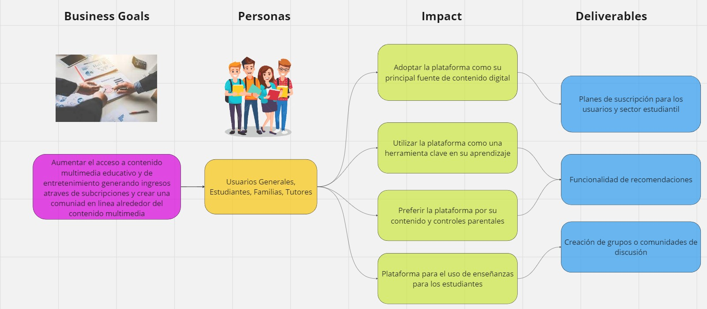

## 3.4. Product Backlog.

| #Orden | User Story ID | Titulo  | Descripción | Story Points (1/2/3/5/8) |
| ------ | ------------- | -------------------------------------------- | ----------------------------------------------------------------------------------------------------------------------- | ------------------------|
| 1 | HU01 | Acceso a contenido básico  | "Como usuario con suscripción básica, deseo tener acceso a una selección limitada de contenidos multimedia." | 2 |
| 2 | HU02 | Publicidad a cambio de premium               | "Como usuario de suscripción básica, deseo la opción de ver o escuchar anuncios a cambio de acceso ocasional a contenido premium." | 3 |
| 3 | HU03 | Crear listas de reproducción personalizadas | "Como usuario, deseo crear listas de reproducción personalizadas para organizar mis contenidos favoritos."              | 3 |
| 4 | HU04 | Acceder a comunidades                        | "Como usuario con suscripción estándar o premium, deseo acceder a comunidades y grupos de discusión."                   | 4 |
| 5 | HU05 | Recibir recomendaciones personalizadas      | "Como usuario, deseo recibir recomendaciones basadas en mi historial de consumo."                                       | 5 |
| 6 | HU06 | Descargar contenido para consumo sin conexión | "Como usuario premium, deseo descargar contenido para consumirlo sin conexión a internet."                              | 4 |
| 7 | HU07 | Participar en eventos en vivo               | "Como usuario premium, deseo participar en eventos en vivo con creadores de contenido."                                 | 4 |
| 8 | HU08 | Beneficios de suscripción para estudiantes  | "Como estudiante, deseo acceder a un descuento en la suscripción estándar o premium."                                   | 3 |
| 9 | HU09 | Herramientas de estudio integradas          | "Como usuario estudiante, deseo herramientas de estudio integradas en la plataforma."                                   | 4 |
| 10 | HU10 | Metodos de pagos  | Como usuario , deseo tener múltiples opciones de métodos de pago para gestionar fácilmente mi suscripción personal, permitiéndome mantener el control total sobre mis gastos y preferencias de pago." | 3 |
| 11 | HU11 | Listas de reproducción            | "Como usuario, deseo crear listas de reproducción que reflejen mis gustos persoanles , para disfrutar sin la necesidad de tener que buscar denuevo el nombre en la navegacion."   | 2 |
| 12 | HU12 | Explorar contenido premium ocasionalmente   | "Como usuario de suscripción básica, deseo la opción de explorar contenido premium ocasionalmente."                     | 3 |
| 13 | HU13 | Crear grupos de estudio virtuales           | "Como estudiante, deseo la capacidad de formar grupos de estudio virtuales con otros usuarios."                         | 4 |
| 14 | HU14 | Acceso a las suscripciones                 | "Como usuario interesado, deseo conocer los detalles de las diferentes suscripciones para elegir la que mejor se ajuste a mis necesidades." | 2  |
| 15 | HU15 | Descubrir servicios           | "Como usuario, deseo descubrir los servicios  que ofrecen la plataforma para maximizar mi experiencia." | 3   |
| 16 | HU16| Conocer autores de la pagina               | "Como usuario curioso, deseo conocer más sobre los creadores y el equipo detrás de la plataforma para sentir una conexión más personal con el servicio." | 3 | 
| 17 | HU17 | Informacion de contacto                    | "Como usuario, deseo tener acceso fácil a opciones de contacto para resolver dudas o gestionar problemas rápidamente." | 2         |
| 18 | HU18 | Registro de usuario                | "Como potencial usuario, deseo registrarme en la plataforma para crear mi perfil y acceder a los servicios ofrecidos."          | 3 | 
| 19 | HU19 | Añadir tarjeta de crédito          | "Como usuario, deseo añadir mi tarjeta de crédito para gestionar mis pagos y suscripciones de manera eficiente."                | 2 | 
| 20 | HU20 | Opción de recuperar contraseña     | "Como usuario, deseo tener la opción de recuperar mi contraseña olvidada para poder acceder nuevamente a mi cuenta."             | 3 | 
| 21 | HU21 | Acceso al material de biblioteca   | "Como usuario, deseo acceder a materiales de la biblioteca para aprovechar los recursos educativos y de entretenimiento."        | 4 | 
| 22 | HU22 | Acceso a multimedia y podcasts     | "Como usuario, deseo acceder a contenido multimedia y podcasts para disfrutar de una variedad de formatos de entretenimiento."   | 3 | 
| 23 | HU23 | Registrar nuevo contenido en la biblioteca multimedia | "Como administrador del sistema, deseo poder registrar nuevo contenido multimedia y podcasts en la biblioteca para mantenerla actualizada y ofrecer una amplia variedad de opciones a los usuarios." | 4 |
| 24 | HU24 | Obtener datos de la biblioteca multimedia y podcasts     | "Como usuario de la plataforma, deseo poder buscar y obtener información detallada sobre el contenido disponible en la biblioteca multimedia y podcasts para encontrar fácilmente lo que me interesa." | 3 |
| 25 | HU25 | Configuración inicial del servidor backend | "Como administrador del sistema, necesito realizar la configuración inicial del servidor backend para garantizar un entorno de ejecución estable y seguro para la aplicación web." | 4 |
| 26 | HU26 | Integración de base de datos | "Como desarrollador de backend, debo integrar la base de datos con el servidor para almacenar y gestionar los datos de la aplicación web de manera eficiente." | 5 |
| 27 | HU27 | Configuración de logging y monitoreo | "Como administrador del sistema, debo configurar sistemas de logging y monitoreo para supervisar el rendimiento y el estado del servidor backend y detectar y solucionar problemas de manera proactiva." | 4 |
|28| HU28 | Configuración del entorno del frontend para la integración con el backend | "Como administrador del sistema, debo configurar configurar el archivo de environment del frontend para asegurar las solicitudes API  del backend." |  5|
|29| HU29 | Actualización del perfil del usuario con conexión backend-frontend | "Actualizar la funcionalidad de edición de perfil en el frontend y backend, asegurando sincronización de datos con la base de datos." | 3 |
|30| HU30 | Configuración de propiedades de la aplicación en el backend | "Configurar las propiedades de la aplicación en el backend implementando los tokens de seguridad." | 4 |
|31 | HU31 | Gestión de habilidades de usuario | "Implementar la funcionalidad obtener todas los registros de usuario en el frontend y backend." |  4 |
# Capítulo IV: Product Design
## 4.1. Style Guidelines.
### 4.1.1. General Style Guidelines.
Un "Style Guideline" es un conjunto de reglas para escribir y diseñar cosas como documentos, páginas web y más. Incluye cosas como gramática, cómo se ven las palabras y las imágenes, y cómo se organizan las cosas.

**Branding**:
- **Brand Overview**:
NexaLibrary es una plataforma líder en la industria de bibliotecas digitales, comprometida en proporcionar acceso fácil y conveniente a una amplia gama de contenido multimedia de alta calidad. Con una interfaz intuitiva y funciones innovadoras, NexaLibrary se esfuerza por ofrecer una experiencia de usuario excepcional que satisfaga las necesidades y expectativas de sus usuarios.
Con una extensa colección de libros electrónicos, audiolibros, música y podcasts, NexaLibrary se posiciona como la elección preferida para aquellos que buscan explorar, descubrir y disfrutar de contenido multimedia en línea. Además, NexaLibrary se distingue por su enfoque en la personalización y la comunidad, ofreciendo características como recomendaciones personalizadas, listas de reproducción curadas y comunidades de usuarios para fomentar la interacción y el compromiso.
- **Misión**:
Conectar a las personas con el contenido que aman, promoviendo la educación, el aprendizaje continuo, el enriquecimiento personal y la reducción del estrés.
- **Visión**: MediaVerse se desea convertirse en la plataforma líder en la entrega de contenido multimedia personalizado, transformando la manera en que las personas exploran, descubren y se conectan con el contenido digital y entre sí. MediaVerse aspira a ser el puente entre el vasto mundo del contenido digital y las preferencias únicas de cada usuario, ofreciendo una experiencia inmersiva y enriquecedora que va más allá de la simple consumición de contenido.        
  
  
- **Brand Name**: El nombre "MediaVerse" se nos ocurrieron al formar 2 palabras "Medios"(Media) y "Universo"(Verse). La palabra Media nos referimos a la gran variedad de medios de comunicación y contenido. Y la palabra Verse nos idealizamos eem que se trata un extenso y expansivo mundo del contenido digital, dando entender que MediaVerse tiene como objetivo abarcar todo este universo de medios digitales.                                
  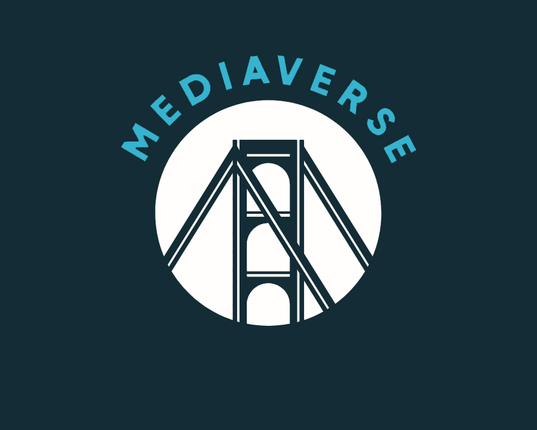
- **Colores**:Los colores toman un papel muy importante para la plataforma al momento de hablar sobre captar la atención y dar comodidad a los usuarios, es alli lo que buscábamos un color específico en el que transmita paz y calma para combinar con nuestros contenidos, el azul, que es bien indicado por los expertos para enfrentar al insomnio o estrés de los estudiantes.
- Primary Colors:                                                             
    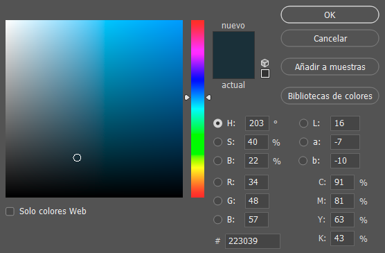
    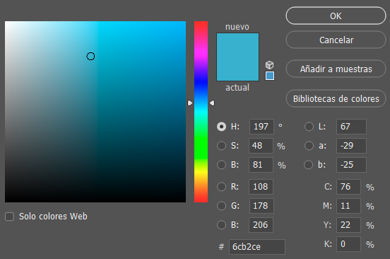
    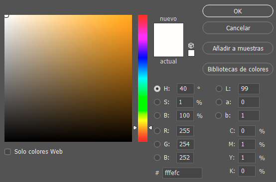
- Secondary Colors:                                                             
    
    
    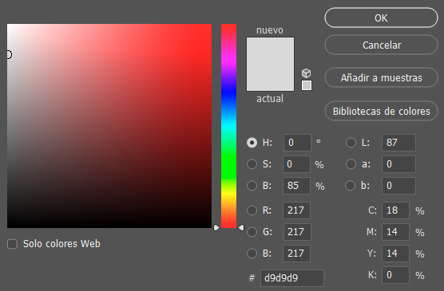
    
- Wireframe Colors:                                                                             
    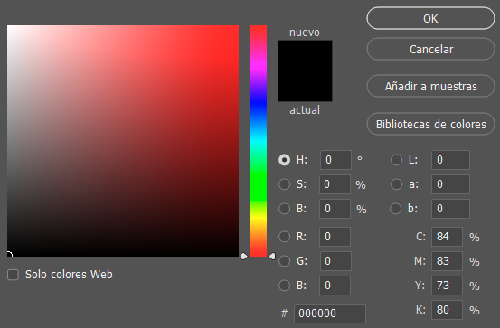
    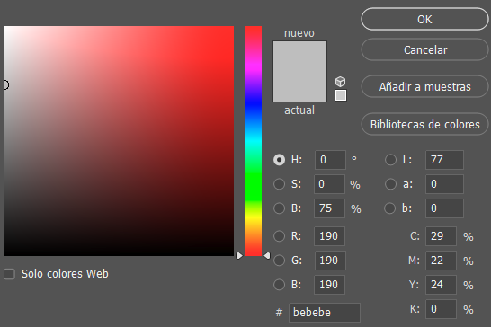
    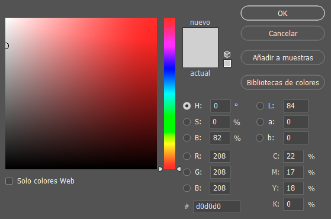
    
    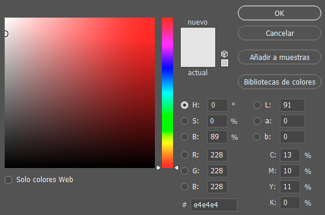
    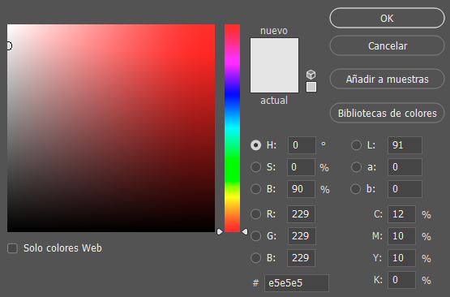
    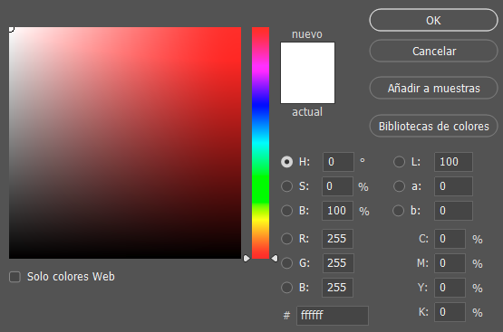
- Text Colors:                                                         
    
    
- Tipografía:
  La tipografía representa el orden y jerarquía. Toma un cumplimiento muy importante para la perspectiva de los usuarios al navegar por la interfaz. El tipo de letra de nuestro proyecto es "Andada Pro"
### 4.1.2. Web Style Guidelines.
El panorama de "MediaVerse" en la perspectiva de la aplicación web es de sencillez, facilidad y comodidad para los ususarios realizar sus navegaciones. Para llenar los procedimientos, procesos y las planillas, están siendo mostrado como formularios que se visualiza en la perspectiva del ususario.
* **Tarjetas:** Solamente usamos el "card" para incluir titulos, subtitulos, información y vinculación para más información.
* **Imágenes:** Aqui se incluyen imágenes decorativas, descriptivas con sus respectivo objetivo de significado. Incluso las imagenes como las fotos personales de los usuarios que se mostrarían despies de ingresar sesión en la parte superior y derecha.
* **Botones:** Solamente se utilizan los botones de acuerdo al General Style Guidelines. Para aplicaciones web, muchas veces se encuentran en la parte inferior de la sección principal de la pantalla. Los botones es importante para los usuarios, ya que al seleccionar esos botones, genera nuevos procesos que toma nuevamente para registrar, términos y políticas.
* **Tablas:** Las tablas toman los colores diferentes de la aplicación, celeste y azul oscuro.
* **Pantallas Emergentes:** Estos avisos están diseñadas para confirmar acciones críticas para el negocio y con un gran impacto en su funcionamiento. Se destacan por colores más vibrantes que el resto de la aplicación web y oscurecen la pantalla para generar contraste. Este efecto busca resaltar la importancia de abordar el asunto antes de continuar navegando en la aplicación.

### 4.1.2. Mobile Style Guidelines.
La experiencia de "MediaVerse" en dispositivos móviles se enfoca en la simplicidad, la facilidad y la comodidad para que los usuarios realicen sus navegaciones. Los procedimientos, procesos y formularios se presentan de manera clara y accesible en la pantalla del celular.
* **Tarjetas:** En las tarjetas se organizan utilizando el componente "card". Estas tarjetas presentan un título, un subtítulo, un párrafo descriptivo y proporcionan un enlace para acceder a más información.
* **Imágenes:** Aqui se incluyen imágenes decorativas, descriptivas con sus respectivo objetivo de significado. Incluso las imagenes como las fotos personales de los usuarios que se mostrarían despies de ingresar sesión en la parte superior y derecha.
* **Botones:** Solamente se utilizan los botones de acuerdo al General Style Guidelines. Para aplicaciones web, muchas veces se encuentran en la parte inferior de la sección principal de la pantalla. Los botones es importante para los usuarios, ya que al seleccionar esos botones, genera nuevos procesos que toma nuevamente para registrar, términos y políticas.
* **Tablas:** Las tablas toman los colores diferentes de la aplicación, celeste y azul oscuro.
* **Pantallas Emergentes:** Estos avisos están diseñadas para confirmar acciones críticas para el negocio y con un gran impacto en su funcionamiento. Se destacan por colores más vibrantes que el resto de la aplicación web y oscurecen la pantalla para generar contraste. Este efecto busca resaltar la importancia de abordar el asunto antes de continuar navegando en la aplicación.

## 4.2. Information Architecture.
La estructura de MediaVerse está diseñada para ofrecer una experiencia fluida y enriquecedora a los usuarios, permitiéndoles explorar y descubrir contenido multimedia de manera intuitiva y personalizada. Desde la página de inicio, los usuarios pueden sumergirse en un vasto universo de medios digitales, navegando a través de diversas categorías como libros electrónicos, audiolibros, música, podcasts y videos.
Cada categoría presenta una amplia gama de opciones, organizadas de manera clara y accesible para facilitar la búsqueda y selección de contenido. Los detalles de cada elemento, incluyendo descripciones, reseñas y opciones de reproducción, se presentan de manera concisa y fácil de entender, brindando a los usuarios la información necesaria para tomar decisiones informadas sobre lo que desean consumir.
### 4.2.1. Organization Systems.
La organización visual de nuestro contenido consta de 3 formas distintas, Hierarchical, Sequential y Matrix. La organización de forma jerárquica puede reflejarse en la organización de archivos y directorios en el repositorio del proyecto, La organización secuencial de la información, podría ayudar a los nuevos colaboradores a familiarizarse con el flujo de trabajo del proyecto y a contribuir de manera efectiva, y por último, La organización matricial, puede permitir a los usuarios explorar el proyecto según sus preferencias de navegación.
### 4.2.2. Labeling Systems.
Las partes de arriba (los encabezados) siempre se va a encontrar en las pantallas, se mantiene el "Services", "Pricing", "About us", "iniciar sesión" y "registrarse" para los ususarios. Además de imágenes, los paneles de controles que están asociadas con labels que informan al usuario del contenido que puede visualizar si llegan a acceder a los mencionados. También mencionar que todas las tarjetas que se ve en esa presentación cuentan con sus respectivos títulos. En "about us" se muestra más detallado en todos mencionados.

### 4.2.3. SEO Tags and Meta Tags
Las metas etiquetas nos facilitan en el análisis de los archivos HTML. Es decir, posiciona nuestro página web en los navegadores webs y muestra de manera llamativa con información breve de la plataforma a los usuarios que aún no entraron.
Las metas etiquetas que usaremos son:
* Titulo: Esa etiqueta es la cabeza principal técnicamente ya que se pone primero antes dque cualquier metaetiqueta, es decir, sería leida por todos los motores de búsqueda (SERP) como encabezado.                                                                                
  ```<title> Register your processes with MediaVerse </title> ```
* Codificación de carácteres: Esta etiqueta básicamente solo mostrará de manera correcta los carácteres especiales en la plataforma.                    
  ```<meta charset="utf-8"> ```
* Descripcion: En esa meta etiqueta sirve para llamar la atención a los usuarios con u resumen de lo que se trata la página web. Solamente un pequeño información sobre cómo sería la perspectiva dentro de la plataforma.                                    
  ```<meta name = "description" content = "MediaVerse is a web application focused so that users can browse and have the multimedia they want to reduce their stress."/> ```
* Palabras Clave: En esa etiqueta solamente se pone palabras claves con el que tiene que ver con la página web.                    
  ```<meta name = "keyword" content = "Music, Library, songs, media, video, stress"/> ```
* Autor y Derechos de Autor: Básicamente se usa para registrar y mostrar información del autor original y sus derechos de autor.                
  ```<meta name="author" content="NexaLibery"/>``` ```<meta name="copyright" content="Copyright NexaLibery team" />```

### 4.2.4. Searching Systems.

Los usuarios podrán encontrar todo el contenido que necesiten saber sobre nuestra plataforma por medio de un menu que se presentará en la pagina principal del sitio web, despues de haberse registrado y/o iniciado sesion, podrán encontrar opciones de filtrado por categorias para los temas de su interes, podrán ingresar a material multimedia de su preferencia y de igual modo podrán cambiar informacion o editar su perfil de cuenta. Dentro de cada material seleccionado, podrán visualizar, autor, comentarios y valoracion por estrellas o puntuacion, realizados por el publico.

### 4.2.5. Navigation Systems.

El sistema de navegacion de nuestro sitio web consta de menus de navegacion, en los cuales el usuario elegir entre diferentes opciones como: iniciar sesion, registrarse, leer sobre el equipo de desarrollo y las diferentes suscripciones que le ofrecemos a los usuarios. De la misma manera podrá desplazarse verticalmente y poder visualizar la informacion dentro de los menus. Luego de haber iniciado sesion/registrarse, el usuario tendrá acceso a la seccion de los caracteres de su interes, como pueden ser ciertos temas de programacion, lecturas, videos, etc. Cada opcion permitirá que el usuario pueda visualizar archivos multimedia sobre el tema elegido. Todas las interfaces son sencilla, para un mayor entendimiento de nuestros usuarios y no complicarles el recorrido por nuestra plataforma.

## 4.3. Landing Page UI Design.
### 4.3.1. Landing Page Wireframe.


<https://www.figma.com/file/jnpsfeSHPNGP0YjRKdvbLH/NexaLibery?type=design&node-id=0%3A1&mode=design&t=XxmpBXkzUHrLgWYU-1>
### 4.3.2. Landing Page Mock-up.


<https://www.figma.com/file/jnpsfeSHPNGP0YjRKdvbLH/NexaLibery?type=design&node-id=0%3A1&mode=design&t=XxmpBXkzUHrLgWYU-1>
## 4.4. Web Applications UX/UI Design.
### 4.4.1. Web Applications Wireframes.


<https://www.figma.com/file/jnpsfeSHPNGP0YjRKdvbLH/NexaLibery?type=design&node-id=0%3A1&mode=design&t=XxmpBXkzUHrLgWYU-1>

### 4.4.2. Web Applications Wireflow Diagrams.


### 4.4.2. Web Applications Mock-ups.


### 4.4.3. Web Applications User Flow Diagrams.


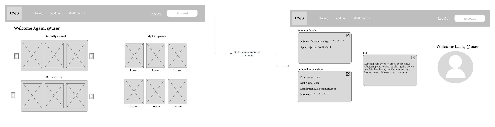

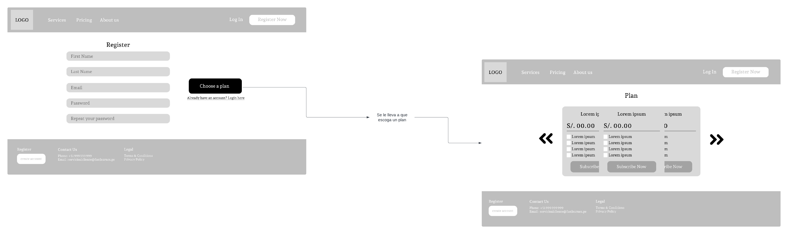

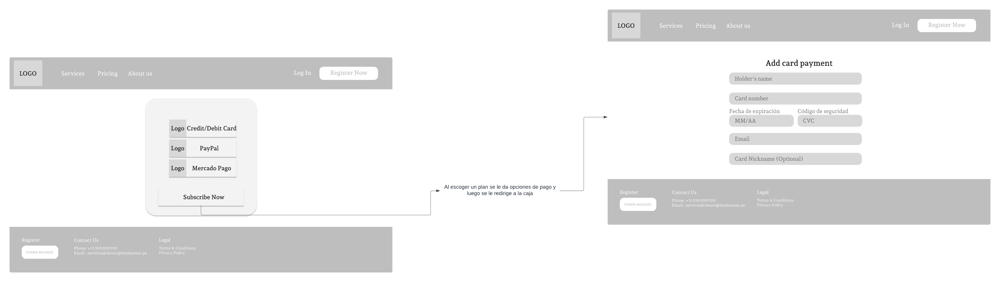

## 4.5. Web Applications Prototyping.
[URL del Prototipo](https://www.figma.com/proto/DQZF3nJxK7cw7GN6apwKpf/Untitled?type=design&node-id=4-2&t=QfKgCRHjJFZCpUX2-8&scaling=contain&page-id=0%3A1&starting-point-node-id=4%3A2&hide-ui=1)

## 4.6. Domain-Driven Software Architecture.
### 4.6.1. Software Architecture Context Diagram.
1. System Context Diagram: Diagrama que muestra la relacion del aplicativo con los usuarios
se incluyen servicios externos (si hay pocos bounded context se incluyen ahi)
 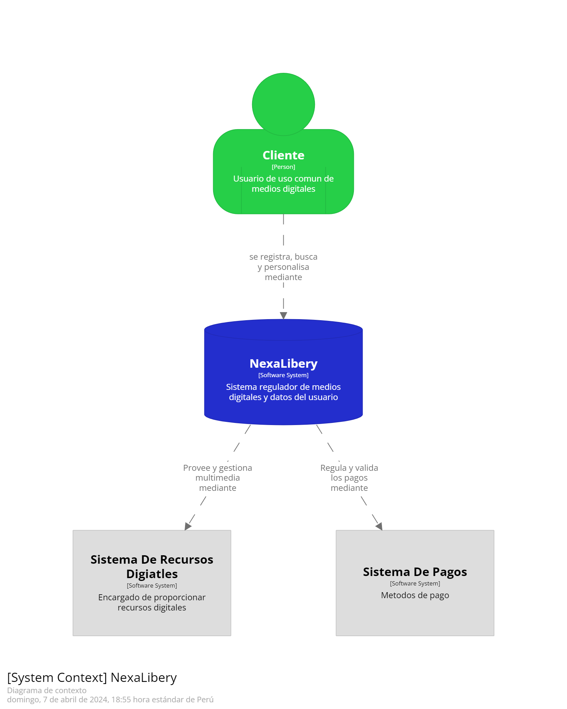
### 4.6.2. Software Architecture Container Diagrams.
1. Bounded Context Deployable / Container Diagrams. Sirve para entender como funciona y el proceso, Se especifican DB's, indexers, Search engine, las Apis que usen los bounded context y se conectan por flechas, las cuales tienen como objetivo explicar la direcion y relacion junto a que se esta enviando/comunicando (TCP) 
 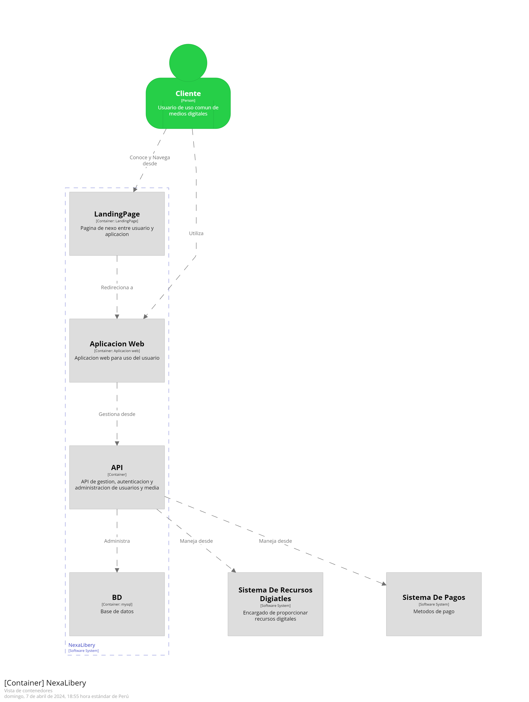
### 4.6.3. Software Architecture Components Diagrams.
1. Component diagrams: Estos van a mostrar las ordenes, procesos, mensajes y componentes utilizados en el uso del aplicativo, claro se deben hacer diferentes de estos para cada bounded o USER GOALS
 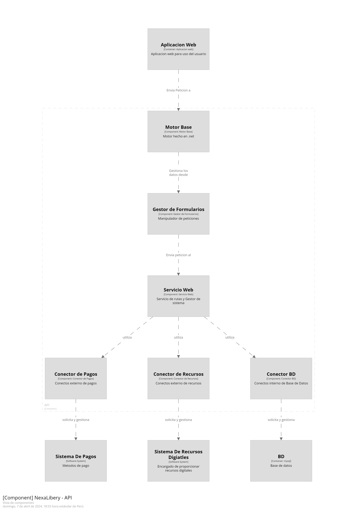
   
## 4.7. Software Object-Oriented Design.
### 4.7.1. Class Diagrams.


### 4.7.2. Class Dictionary.
## 1. User
**Descripción**: Representa a cada persona que se registra y utiliza la plataforma. Incluye información personal básica, así como detalles de su cuenta como el email y contraseña.

| Atributo           | Tipo de Dato | Descripción                                          |
|--------------------|--------------|------------------------------------------------------|
| userID             | INT (PK)     | Identificador único para cada usuario.               |
| name               | VARCHAR      | Nombre completo del usuario.                         |
| email              | VARCHAR      | Dirección de correo electrónico del usuario.         |
| password           | VARCHAR      | Contraseña de acceso del usuario.                    |
| bornhDate          | DATE         | Fecha de nacimiento del usuario.                     |
| registrationDate    | DATETIME     | Fecha en la que el usuario se registró en la plataforma. |

## 2. subscriptions
**Descripción**: Gestiona las suscripciones de los usuarios a la plataforma. Cada suscripción está vinculada a un usuario y un tipo de suscripción, y tiene un período de validez.

| Atributo           | Tipo de Dato  | Descripción                                             |
|--------------------|---------------|---------------------------------------------------------|
| subcriptionID      | INT (PK)      | Identificador único de cada suscripción.                |
| subcriptiontypeID  | INT (FK)      | Clave foránea que enlaza al tipo de suscripción elegido.|
| userID             | INT (FK)      | Clave foránea que enlaza al usuario suscrito.           |
| startdate          | DATE          | Fecha de inicio de la suscripción.                      |
| enddate            | DATE          | Fecha de fin de la suscripción.                         |

## 3. subcriptionType
**Descripción**: Define los diferentes planes o tipos de suscripción que los usuarios pueden adquirir. Esto puede incluir diferentes niveles de acceso a contenidos, precios, y beneficios.

| Atributo           | Tipo de Dato | Descripción                                          |
|--------------------|--------------|------------------------------------------------------|
| subcriptiontypeID  | INT (PK)     | Identificador único para cada tipo de suscripción.   |
| name               | VARCHAR      | Nombre del tipo de suscripción (ej. Básica, Premium).|
| monthlyprice       | DECIMAL      | Costo mensual de la suscripción.                     |
| description        | VARCHAR      | Descripción breve de lo que incluye la suscripción.  |

## 4. MultimediaContent
**Descripción**: Gestiona el contenido multimedia disponible en la plataforma, categorizado por tipo y accesibilidad.

| Atributo           | Tipo de Dato | Descripción                                          |
|--------------------|--------------|------------------------------------------------------|
| contentID          | INT (PK)     | Identificador único de cada contenido multimedia.    |
| authorID           | INT (FK)     | Identificador único de cada autor.            |
| titule             | VARCHAR      | Título del contenido.                                |
| type               | VARCHAR      | Categoría del contenido (ej. Libro electrónico).     |
| description        | VARCHAR      | Breve descripción del contenido.                     |
| premiun            | BOOLEAN      | Indica si el contenido es exclusivo para suscriptores premium. |
| URL                | VARCHAR      | Dirección URL donde se encuentra alojado el contenido. |

## 5. Authors
**Descripción**: Contiene información sobre los autores de los contenidos disponibles en la plataforma.

| Atributo           | Tipo de Dato | Descripción                                   |
|--------------------|--------------|-----------------------------------------------|
| authorID           | INT (PK)     | Identificador único de cada autor.            |
| name               | VARCHAR      | Nombre completo del autor.                    |
| description        | VARCHAR      | Breve biografía del autor.                    |

## 6. playList
**Descripción**: Permite a los usuarios crear y gestionar listas personalizadas de contenidos multimedia.

| Atributo           | Tipo de Dato | Descripción                                        |
|--------------------|--------------|----------------------------------------------------|
| listID             | INT (PK)     | Identificador único de cada lista de reproducción. |
| userID             | INT (FK)     | Clave foránea que enlaza al usuario creador.       |
| name               | VARCHAR      | Nombre de la lista de reproducción.                |
| description        | VARCHAR      | Descripción breve de la lista.                     |
| createddate        | DATETIME     | Fecha en que la lista fue creada.                  |

## 7. community
**Descripción**: Facilita la creación y gestión de comunidades dentro de la plataforma para fomentar la interacción entre usuarios.

| Atributo           | Tipo de Dato | Descripción                                 |
|--------------------|--------------|---------------------------------------------|
| communityID        | INT (PK)     | Identificador único de cada comunidad.      |
| name               | VARCHAR      | Nombre de la comunidad.                     |
| description        | VARCHAR      | Descripción breve de la comunidad.          |
| createdate         | DATETIME     | Fecha en que la comunidad fue creada.       |

## 8. communityMembers
**Descripción**: Gestiona la membresía de usuarios en las comunidades, incluyendo la cantidad de usuarios por comunidad.

| Atributo           | Tipo de Dato | Descripción                                       |
|--------------------|--------------|---------------------------------------------------|
| memberID           | INT (PK)     | Identificador único de cada miembro de comunidad. |
| communityID        | INT (FK)     | Clave foránea que enlaza a la comunidad.          |
| userID             | INT (FK)     | Clave foránea que enlaza al usuario miembro.      |
| amount             | INT          | Cantidad de usuarios de comunidades.              |

## 9. studentProfile
**Descripción**: Asocia a los usuarios con sus respectivas instituciones educativas, posibilitando ofertas o contenidos exclusivos para estudiantes.

| Atributo              | Tipo de Dato | Descripción                                            |
|-----------------------|--------------|--------------------------------------------------------|
| PerfilEstudianteID    | INT (PK)     | Identificador único del perfil de estudiante.         |
| userID                | INT (FK)     | Clave foránea que enlaza al usuario con estatus de estudiante. |
| institute             | VARCHAR      | Nombre de la institución educativa del estudiante.    |

## 10. history
**Descripción**: Registra cada vez que un usuario accede a un contenido, permitiendo seguimiento de lo que los usuarios ven o escuchan en la plataforma.

| Atributo       | Tipo de Dato | Descripción                                                    |
|----------------|--------------|----------------------------------------------------------------|
| historyID      | INT (PK)     | Identificador único del historial de acceso a contenidos.      |
| userID         | INT (FK)     | Clave foránea que enlaza al usuario.                           |
| contentID      | INT (FK)     | Clave foránea que enlaza al contenido accedido.                |
| accessdate     | DATETIME     | Fecha y hora en que el contenido fue accedido.                 |

## 11. valorizations
**Descripción**: Permite a los usuarios valorar y comentar sobre los contenidos que consumen, ofreciendo feedback y recomendaciones a otros usuarios.

| Atributo         | Tipo de Dato | Descripción                                                     |
|------------------|--------------|-----------------------------------------------------------------|
| valorizationID   | INT (PK)     | Identificador único de cada valoración.                         |
| contentID        | INT (FK)     | Clave foránea que enlaza al contenido valorado.                 |
| userID           | INT (FK)     | Clave foránea que enlaza al usuario que realiza la valoración.  |
| score            | INT          | Puntuación otorgada al contenido.                               |
| comment          | VARCHAR      | Comentario sobre el contenido.                                  |
| valorizationdate | DATE         | Fecha en que se realizó la valoración.                          |


## 4.8. Database Design.
### 4.8.1. Database Diagram.
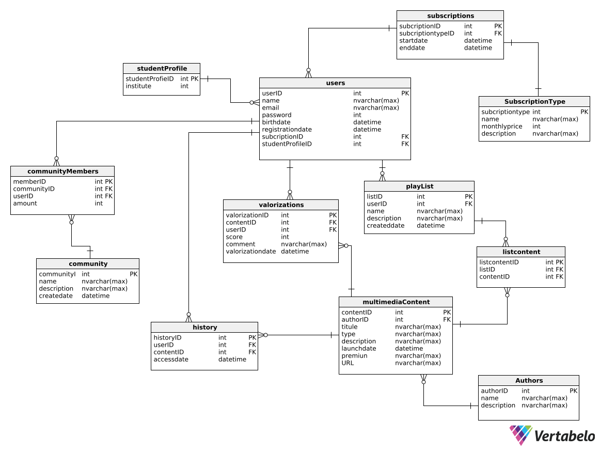

# Capítulo V: Product Implementation, Validation & Deployment
## 5.1. Software Configuration Management.
### 5.1.1. Software Development Environment Configuration.

## Requirements Management
1. Figma: Figma es una herramienta de diseño, la cual la implementamos para llevar a cabo el prototipado de nuestra landing page y coordinar el desarrollo de la misma, de igual manera para nuestra plataforma final, tanto en movil como en web. Ruta de referencia: <https://www.figma.com/files/recents-and-sharing?fuid=1157140311282758154>
2. Canva: Canva es una plataforma que usamos para el diseño de los user persona para ambos segmentos detectados en nuestro publico y tambien fue usado para los Empathy Map para los mismos. Ruta de referencia: <https://www.canva.com/>

## Software Development
1. WebStorm: IDE desarrollado por JetBrain, creado para la elaboracion y compilacion de los codigos, esto lo empleamos para el desarrollo de nuestra Landing Page y de igual manera lo usaremos para el desarrollo de la plataforma.
2. HTML5: HTML5 o tambien HyperText Markup Language, es un lenguaje de etiquetado empleado en paginas webs y será usado por nuestro equipo durante el proceso de nuestro proyecto.
3. CSS: Cascading Style Sheets, es un lenguaje de programacion para el manejo y estetica de la pagina web, de igual manera será empleado durante todo el transcurso del proyecto.

## Software Deployment
1. Git: Control de versiones, el cual nos facilita el desarrollo del proyecto, ya que podemos ver el avance y participacion de los participantes del proyecto.

## Software Documentation and Project Management
1. Github: Plataforma en la cual hemos alojado nuestro proyecto por su dinamica y facil colaboracion entre colaboradores.

### 5.1.2. Source Code Management.
Nuestro proyecto mantiene las convenciones de flujo implementadas por el modelo GitFlow para el control de versiones en GitHub como plataforma. Compartiremos nuestras URLs de nuestra Landing Page y seguiremos implementando nuestros proximos productos.

## Repositorio de Github:
URL para acceder a nuestra organizacion de GitHub <https://github.com/AplicacionesWeb-SW56> <br>
URL para acceder a nuestra Landing Page <https://github.com/AplicacionesWeb-SW56/NexaLibery-landingPage>

### 5.1.3. Source Code Style Guide & Conventions.

**Lenguaje de Programación y Documentación:**
Los informes y documentación técnica se elaborarán en español para facilitar la comprensión dentro del equipo.
En cambio, los identificadores como nombres de archivos, clases, métodos, variables y constantes en HTML, CSS, JavaScript, TypeScript y Java se nombrarán en inglés. Esta práctica apunta a mantener una coherencia con las normas internacionales de programación.

**Estructura de Código:**
Utilizaremos inglés para los nombres de clases y métodos, empleando camelCase o snake_case según corresponda al lenguaje de programación utilizado. Esto ayudará a mantener un código limpio y fácilmente legible.

**Documentación Interna del Código:**
Los comentarios dentro del código serán en español, buscando ofrecer explicaciones claras y breves de las funciones y lógica utilizadas. Esto permitirá a cualquier miembro del equipo entender rápidamente el propósito de los bloques de código específicos.

### 5.1.4. Software Deployment Configuration.
Implementamos la publicación de nuestra página web utilizando GitHub Pages, una herramienta que ofrece hospedaje gratuito para sitios estáticos. A continuación se describe el procedimiento que seguimos para realizar el despliegue:

1. Accedimos a la sección 'Settings' del repositorio de nuestra landing page y, desde allí, nos dirigimos a 'Pages'.
2. Elegimos la rama del repositorio donde se encuentra el código de nuestro sitio y aplicamos los cambios necesarios para 
 activar el servicio.
3. Tras finalizar el proceso de configuración, GitHub Pages procesó y desplegó nuestra página, proporcionándonos una URL específica para acceder a ella.
   
## 5.2. Landing Page, Services & Applications Implementation.
### 5.2.1. Sprint 1
#### 5.2.1.1. Sprint Planning 1.
Dentro del marco de trabajo Scrum, un Sprint representa un período de tiempo definido y limitado en el que un equipo se dedica a completar todas las tareas necesarias para alcanzar el objetivo final del proyecto. En el caso del desarrollo de la aplicación MediaVerse, se optó por dividir el proyecto en tres sprints, cada uno con una duración de dieciocho días. El Sprint #1, que comienza el 21/03/2024, tiene como objetivo principal la creación de una página de inicio atractiva para MediaVerse, destinada a captar la atención de los usuarios y comunicar claramente los beneficios del producto.

| Sprint # | Date       | Time  | Location        | Prepared By | Attendees |
|----------|------------|-------|-----------------|-------------|-----------|
| 1        | 21/03/2024 | 5:00pm| Reunión virtual a través de Discord | Raúl Quispe | Loli Ruiz, Renzo Javier; Quispe Erasmo, Raúl Ronaldo; Ramirez Ramirez, Marcelo Sebastian; Javier Murillo, Mathias; Leon Rioja Carlos Andres |

| Sprint 1 Goal                                        | Sprint 1 Velocity | Sum of Story Points |
|------------------------------------------------------|-------------------|---------------------|
| Elaborar y crear la página MediaVerse con HTML y CSS |      13           |      40             |

#### 5.2.1.2. Sprint Backlog 1.
# Sprint 1
| User Story |                | Work-Item/Task |                                |                                              |            |                          |        |
|------------|----------------|-------------   |--------------------------------|----------------------------------------------|----------- |--------------------------|--------|
| ID         | Title          | ID             | Title                          | Description                                  | Estimation | Assigned To              | Status(To-do/In-Process/To-Review/Done) |
| HU16       | Acceso a las suscripciones | W101 | Desarrollo de la sección Suscripciones | "Desarrollo del código base HTML para detallar las diferentes opciones de suscripción disponibles." | 8 horas | Renzo Javier Loli Ruiz | Done   |
| HU17       | Descubrir servicios | W102 | Desarrollo de la sección Servicios | "Desarrollo del código base HTML para la sección de Servicios, mostrando los servicios ofrecidos por la plataforma." | 8 horas | Ramirez Ramirez Marcelo Sebastian | Done   |
| HU18       | Conocer autores de la página | W103 | Desarrollo de la sección Equipo | "Mejora del código HTML para incluir información sobre los creadores y el equipo detrás de la plataforma." | 8 horas | Leon Rioja Carlos Andres | Done   |
| HU19       | Información de contacto | W104 | Desarrollo de la sección Contacto | "Desarrollo del código base HTML para la sección Contacto, facilitando el acceso a las opciones de comunicación." | 8 horas | Raul Ronaldo Quisper Erasmo | Done   |


#### 5.2.1.3. Development Evidence for Sprint Review.
Se descompuso cada vista del landing page para realizar el trabajo. Estos son los principales commits que ayudan a entender de manera indivirual cada vista.
| Repository                             | Branch                     | Commit ID  | Commit Message             | Committed on(date) |
|----------------------------------------|----------------------------|-----------------------------------------|---------------------------|--------------------|
| NexaLibery-landingPage                 | feature/navbar-footer      | af09715    | Update Navbar_Footer.html  | 05/04/2024         |
| NexaLibery-landingPage                 | feature/home               | d09b222    | Add files via upload       | 07/04/2024         |
| NexaLibery-landingPage                 | feature/home               | 4466239    | Update Home                | 10/04/2024         |
| NexaLibery-landingPage                 | feature/Services           | ce2e91b    | Add files via upload       | 07/04/2024         |
| NexaLibery-landingPage                 | feature/Pricing            | 484f5c0    | Added pricing section      | 09/04/2024         |
| NexaLibery-landingPage                 | feature/About-us           | 8d2dd57    | Add files via upload       | 10/04/2024         |
| NexaLibery-landingPage                 | feature/Development        | 8d2dd57    | Update Development         | 10/04/2024         |
| NexaLibery-landingPage                 | feature/main               | 4debb6f    | Merge branch 'development' | 10/04/2024         |

#### 5.2.1.4. Testing Suite Evidence for Sprint Review.
| Repository                             | Branch                     | Commit ID                                  | Commit Message            | Committed on(date) | 
|----------------------------------------|----------------------------|--------------------------------------------|---------------------------|--------------------| 
|  NexaLibery-landingPage                |  main                      |  4debb6f                                   |  Merge branch 'development |   10/02/24                 | 


#### 5.2.1.5. Execution Evidence for Sprint Review. 
Se hace referencia del link del [Landing Page](https://nexa-libery-landing-page.vercel.app) en funcionamiento.
Luego se referencian las vistas del landing page:

- Home

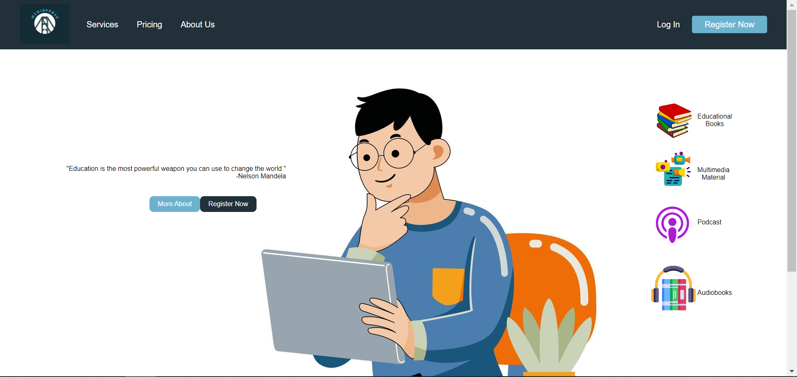 

- Services

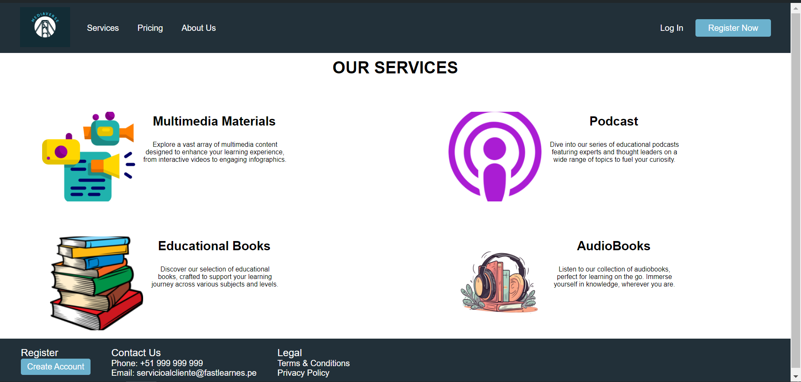 

- Pricing

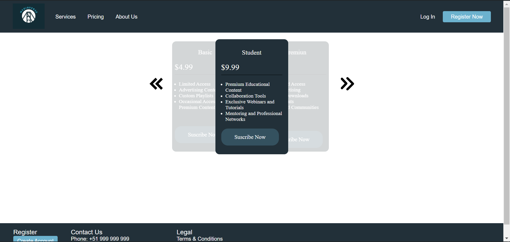 

- AboutUs

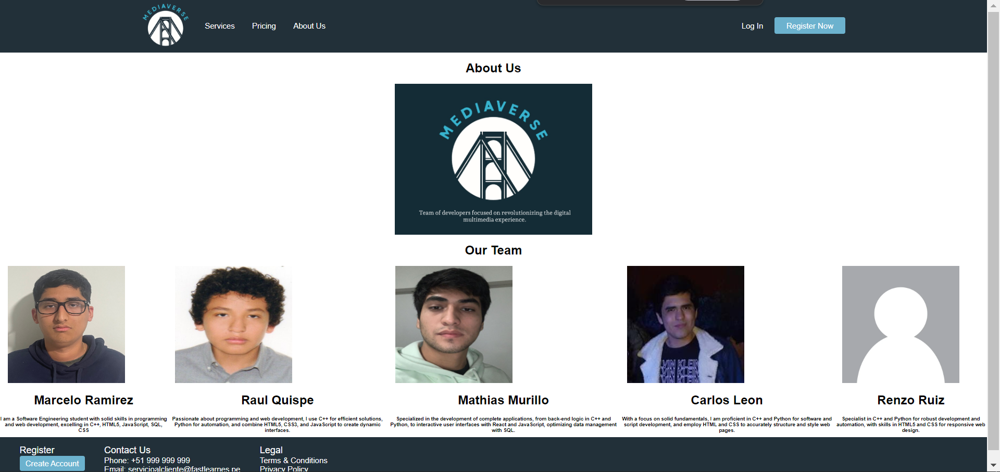 

https://nexa-libery-landing-page.vercel.app/

#### 5.2.1.6. Services Documentation Evidence for Sprint Review.
En este sprint, el equipo de NexaLiberty alcanzó con éxito las metas establecidas. Durante este período, se enfocaron en complementar las tareas previamente propuestas sin la necesidad de añadir nuevas. El proceso se caracterizó por un flujo de trabajo constante y eficiente, demostrando la capacidad del equipo para manejar y ejecutar el proyecto de manera efectiva.

#### 5.2.1.7. Software Deployment Evidence for Sprint Review.
## Herramientas Utilizadas en el Desarrollo y Despliegue de la Landing Page

- **Git**
  - **Uso:** Control de versiones del código fuente.
  - **Beneficio:** Permite la gestión eficiente de las versiones y cambios en el código.

- **GitFlow**
  - **Uso:** Gestión del avance y colaboración del equipo.
  - **Beneficio:** Facilita el seguimiento de las contribuciones individuales y la organización del trabajo en ramas dedicadas.

- **GitHub**
  - **Uso:** Hosting del repositorio del proyecto.
  - **Beneficio:** Centraliza el almacenamiento del código fuente y facilita la colaboración y el control de versiones.

- **Vercel**
  - **Uso:** Despliegue de la página web.
  - **Beneficio:** Ofrece un servicio de despliegue rápido y gratuito, integrado directamente con GitHub, lo que simplifica la publicación de actualizaciones.

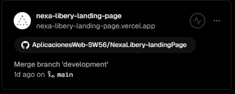 

#### 5.2.1.8. Team Collaboration Insights during Sprint.
| Alumno                           | Actividad                                  |          
|----------------------------------|--------------------------------------------|
|Loli Ruiz, Renzo Javier           | Implementacion de la seccion Pricing       |                                           
|Quispe Erasmo, Raúl Ronaldo       | Implementacion de la seccion NavBar-Footer |    
|Ramirez Ramirez, Marcelo Sebastian| Implementacion de la seccion Service       |    
|Javier Murillo, Mathias           | Implementacion de la seccion Home          |    
|Leon Rioja Carlos Andres          | Implementacion de la seccion About us      |

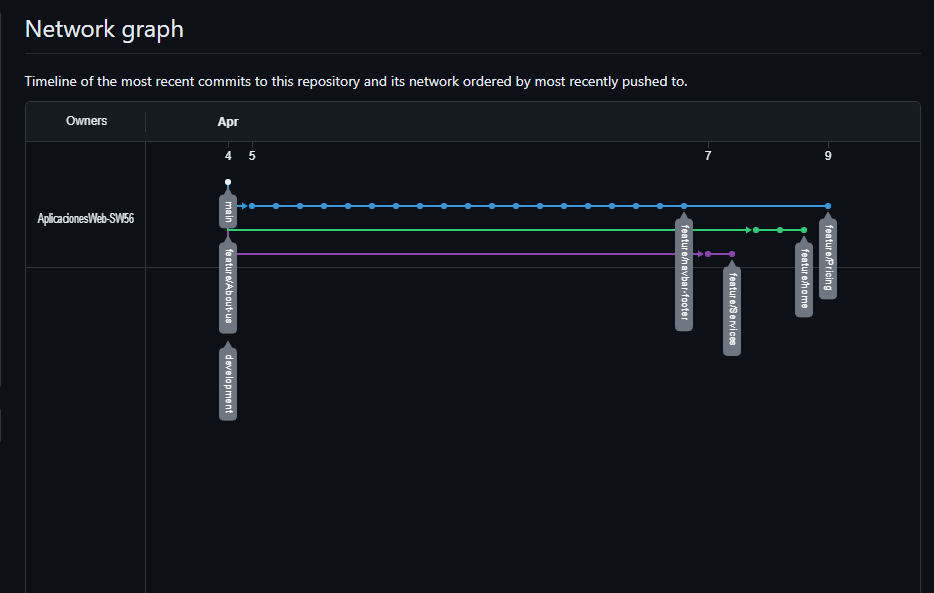 

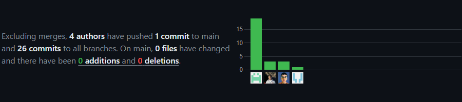 


### 5.2.2. Sprint 2
#### 5.2.2.1. Sprint Planning 2.
Dentro del marco de trabajo Scrum, un Sprint representa un período de tiempo definido y limitado en el que un equipo se dedica a completar todas las tareas necesarias para alcanzar el objetivo final del proyecto. En el caso del desarrollo de la aplicación MediaVerse, se optó por dividir el proyecto en tres sprints, cada uno con una duración de dieciocho días. El Sprint #2, que comienza el 24/04/2024, tiene como objetivo principal la creación de una página de inicio atractiva para MediaVerse, destinada a captar la atención de los usuarios y comunicar claramente los beneficios del producto.

| Sprint #                 | Sprint 2                                                                                       |
|--------------------------|------------------------------------------------------------------------------------------------|
| **Sprint Planning Background**  |                                                                                                 |
| Date                     | 01/05/2024                                                                                    |
| Time                     | 5:00pm                                                                                    |
| Location                 | REUNION VIRTUAL POR DISCORD                                                                    |
| Prepared By              |Loli Ruiz, Renzo Javier; Quispe Erasmo, Raúl Ronaldo; Ramirez Ramirez, Marcelo Sebastian; Javier Murillo, Mathias; Leon Rioja Carlos Andres                                                                  |
| Attendees (to planning meeting) | Loli Ruiz, Renzo Javier; Quispe Erasmo, Raúl Ronaldo; Ramirez Ramirez, Marcelo Sebastian; Javier Murillo, Mathias; Leon Rioja Carlos Andres                   |
| **Pre-Sprint Review Summary**       | Durante el 2 sprint, hemos completado la partes que tendrá el frontend web applications y definimos las herramientas para el desarrollo de esta. También hemos llevado a cabo una serie de reuniones de planificación para unir los componeste y crear nuestra fakeapi. |
| **Initial Sprint  Retrospective Summary** | Para el segundo sprint decidimos corregir algunas cosas de la entrega anterior y pensar bien en la creacion de nuestra frontend web applications.|
| **Sprint Goal & User Stories** |                                                                            |
| Sprint 2 Goal             | El propósito de este Sprint es avanzar en la construcción de nuestra aplicación web de frontend. Nos enfocaremos en ofrecer una experiencia de usuario fluida y comprensible, desarrollando una interfaz amigable y fácil de manejar que facilite la navegación por el sistema. Este sprint se dedicará a implementar una aplicación informativa con un diseño intuitivo. |
| Sprint 2 Velocity        | Para el Sprint 2, hemos estimado una velocidad de 34 Story Points. Esta estimación se basa en las horas laborales disponibles del equipo y en la complejidad y esfuerzo estimados de las historias de usuario seleccionadas para este periodo de desarrollo.|
| Sum of Story Points     | 34 |


#### 5.2.2.2. Sprint Backlog 2.
# Sprint 2
| User Story |                | Work-Item/Task |                                |                                              |            |                          |        |
|------------|----------------|-------------   |--------------------------------|----------------------------------------------|----------- |--------------------------|--------|
| ID         | Title          | ID             | Title                          | Description                                  | Estimation | Assigned To              | Status(To-do/In-Process/To-Review/Done) |
| HU05 | Recibir recomendaciones personalizadas | W102 | Desarrollo de motor de recomendación | "Implementación del algoritmo para generar recomendaciones basadas en el historial de consumo del usuario." | 10 horas | Renzo Javier Loli Ruiz | Done |
| HU08 | Beneficios de suscripción para estudiantes | W103 | Integración con sistema de verificación estudiantil | "Integrar un sistema de verificación de estatus estudiantil para otorgar descuentos." | 7 horas | Javier Murillo Mathias | Done |
| HU09       | Herramientas de estudio integradas | W101 | Desarrollo de la sección Libreria | "Desarrollo del código base HTML para detallar las diferentes libros de estudio y/o interes disponibles." | 8 horas | Javier Murillo Mathias | Done   |
| HU10       | Acceso a las suscripciones | W104 | Desarrollo de la sección Suscripciones | "Desarrollo del código base HTML para detallar las diferentes opciones de suscripción disponibles." | 8 horas | Renzo Javier Loli Ruiz | Done   |
| HU11 | Listas de reproducción | W111 | Implementación de gestión de listas de reproducción | "Desarrollo de funcionalidades para la creación y gestión de listas de reproducción personalizadas." | 8 horas | Quispe Erasmo, Raúl Ronaldo  | To Do |
| HU14 | Crear grupos de estudio virtuales | W112 | Desarrollo de funcionalidades de grupos de estudio | "Implementación de un sistema para crear y administrar grupos de estudio virtuales." | 10 horas | Quispe Erasmo, Raúl Ronaldo | To Do |
| HU18       | Registro de usuario | W105 | Implementación del formulario de registro | "Desarrollo del código para el formulario de registro, incluyendo validaciones de campo para crear el perfil del usuario." | 6 horas | Ramirez Ramirez Marcelo Sebastian | Done |
| HU19       | Añadir tarjeta de crédito | W106 | Desarrollo de la interfaz de tarjeta de crédito | "Implementación de la interfaz para añadir información de tarjeta de crédito en el perfil del usuario." | 5 horas |Renzo Javier Loli Ruiz | To Do |
| HU20       | Opción de recuperar contraseña | W107 | Implementación de recuperación de contraseña | "Desarrollo de la funcionalidad para que los usuarios puedan recuperar su contraseña mediante un enlace enviado a su correo electrónico." | 4 horas | Javier Murillo Mathias | Done |
| HU21       | Acceso al material de biblioteca | W108 | Mejoras en la sección de biblioteca | "Implementación de mejoras en la sección de biblioteca para facilitar el acceso y visualización de materiales." | 5 horas |  Javier Murillo Mathias  | Done |
| HU22       | Acceso a multimedia y podcasts | W109 | Desarrollo de la sección de multimedia | "Implementación de la sección multimedia y podcasts, permitiendo al usuario explorar y reproducir diferentes formatos de contenido." | 7 horas | Leon Rioja Carlos Andres | Done |


#### 5.2.2.3. Development Evidence for Sprint Review.
Se descompuso cada vista del landing page para realizar el trabajo. Estos son los principales commits que ayudan a entender de manera indivirual cada vista.
| Repository                           | Branch                     | Commit ID  | Commit Message             | Committed on(date) |
|--------------------------------------|----------------------------|-----------------------------------------|---------------------------|--------------------|
| NexaLibery-Frontend                  | feature/Library    | 596c044    | Update Library-component.vue  | 25/04/2024 |
| NexaLibery-Frontend                  | feature/LogIn      | 3b69629    |  adding Vue-Project      | 23/04/2024 |
| NexaLibery-Frontend                  | feature/Multimedia | d0a0670    | Update Multimedia-component.vue  | 28/04/2024         |
| NexaLibery-Frontend                  | feature/Podcast    | 0f35c40    | Update Podcast-components.vue      | 26/04/2024         |
| NexaLibery-Frontend                  | feature/addPayment |  b33d311   | Feat: Update addPayment-component.vue     | 28/04/2024         |
| NexaLibery-Frontend                  | feature/menu     | 8d2dd57    | Merge feature/prcing into menu       | 02/05/2024         |
| NexaLibery-Frontend                  | feature/methodsPayment  |  121de8a    | feat: Update methodsPayment-component.vue        | 28/04/2024      |
| NexaLibery-Frontend                  | feature/pricing         | 0130b4d    | feature(menu): added menu component | 28/04/2024         |
| NexaLibery-Frontend                  | feature/register        | 3b69629   | adding Vue-Project | 23/04/2024         |
| NexaLibery-Frontend                  | feature/userProfile      | 1e89482  | Add files via upload | 27/04/2024         |

#### 5.2.2.4. Testing Suite Evidence for Sprint Review.
| Repository                             | Branch                     | Commit ID                                  | Commit Message            | Committed on(date) | 
|----------------------------------------|----------------------------|--------------------------------------------|---------------------------|--------------------| 
|  NexaLibery-Frontend                   |  main                      |   655bed8                                  | Merge branch 'development |   01/05/24         | 


#### 5.2.2.5. Execution Evidence for Sprint Review. 
Se hace referencia del link del [FrontendWebApplication](https://nexa-liberty-frontend.firebaseapp.com/login) en funcionamiento.

- Log-In

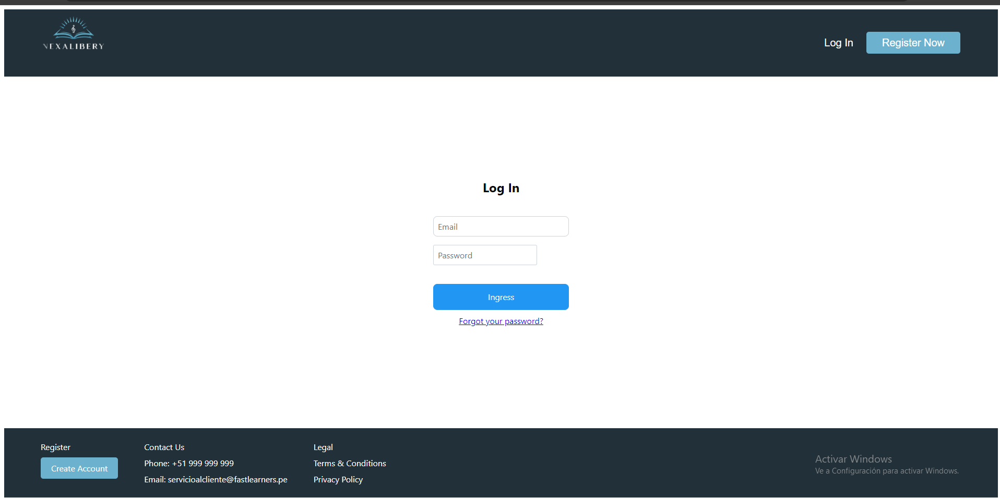 

- Register

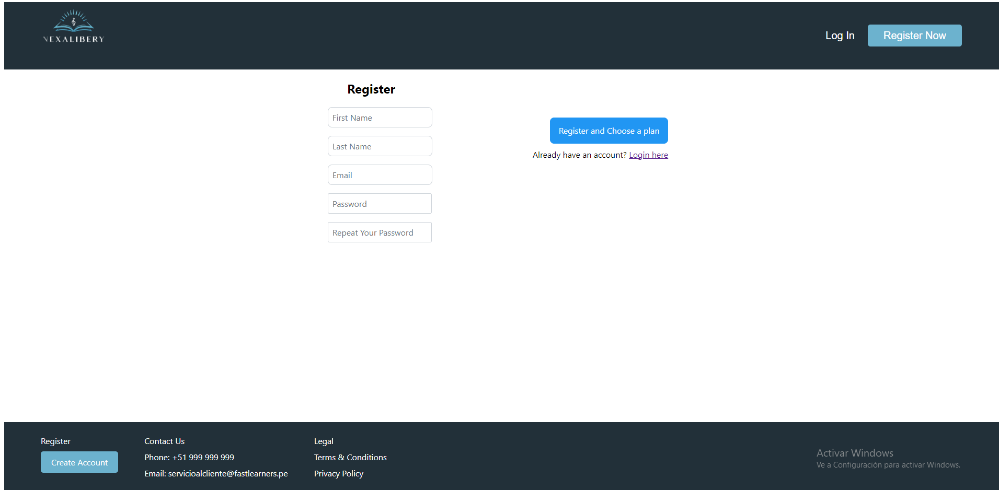 

- Pricing

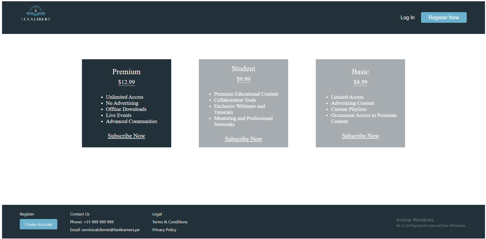 

- Methods Payment

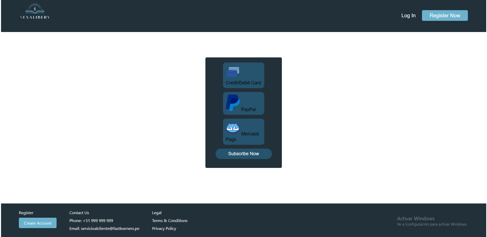 


- Add Payment

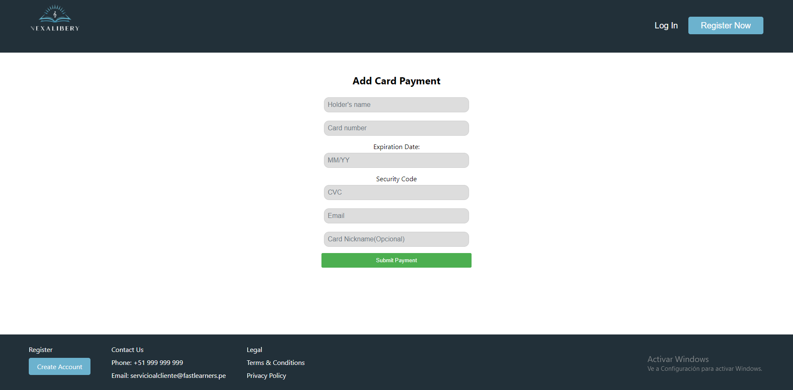 


- Menu

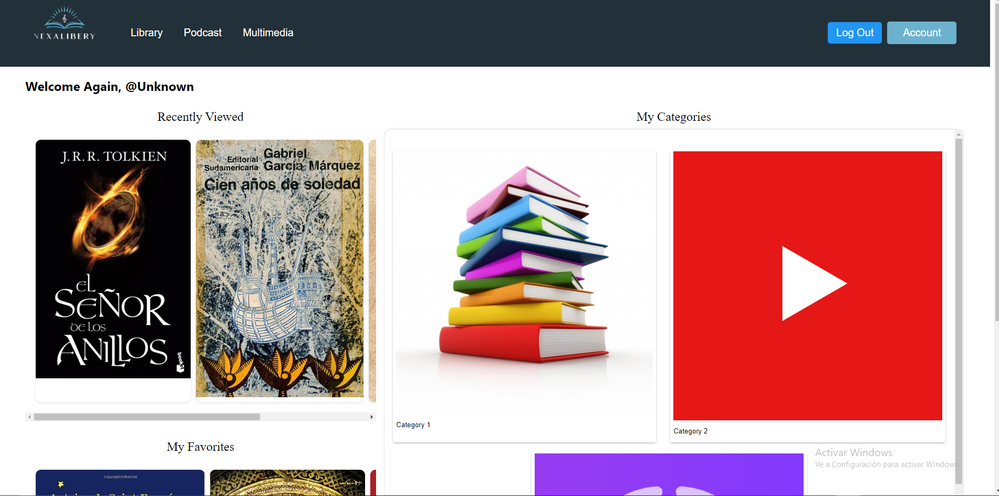 


- Library

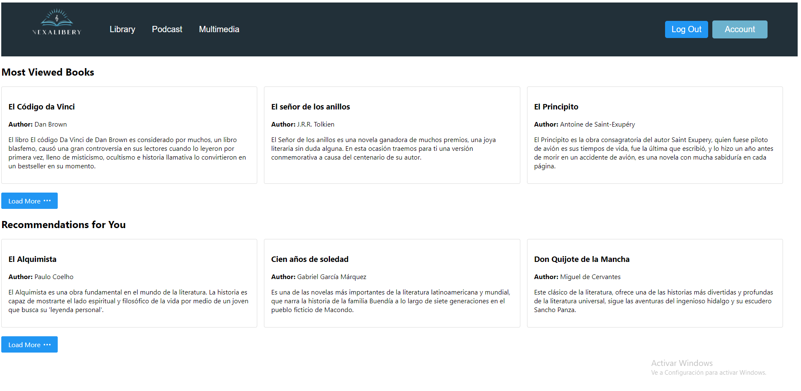 


- Podcast

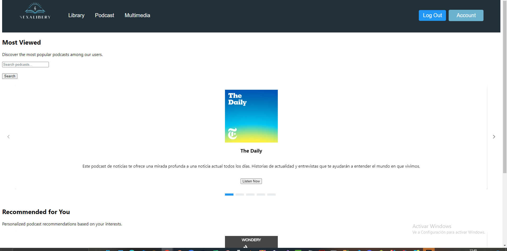 


- Multimedia

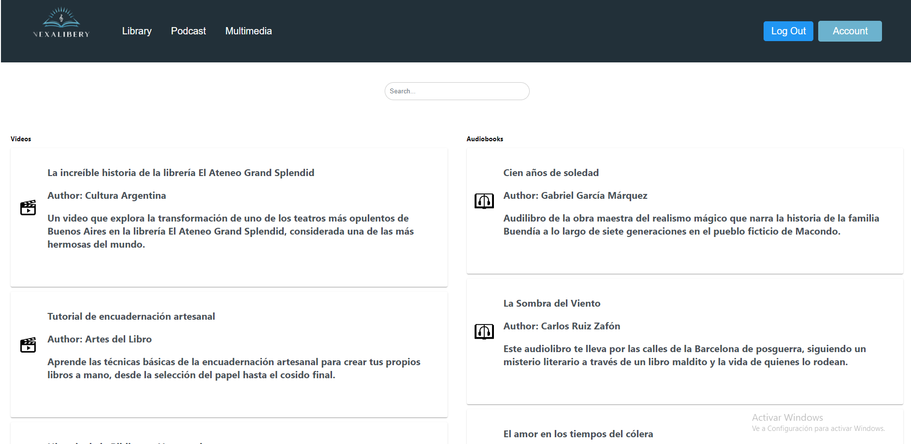 


- User Profile

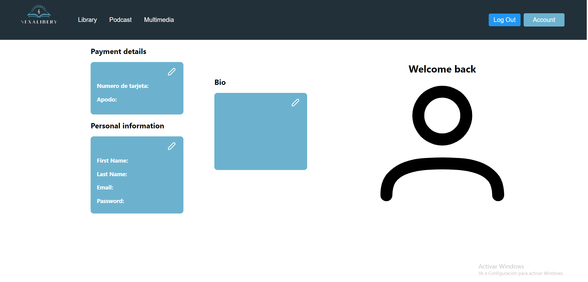 


#### 5.2.2.6. Services Documentation Evidence for Sprint Review.
En este sprint 2 los miembros del grupo completaron satisfactoriamente las tareas propuestas. El sprint 2 estuvo relacionado mayormente con el diseño y desarrollo del front-end de la aplicacion. A lo largo del desarrollo se hizo el ruteo de cada compoente y la creacion de nuestro archivo db.json 

#### 5.2.2.7. Software Deployment Evidence for Sprint Review.
## Herramientas Utilizadas en el Desarrollo del Frontend web
Para alcanzar exitosamente los objetivos de este Sprint 2 el equipo tuvo que documentarse sobre las tecnologías que se iban a implementar. Es por ello que a continuación se detalla la documentación a la que se acudió:

PrimeVue: Suite de componentes de UI para Vue.js que facilita la creación de interfaces visuales ricas y dinámicas. https://primevue.org

Vue: Framework ligero para construir interfaces de usuario y aplicaciones de una sola página (SPA), conocido por su simplicidad y flexibilidad. https://vuejs.org/

Firebase: Plataforma de Google que proporciona herramientas para el desarrollo rápido de aplicaciones web y móviles, ofreciendo funciones como bases de datos, autenticación y hosting. https://firebase.google.com/gad_source=1&gclid=CjwKCAjw88yxBhBWEiwA7cm6pRXSZrA5rERKwlktLqRrddWpoONIe7_OIgI-WLTAc0Fb4MY0dHNbdxoCjXMQAvD_BwE&gclsrc=aw.ds&hl=es-419

- Primero probamos el build localmente antes de subirlo a Firebase
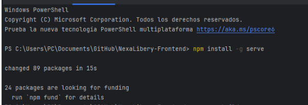

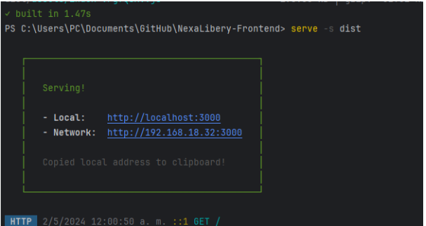

- Despues instalamos el Firebase CLI para interactuar con Firebase desde la línea de comandos <br>
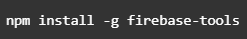

- Es necesario que tengamos una cuenta en [FireBase](https://firebase.google.com/?gad_source=1&gclid=CjwKCAjw88yxBhBWEiwA7cm6pWW3SGWgnKrEP_l-ODNAonRhDiVtc_CJVopR-rKlhmWPaRFjMT3JdxoCltEQAvD_BwE&gclsrc=aw.ds&hl=es-419) para subir el proyecto
  
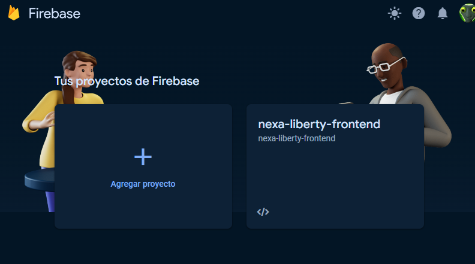

- Nos auntetificamos en Firebase e inicializamos el poryecto de Firebase: <br>
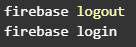

- Seleccionamos la opción Hosting al ser preguntado sobre qué características de Firebase que queremos configurar.Luego, elegimos el proyecto Firebase existente o nuevo al que deseamos conectar este proyecto local y Finalizamos con hacer que el directo de esta sea publico  ademas de configurar el archivo firebase.json y hacerle un deploy al hosting
  
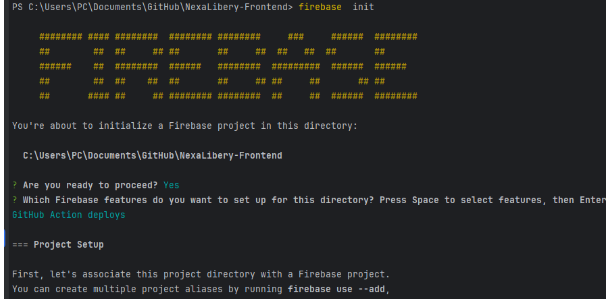

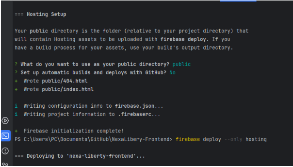

- Resultado final


https://nexa-liberty-frontend.firebaseapp.com/login

#### 5.2.2.8. Team Collaboration Insights during Sprint.
| Alumno                           | Actividad                                  |          
|----------------------------------|--------------------------------------------|
|Loli Ruiz, Renzo Javier           | Implementacion del componente pricing y menu |                                           
|Quispe Erasmo, Raúl Ronaldo       | Implementacion del compoenente add payment and methodsofpayement  |    
|Ramirez Ramirez, Marcelo Sebastian| Implementacion del component log-in and register     |    
|Javier Murillo, Mathias           | Implementacion del componente libary y podcats       |    
|Leon Rioja Carlos Andres          | Implementacion del component Multimedia and profile  |

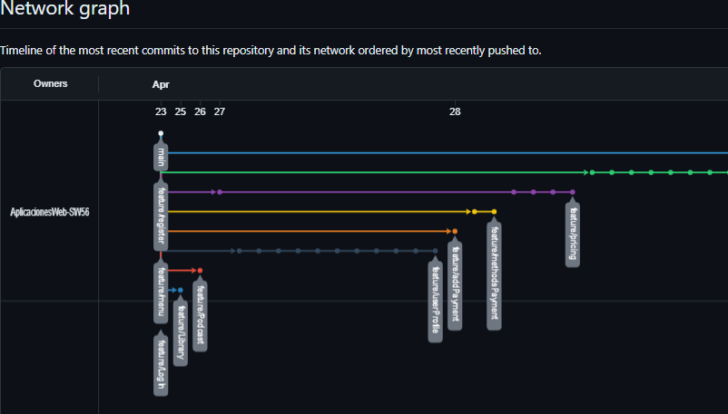 

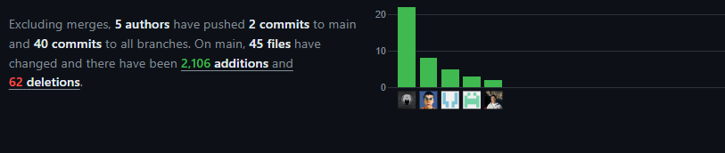 

### 5.2.3. Sprint 3
#### 5.2.3.1. Sprint Planning 3
Dentro del marco de trabajo Scrum, un Sprint representa un período de tiempo definido y limitado en el que un equipo se dedica a completar todas las tareas necesarias para alcanzar el objetivo final del proyecto. En el caso del desarrollo de la aplicación MediaVerse, se optó por dividir el proyecto en tres sprints, cada uno con una duración de dieciocho días. El Sprint #3, que comienza el 27/05/2024, tiene como objetivo principal la creación de una página de inicio atractiva para MediaVerse, destinada a captar la atención de los usuarios y comunicar claramente los beneficios del producto.

| Sprint #                 | Sprint 3                                                                                       |
|--------------------------|------------------------------------------------------------------------------------------------|
| **Sprint Planning Background**  |                                                                                         |
| Date                     | 27/05/2024                                                                                     |
| Time                     | 5:00pm                                                                                         |
| Location                 | REUNION VIRTUAL POR DISCORD                                                                    |
| Prepared By              |Loli Ruiz, Renzo Javier; Quispe Erasmo, Raúl Ronaldo; Ramirez Ramirez, Marcelo Sebastian; Javier Murillo, Mathias; Leon Rioja Carlos Andres                                                                  |
| Attendees (to planning meeting) | Loli Ruiz, Renzo Javier; Quispe Erasmo, Raúl Ronaldo; Ramirez Ramirez, Marcelo Sebastian; Javier Murillo, Mathias; Leon Rioja Carlos Andres                   |
| **Pre-Sprint Review Summary**       | Durante el 3 sprint, hemos completado la partes que tendrá el services API y definimos las herramientas para el desarrollo de esta. También hemos llevado a cabo una serie de reuniones de planificación para unir las api sobre los fakeAPI creados . |
| **Initial Sprint  Retrospective Summary** | Para el tercer sprint decidimos corregir algunas cosas de la entrega anterior y pensar como subir nuestro backend a la nube.|
| **Sprint Goal & User Stories** |                                                                            |
| Sprint 2 Goal             | El propósito de este Sprint es avanzar en la construcción de nuestro services API. Nos enfocaremos en ofrecer una experiencia de usuario fluida y comprensible, desarrollando una interfaz amigable y fácil de manejar que facilite la navegación por el sistema. Este sprint se dedicará a implementar una aplicación informativa con un diseño intuitivo. |
| Sprint 2 Velocity        | Para el Sprint 3, hemos estimado una velocidad de 20 Story Points. Esta estimación se basa en las horas laborales disponibles del equipo y en la complejidad y esfuerzo estimados de las historias de usuario seleccionadas para este periodo de desarrollo.|
| Sum of Story Points     | 20 |

#### 5.2.3.2. Sprint Backlog 3

| User Story |                | Work-Item/Task |                                |                                              |            |                          |        |
|------------|----------------|-------------   |--------------------------------|----------------------------------------------|----------- |--------------------------|--------|
| ID         | Title          | ID             | Title                          | Description                                  | Estimation | Assigned To              | Status(To-do/In-Process/To-Review/Done) |
| HU23       | Registrar nuevo contenido en la biblioteca multimedia | W111 | Desarrollar la funcionalidad para que los administradores puedan registrar nuevo contenido multimedia en la biblioteca de la plataforma. | 8 horas | Renzo Javier Loli Ruiz | Done |
| HU24       | Obtener datos de la biblioteca multimedia y podcasts | W112 | Desarrollar la funcionalidad para obtener datos de la biblioteca multimedia y podcasts y mostrarlos en la aplicación. | 6 horas | Raúl Ronaldo Quispe Erasmo | Done |
| HU25       | Configuración inicial del servidor backend | W112 | Realizar la configuración inicial del servidor backend para garantizar un entorno de ejecución estable y seguro para la aplicación web. | 10 horas | Renzo Javier Loli Ruiz | Done |
| HU26       | Integración de base de datos | W113 | Integrar la base de datos con el servidor para almacenar y gestionar los datos de manera eficiente. | 8 horas   | Javier Murillo Mathias | Done |
| HU27       | Configuración de logging y monitoreo | W114 | Configurar sistemas de logging y monitoreo para supervisar el rendimiento y estado del servidor backend de manera proactiva. | 8 horas   | Ramirez Ramirez Marcelo Sebastian | Done |


#### 5.2.3.3. Development Evidence for Sprint Review

|                         Repository                         |         Branch         |                     Commit Id                    |     Commit Message                              | Commited on (Date) | 
|------------------------------------------------------------|------------------------|--------------------------------------------------|-------------------------------------------------|--------------------|
| NexaLibery-Backend                                         |    feature/Multimedia  |     e0c07afc5d3944aa37b227f3df5b295ec84a4b20     |  Add files Multimedia                           |      30/05/24      | 
| NexaLibery-Backend                                         |    feature/Podcast     |     9be1f3a8584f552860562ef361e799887f1dc1b8     |  Add files Podcast                              |      02/06/24      |
| NexaLibery-Backend                                         |    feature/Library     |     04d169b9494d2f13ca3d935c650edf0dd00d88b3     |  feature Multimedia/application/internal files  |      29/05/24      |
| NexaLibery-Backend                                         |    feature/Library     |     3f25f0b20fd27e1a316096dba00d9d627dd915f0     |  feature Domain/model/Aggregate                 |      29/05/24      |
| NexaLibery-Backend                                         |    feature/Library     |     4ed417b23ce93a430cc5f7f7a096c05aefb24d2b     |  feature files Commands and Queries             |      29/05/24      |
| NexaLibery-Backend                                         |    feature/Library     |     9598b37886a4eb54ab1f3d764266154edffa5292     |  feature files Interfaces Library               |      29/05/24      |
| NexaLibery-Backend                                         |    feature/Library     |     b4563ce2a70480b4f21e152f59120cb072ecab76     |  feature repositories                           |      29/05/24      |
| NexaLibery-Backend                                         |    feature/Library     |     1394b6f2209354e20582595898e311331b97b21b     |  feature resources files                        |      29/05/24      |
| NexaLibery-Backend                                         |    feature/Library     |     706c73b2f4831d47628a01373a9a78e747b4097c     |  files transform and controller                 |      29/05/24      |
| NexaLibery-Backend                                         |    feature/Library     |     7fee1d094c72f0c4483aeb156c77c0654e8b93e0     |  Update AppDbContext.cs                         |      29/05/24      |
| NexaLibery-Backend                                         |    feature/Library     |     9a2f41dab42739a1a4746bcdffc4bfc86c3baa4e     |  settings Program.cs                            |      29/05/24      |

#### 5.2.3.4. Testing Suite Evidence for Sprint Review
| Repository                             | Branch                     | Commit ID                                  | Commit Message                                     | Committed on(date) | 
|----------------------------------------|----------------------------|--------------------------------------------|----------------------------------------------------|--------------------| 
|  NexaLibery-Frontend                   |  main                      |   648563cdc5a5cc30da3cc464c4a033520bc65ec9 | Feature files command services                     |   02/06/24         | 
|  NexaLibery-Frontend                   |  main                      |   e579831423684396cf1036b777ff4375727f20c4 | feature files queryService                         |   02/06/24         | 
|  NexaLibery-Frontend                   |  main                      |   1b6a05647e78feded17c9bd18f19b4b32ceff50f | feature model aggregates                           |   02/06/24         | 
|  NexaLibery-Frontend                   |  main                      |   9bee4cc1677b54395a1c74ea810b5930416718d1 | feature model commands                             |   02/06/24         | 
|  NexaLibery-Frontend                   |  main                      |   4daf621fe3baee07bafe202d3d79dfbe70513133 | feature interfaces repository command and services |   02/06/24         | 
|  NexaLibery-Frontend                   |  main                      |   da00ccc445e41e2046b5b57a4231271f7973c761 | feature files repositories                         |   02/06/24         | 
|  NexaLibery-Frontend                   |  main                      |   adb8c761edf8db61514ef84e82bbd0004fe778c3 | feature files resource                             |   02/06/24         | 
|  NexaLibery-Frontend                   |  main                      |   c53cd4f65cedc26ebb2d4d8b65a7c4f11b302ff3 | feature files transform                            |   02/06/24         | 
|  NexaLibery-Frontend                   |  main                      |   d8fd05895d7b9809885066444038006163e6e164 | feature files controllers                          |   02/06/24         | 
|  NexaLibery-Frontend                   |  main                      |   8b54cf975e7bee1725a68b4df70a08470b1d5de2 | Upload files AppDbcontext and Programns.cs         |   02/06/24         | 

#### 5.2.3.5. Execution Evidence for Sprint Review
[https://nexalibery-backend.onrender.com/swagger/index.html](https://nexalibery-backend.onrender.com/swagger/index.html)

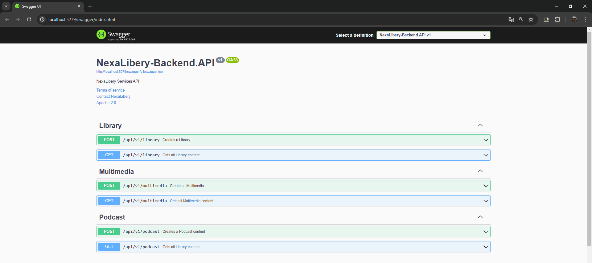 
#### 5.2.3.6. Services Documentation Evidence for Sprint Review
| Endpoint | Description | Method | Call Syntax | Query / Body | Response
| --- | --- | --- | --- | --- | --- |
| `/library` | Obtener Todos los Libros | GET | `/library` | ` ` |`[{"id":"int","title":"string","description":"string","pic":"string","url":"string","premium":"string"}]` |
| `/library` | Añadir Un Libro | POST | `/library` |`[{"id":"int","title":"string","description":"string","pic":"string","url":"string","premium":"string"}]` | ` ` |
| `/podcast` | Obtener Todos los Podcast | GET | `/podcast` | ` ` |`[{"id": 0,"title":"string","description":"string","date":"2024-06-08T07:33:22.226Z","pic":"string","url":"string","premium":"string"}]` |
| `/podcast` | Añadir Un Podcast | POST | `/podcast` |`[{"id": 0,"title":"string","description":"string","date":"2024-06-08T07:33:22.226Z","pic":"string","url":"string","premium":"string"}]` | ` ` |
| `/multimedia` | Obtener Todos los Videos | GET | `/multimedia` | ` ` |`[{"id":0,"title":"string","description":"string","date":"2024-06-08T07:35:17.888Z","pic":"string","url":"string","premium":"string"}]` |
| `/multimedia` | Añadir un Nuevo Video | POST | `/multimedia` |`[{"id":0,"title":"string","description":"string","date":"2024-06-08T07:35:17.888Z","pic":"string","url":"string","premium":"string"}]` | ` ` |
| `/users` | Obtener Todos los Usuarios | GET | `/users` | ` ` |`[{"email":"string","password":"string"}]` |
| `/login` | Iniciar Sesion | POST | `/login` | `{"email":"string","password":"string"}` |`{"accessToken":"string"}` |
| `/signup` | Registrarse | POST | `/signup` | `{"email":"string","password":"string"}` |`{"accessToken":"string"}` |

#### 5.2.3.7. Software Deployment Evidence for Sprint Review

1) Database Deploy

- Se uso Mysql como motor base
- Se hace uso de aiven.io como servicio 
- Se necesita de una cuenta 
- Se genera un nuevo servicio
- Se elige el motor a usar "mysql" para nosotros
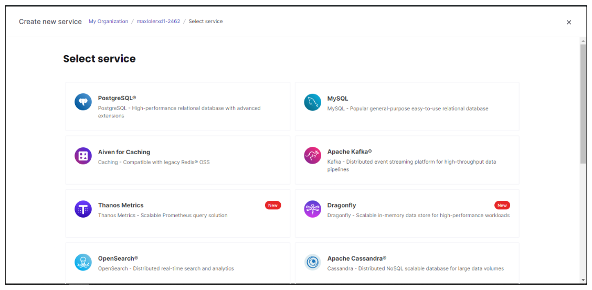 
- Se escoje el plan gratuito
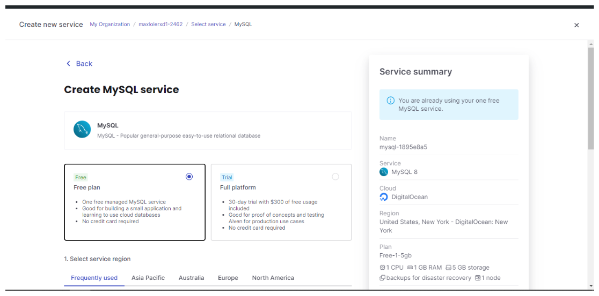
- Se da en Crear Servicio para finalizar
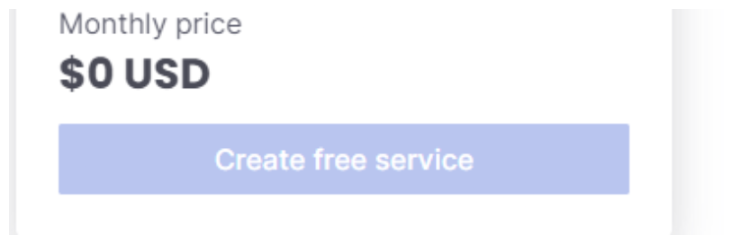
- Al hacer click en el servicio generado, se puede visualizar las variables necesarias para la cadena de conexion
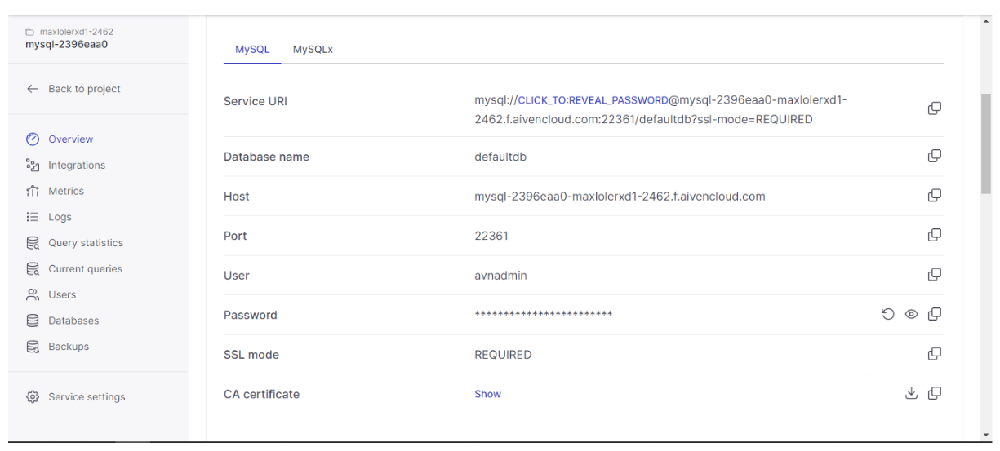

- URL: https://nexalibery-userauth.onrender.com

2) Backend Deploy

- Se usa ASP Core
- Se despliega en Render.com
- Se necesita de una cuenta
- Se hace click en new y en servicio web
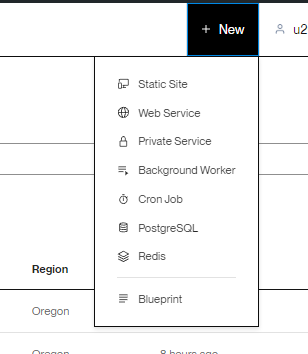
- Se selecciona la seecion de github para la integracion con el repositorio del proyecto
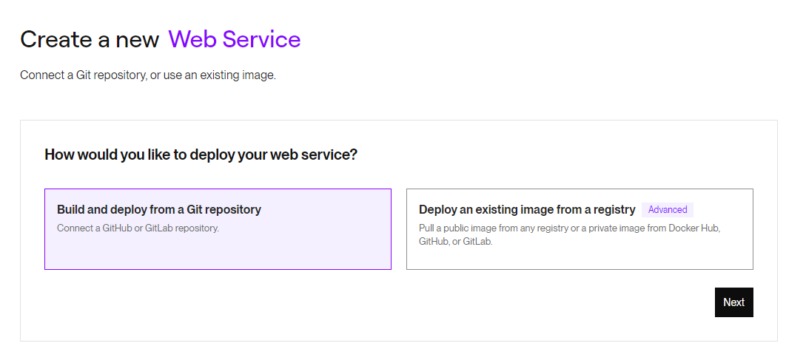
- Se selecciona el repositorio a utilizar
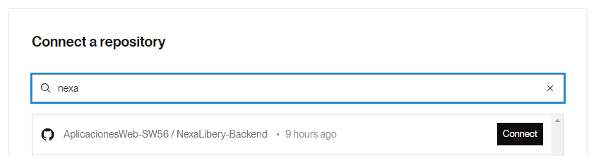
- Las unicas cofiguraciones seran
- añadir la carpeta por defecto "NexaLibery-Backend.API"
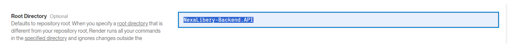
- Se usara "Docker" como runtime
- Se usara la version gratuita
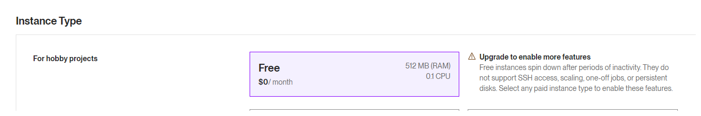
- Se configuran las variables de entorno para que el backend dentro del docker funcione con la base de datos generada
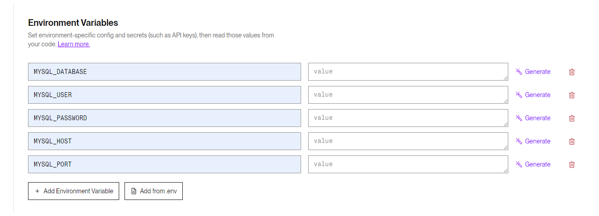
- Se da en created service
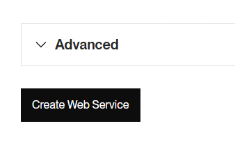
- Para este punto ya debe estar en "deploying" el servicio de logs
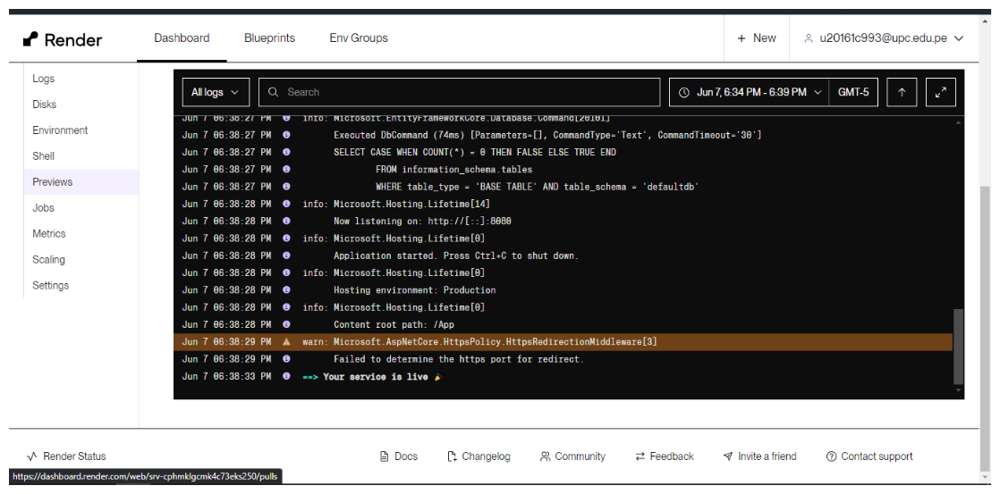
- URL: https://nexalibery-backend.onrender.com/

3) Frontend Deploy

- Primero creamos el proyecto en la consola de firebase en la seccion "hosting"
- Hacemos el build 

``` bash
npm build
```

- Instalamos los fire-tools

``` bash
npm -g install firebase-tools
```

- Nos logueamos

``` bash
firebase login
```

- Iniciamos una conexion con firebase y la configuracion del despliegue donde estaran el tipo de subida al servicio y la carpeta donde estar el bundle del proyecto "en nuestro caso dist" (cabe resaltar que se debe generar dependiendo de un proyecto existente que previamente se creo)

``` bash
firebase init
```

- Hacemos deploy de la carpeta dist

``` bash
firebase deploy
``` 

- URL: https://nexalibery-1ac72.web.app/

#### 5.2.3.8. Team Collaboration Insights during Sprint
| Alumno                           | Actividad                                  |          
|----------------------------------|--------------------------------------------|
|Loli Ruiz, Renzo Javier           | Implementacion de una nueva version del frontend y conexion del backend |                                           
|Quispe Erasmo, Raúl Ronaldo       | Desarrollo del backend en development  |    
|Ramirez Ramirez, Marcelo Sebastian| Implementacion del endpoint Library     |    
|Javier Murillo, Mathias           | Implementacion del endpoint Multimedia Content         |    
|Leon Rioja Carlos Andres          | Implementacion del endpoint Podcast |

# Sprint 4
#### 5.2.4.1. Sprint Planning 4.
Dentro del marco de trabajo Scrum, un Sprint representa un período de tiempo definido y limitado en el que un equipo se dedica a completar todas las tareas necesarias para alcanzar el objetivo final del proyecto. En el caso del desarrollo de la aplicación MediaVerse, se incluyo el uso de tokens  y seguridad iam. El Sprint #4, que comienza el 17/06/2024, tiene como objetivo principal implementar la seguridad del backend usando los tokens lo mismo para el front para el ingreso de usuarios

| Sprint #                 | Sprint 4                                                                                       |
|--------------------------|------------------------------------------------------------------------------------------------|
| **Sprint Planning Background**  |                                                                                         |
| Date                     | 17/06/2024                                                                                     |
| Time                     | 4:00pm                                                                                         |
| Location                 | REUNION VIRTUAL POR DISCORD                                                                    |
| Prepared By              |Loli Ruiz, Renzo Javier; Quispe Erasmo, Raúl Ronaldo; Ramirez Ramirez, Marcelo Sebastian; Javier Murillo, Mathias; Leon Rioja Carlos Andres                                                                  |
| Attendees (to planning meeting) | Loli Ruiz, Renzo Javier; Quispe Erasmo, Raúl Ronaldo; Ramirez Ramirez, Marcelo Sebastian; Javier Murillo, Mathias; Leon Rioja Carlos Andres                   |
| **Pre-Sprint Review Summary**       | Durante el 4 sprint, hemos completado la ultima parte del trabajo en el cual trata sobre la inclusion de la carpeta IAM . |
| **Initial Sprint  Retrospective Summary** | Para el cuarto sprint decidimos corregir algunas cosas de la entrega anterior y pensar como subir nuestro backend a la nube.|
| **Sprint Goal & User Stories** |                                                                            |
| Sprint 2 Goal             | El propósito de este Sprint es avanzar en la construcción de los controllers authentication y users.|
| Sprint 2 Velocity        | Para el Sprint 4, hemos estimado una velocidad de 16 Story Points. Esta estimación se basa en las horas laborales disponibles del equipo y en la complejidad y esfuerzo estimados de las historias de usuario seleccionadas para este periodo de desarrollo.|
| Sum of Story Points     | 16  |

#### 5.2.4.2. Sprint Backlog 4

| User Story |                | Work-Item/Task |                                |                                              |            |                          |        |
|------------|----------------|-------------   |--------------------------------|----------------------------------------------|----------- |--------------------------|--------|
| ID         | Title          | ID             | Title                          | Description                                  | Estimation | Assigned To              | Status(To-do/In-Process/To-Review/Done) |
| HU28       | Configuración del entorno del frontend para la integración con el backend	| W115           | Configuración del environment del frontend               | Configurar el archivo de environment del frontend para asegurar las solicitudes API  del backend                                 | 8 horas    | Renzo Loli   | Done   |
| HU29       | Actualización del perfil del usuario con conexión backend-frontend	        | W116           | Actualización de perfil de usuario en frontend y backend | Actualizar la funcionalidad de edición de perfil en el frontend y backend, asegurando sincronización de datos con la base de datos                                | 8 horas    | Mathias Javier Murillo    | Done   |
| HU30       | Configuración de propiedades de la aplicación en el backend                | W117          | Configurar propiedades de la aplicación en backend       | Configurar las propiedades de la aplicación en el backend implementando los tokens de seguridad | 8 horas    | Marcelo Ramirez     | Done   |
| HU31       | Gestión de habilidades de usuario                                          | W118           | Gestión de habilidades de usuario en frontend y backend  | Implementar la funcionalidad obtener todas los registros de usuario en el frontend y backend                                                   | 8 horas    | Raul Quispe | Done   |


#### 5.2.4.3. Development Evidence for Sprint Review
|                         Repository                         |         Branch         |                     Commit Id                    |     Commit Message                              | Commited on (Date) | 
|------------------------------------------------------------|------------------------|--------------------------------------------------|-------------------------------------------------|--------------------|
| NexaLibery-Backend                                         |    main                |     9cf9155adf0d52c8348e754ba463d5be459c20bc     |  chore: bearer token for swagger                 |      21/06/24      | 
| NexaLibery-Backend                                         |    main                |     4c7f6fe88d6c1e6f07c6b0531723b67c782071c8     |  Feature IAM files Application internal               |      22/06/24      |
| NexaLibery-Backend                                         |    main      |     d215df8a38d6da7306e03918fb79bd1411e4b065    | Feature IAM Domain model  |      22/06/24      |
| NexaLibery-Backend                                         |    main     |     4b7bc9a8e4afe6149a60ee678c59b5267049a0b8    |  Feature interfaces IAM users                |      22/06/24      |
| NexaLibery-Backend                                         |    main      |     1c0c84f5434bce187067e1d8f0bebc1b56d8a890     |  Feature infrastructure Hashing an persistence repository           |      22/06/24      |
| NexaLibery-Backend                                         |    main      |     3101c861360f0a0b6ef430daa02a1ddcce5338bb     |  Feature Pipeline               |      22/06/24      |
| NexaLibery-Backend                                         |    main      |     0ac98f86d4b461fc9b0dbd1c1db5b563b03001c6     |  Feature tokens                          |      22/06/24      |
| NexaLibery-Backend                                         |    main    |     a93eee710e41695e0972bf93d1fbd9fc9e05e84e     |  Feature controllers                       |      22/06/24      |
| NexaLibery-Backend                                         |    main     |     e73cbb1644d515d1b45b1d1037edd48a8dc4f24f     |  feature interfaces REST resources and transform                |      22/06/24      |
| NexaLibery-Backend                                         |    main      |     982ffe8a40e72f8570399133a6b00e5669be7067     |  Mayor changes Program.cs                        |      22/06/24      |
| NexaLibery-Backend                                         |    main      |     47dee6a69ec052ad7ee617b42acdea5113c51538     |  Upgrade AppDbContext                           |      22/06/24      |
| NexaLibery-Frontend                                        |  main             |   ed9375f10e7fc138da537162e220706ff682c06f | feature: add pinia iam storage service        |   21/06/24         | 

#### 5.2.4.4. Testing Suite Evidence for Sprint Review
| Repository                             | Branch                     | Commit ID                                  | Commit Message                                     | Committed on(date) | 
|----------------------------------------|----------------------------|--------------------------------------------|----------------------------------------------------|--------------------| 
|  NexaLibery-Backend                   |  main                      |   b224895f79421cf93e5fdd5c03f9f8e31d6ef386  | fix: exception handling and dependencies           |   25/06/24         | 
|  NexaLibery-Backend                   |  main                      |   2bb74c41b8eecd106caba7d26a25c838765672be | chore: refactor format env string                   |   25/06/24         | 
|  NexaLibery-Backend                   |  main                      |   1e409f1c8e427ae2035c56c2a1b96ccdea6238ea1 | chore: add table users                             |   25/06/24         | 
|  NexaLibery-Backend                   |  main                      |   820bf3fe664486e191497a3b0708be7a8e79ef1c | fix: production no migrate                          |   25/06/24         | 
|  NexaLibery-Backend                   |  main                      |   332fd2e58a561a6c647aca0864ce85ed170230b7 | fix: production no migrate                          |   25/06/24         | 
|  NexaLibery-Frontend                   |  main                      |  9c31616b46dd19c547f3e358352913597ac180b2 | fix: firebase resources                            |   21/06/24         | 
|  NexaLibery-Frontend                   |  main                      |   fb1a02adfc3c5f9f85ccf6b01f2fc2169ecd49a8 | feature: refactor user to iam for authentication   |   21/06/24         | 
|  NexaLibery-Frontend                   |  main                      |   113df12c59b92477d98c159e420361a5276fd743 | fix: need reference                                |   24/06/24         | 
|  NexaLibery-Frontend                   |  main                      |   0a7116b27e70950feecbccf99381a31d38c68ce0 | chore: refactor user context                       |   25/06/24         | 
|  NexaLibery-Frontend                   |  main                      |   2fe66a5536441dc70a0ee5cddf2c36a1b24ff365 | fix: double auth name                              |   25/06/24         | 

#### 5.2.4.5. Execution Evidence for Sprint Review
[https://nexalibery-backend.onrender.com/swagger/index.html](https://nexalibery-backend.onrender.com/swagger/index.html)

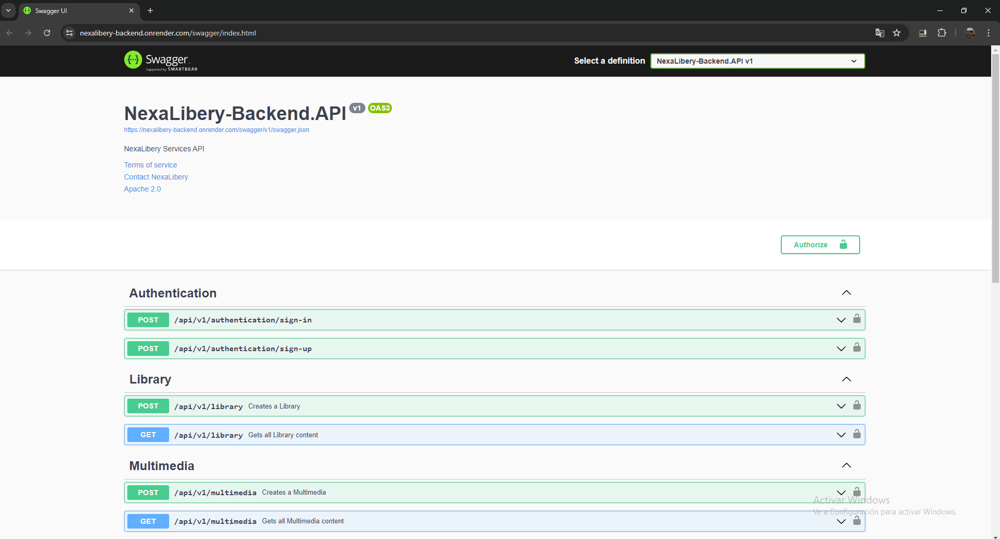 

#### 5.2.4.6. Services Documentation Evidence for Sprint Review
En este sprint 4 todos los miembros del grupo complementaron satisfactoriamente las tareas propuestas. El sprint 4 estuvo enfocado en la creacion de la seguridad de nuestro backend a travesd e los tokens . 

| Endpoint | Description | Method | Call Syntax | Query / Body | Response
| --- | --- | --- | --- | --- | --- |
| `/users` | Obtener Todos los Usuarios | GET | `/users` | ` ` |`[{"id": "int","username": "string","password": "string","email": "string","description": "string","cardNumber": "string","bornDate": "string","photo": "string"}]` |
| `/sign-in` | Iniciar Sesion | POST | `/login` | `{"email":"string","password":"string"}` |`{"id": "int", "email": "string", "username": "string", "token": "string"}` |
| `/signup` | Registrarse | POST | `/signup` | `[{"username": "string","password": "string","email": "string","description": "string","cardNumber": "string","bornDate": "string","photo": "string"}]` |`{"message":"string"}` |
#### 5.2.4.7. Software Deployment Evidence for Sprint Review

1) Para la base de datos no es necesaria mas configuracion de la que ya tenemos, solo añadiremos una nueva 
database llamada "NexaLibery" desde la consola de aiven.io

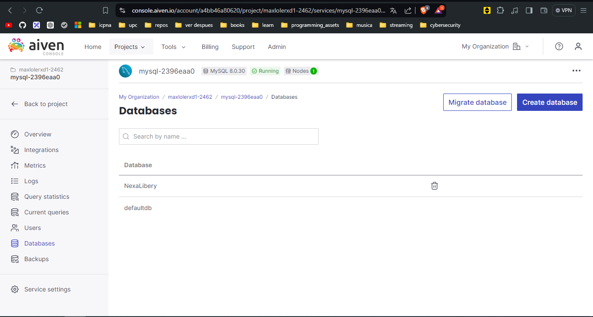

2) Para el backend solo se necesitara cambiar en las variables de entorno la base de datos a utilizar
desde Render

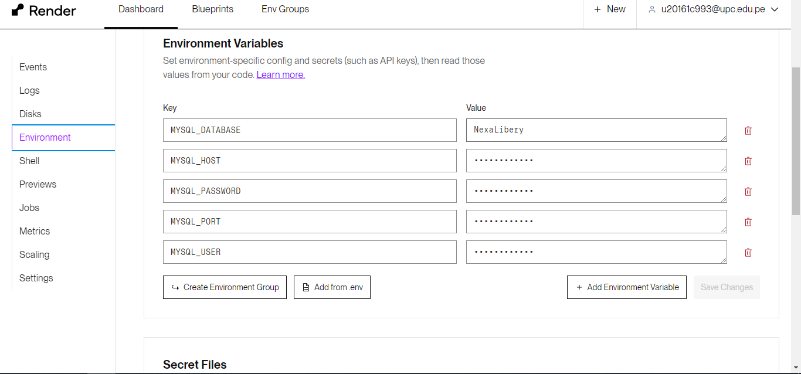

* Link: https://nexalibery-backend.onrender.com

3) Para el Frontend solo necesitamos hacer 2 pasos

- Build del proyecto 

    npm run build

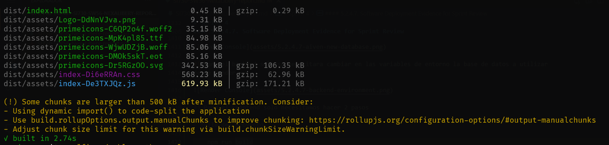

- Subir a firebase 

    firebase deploy

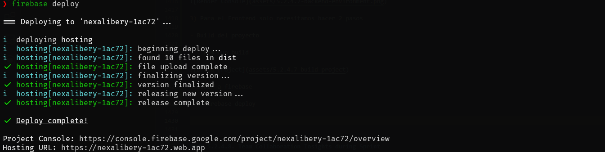

* Link: https://nexalibery-1ac72.web.app/

#### 5.2.4.8. Team Collaboration Insights during Sprint 

| Alumno                           | Actividad                                  |          
|----------------------------------|--------------------------------------------|
|Loli Ruiz, Renzo Javier           | Implementacion de carpeta IAM en el frontend y backend |                                           
|Quispe Erasmo, Raúl Ronaldo       | Desarrllo y mejoras del informe  |    
|Ramirez Ramirez, Marcelo Sebastian| Implementacion Authentic Controller |    
|Javier Murillo, Mathias           | Implementacion User controller |    
|Leon Rioja Carlos Andres          | Desarrllo y mejoras del informe |

Commits del Reporte:
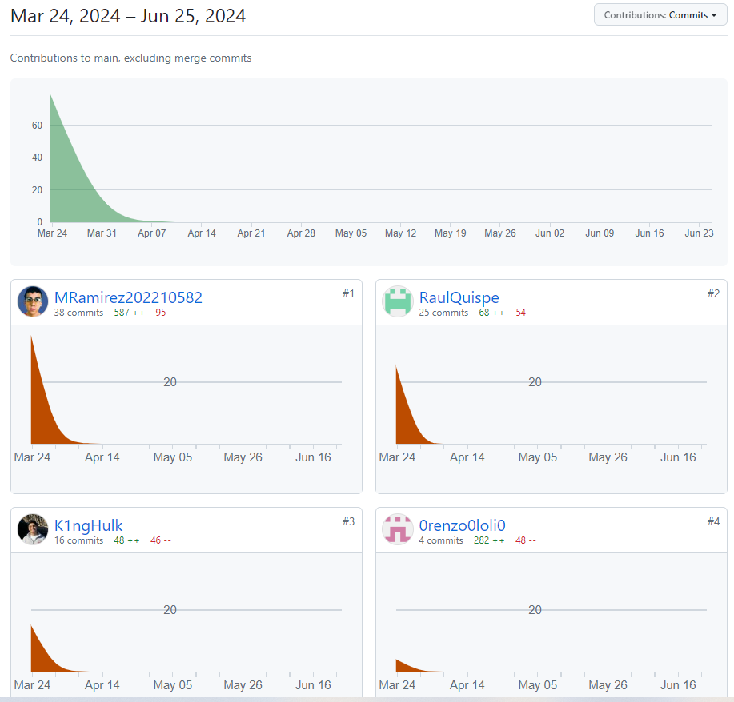

Commits del Landing Page:
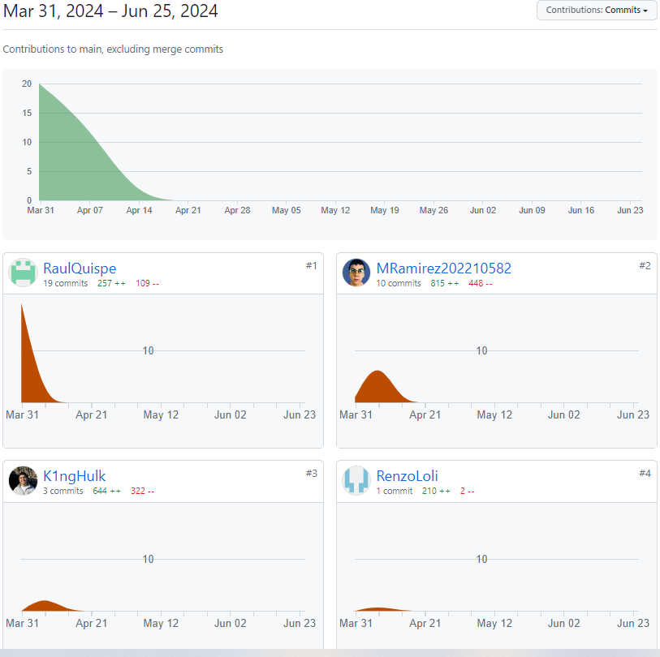

Commits del backend:
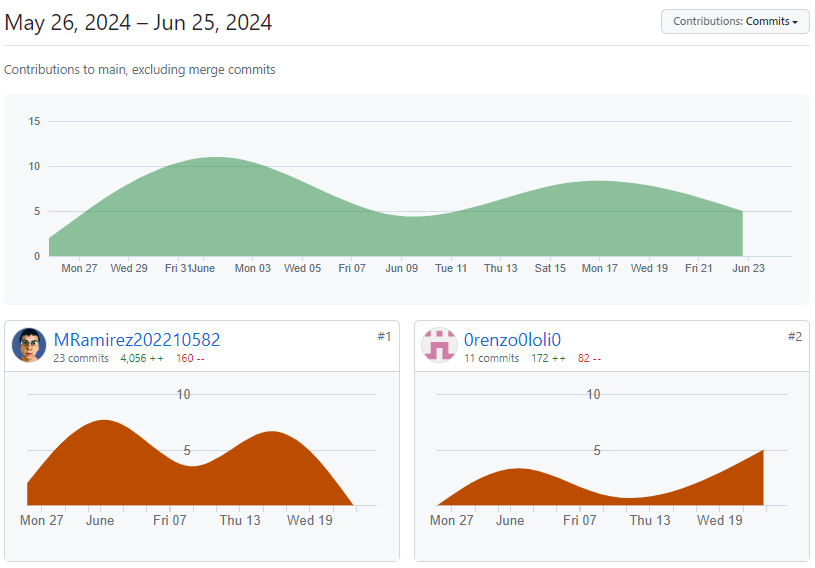

Commits del frontend: 
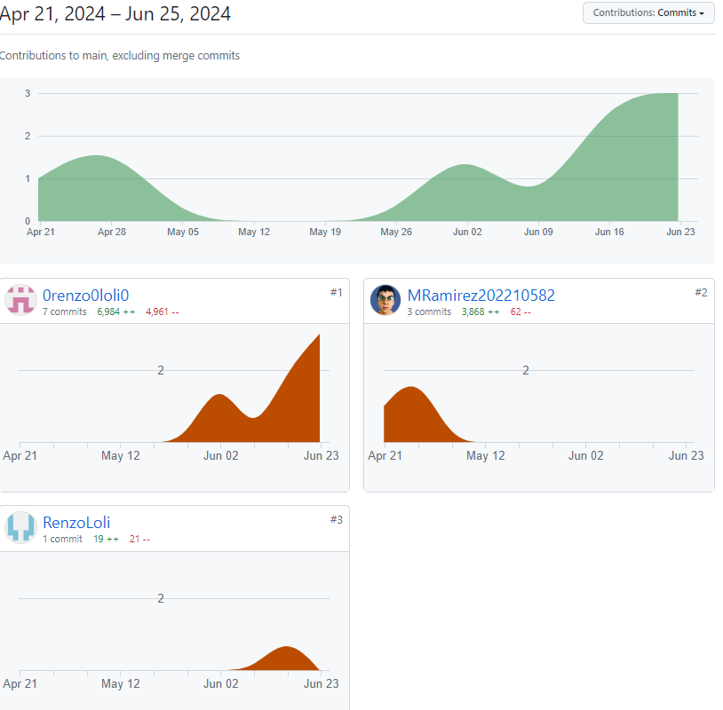

## 5.3. Validation Interviews
### 5.3.1. Diseño de Entrevistas
Una vez terminada la parte visual de nuestra aplicación (FrontEnd) y conectada a los servicios web desplegados (BackEnd), se considera una segunda parte de entrevistas, en la cual se busca validar la experiencia de usuario y la funcionalidad de la aplicación. Para ello, se plantean las siguientes preguntas:

**Preguntas generales:**
1. ¿Cuál es su nombre? 
2. ¿Qué edad tiene? 
3. ¿A qué se dedica? 

**Preguntas a los usuarios y estudiantes:**
1. ¿Qué opina sobre el diseño de la aplicación?
2. ¿Encuentra la aplicación intuitiva y fácil de usar?
3. ¿Cómo evalúa la navegación entre diferentes vistas? ¿Le resulta sencilla?
4. ¿Considera que las vistas cubren todos los aspectos necesarios para gestionar su experiencia en la apgina?
5. ¿Cuál cree que es el principal punto fuerte de la aplicación?
6. ¿De qué manera cree que la plataforma podría beneficiarle?
7. ¿La aplicación proporciona toda la información necesaria a través de los distintos botones y opciones?
8. ¿Estaría interesado en suscribirse al plan de NexaLibery?
   

### 5.3.2. Registro de Entrevistas 
**Entrevista 1 (realizada por Marcelo Ramirez):** <br>
**Nombre:** Maria Teresa Ramirez <br>
**Edad:** 52 años <br>
**Ocupación:** Administradora de empresas<br>
**Duracion:** 09:54 min
<div style="display:flex;justify-content:center">
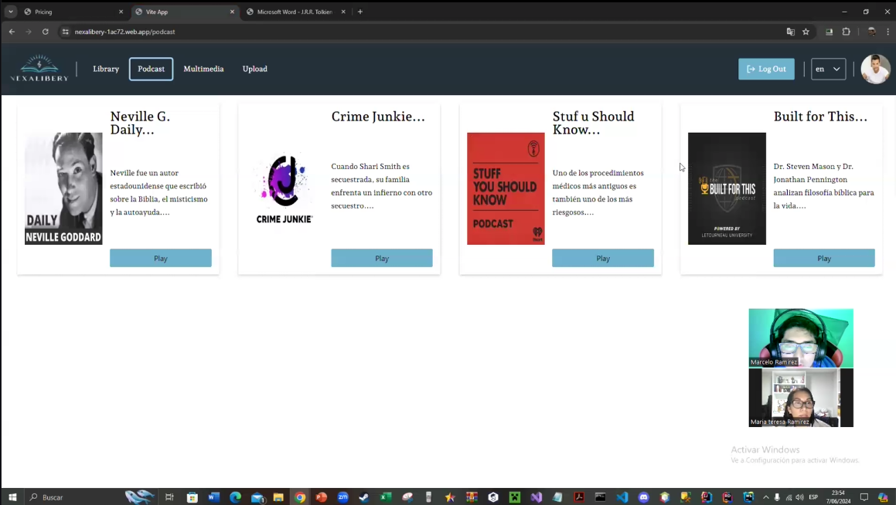
</div>

[https://upcedupe-my.sharepoint.com/:v:/g/personal/u202210582_upc_edu_pe/EYGhfFC03atCgH8SOFmZ0osBJiprVi3ZpPlkTIp-a3TYXg?e=i7OtyH&nav=eyJyZWZlcnJhbEluZm8iOnsicmVmZXJyYWxBcHAiOiJTdHJlYW1XZWJBcHAiLCJyZWZlcnJhbFZpZXciOiJTaGFyZURpYWxvZy1MaW5rIiwicmVmZXJyYWxBcHBQbGF0Zm9ybSI6IldlYiIsInJlZmVycmFsTW9kZSI6InZpZXcifX0%3D](https://upcedupe-my.sharepoint.com/:v:/g/personal/u202210582_upc_edu_pe/EYGhfFC03atCgH8SOFmZ0osBJiprVi3ZpPlkTIp-a3TYXg?e=i7OtyH&nav=eyJyZWZlcnJhbEluZm8iOnsicmVmZXJyYWxBcHAiOiJTdHJlYW1XZWJBcHAiLCJyZWZlcnJhbFZpZXciOiJTaGFyZURpYWxvZy1MaW5rIiwicmVmZXJyYWxBcHBQbGF0Zm9ybSI6IldlYiIsInJlZmVycmFsTW9kZSI6InZpZXcifX0%3D)
<br>
Maria Teresa considera que la aplicación NexaLibery es bastante interesante por el contenido que presenta y la forma en que lo ofrece. Encuentra la aplicación intuitiva, didáctica, sencilla de usar y agradable a la vista. Evalúa la navegación entre diferentes vistas como sencilla, dinámica y de fácil acceso para la búsqueda. Opina que las vistas cubren todos los aspectos necesarios para gestionar su experiencia en la página, ya que cada vista ofrece claridad y profundidad. Para Maria Teresa, el principal punto fuerte de la aplicación es el amplio contenido que ofrece, combinado con un diseño llamativo y una navegación fácil. La plataforma podría beneficiarle personalmente debido a su amplio contenido en materias de su interés profesional y laboral. Le ayudaría a usar los accesos a videos tutoriales para aprender y disfrutar de una gran variedad de libros en su tiempo libre. Maria Teresa también cree que la aplicación proporciona toda la información necesaria a través de los distintos botones y opciones, permitiendo encontrar con facilidad lo que busca y ofreciendo un amplio panorama de sugerencias útiles. Finalmente, muestra un alto interés en suscribirse al plan de NexaLibery, especialmente al paquete premium, que ofrece una amplia variedad de usos.

**Entrevista 2 (realizada por Mathias Javier):** <br>
**Nombre:** Andres Cieza<br>
**Edad:** 25 <br>
**Ocupación:** Jefe de finanzas <br>
**Duracion:** 03:08 min
<div style="display:flex;justify-content:center">

</div>

[https://upcedupe-my.sharepoint.com/:v:/g/personal/u202210582_upc_edu_pe/EauH4xjiM4VGnqcruEGitt8B_z5CIHbSz8Gmn-oHctAd9A?e=bfUs10&nav=eyJyZWZlcnJhbEluZm8iOnsicmVmZXJyYWxBcHAiOiJTdHJlYW1XZWJBcHAiLCJyZWZlcnJhbFZpZXciOiJTaGFyZURpYWxvZy1MaW5rIiwicmVmZXJyYWxBcHBQbGF0Zm9ybSI6IldlYiIsInJlZmVycmFsTW9kZSI6InZpZXcifX0%3D](https://upcedupe-my.sharepoint.com/:v:/g/personal/u202210582_upc_edu_pe/EauH4xjiM4VGnqcruEGitt8B_z5CIHbSz8Gmn-oHctAd9A?e=aTNR8J&nav=eyJyZWZlcnJhbEluZm8iOnsicmVmZXJyYWxBcHAiOiJTdHJlYW1XZWJBcHAiLCJyZWZlcnJhbFZpZXciOiJTaGFyZURpYWxvZy1MaW5rIiwicmVmZXJyYWxBcHBQbGF0Zm9ybSI6IldlYiIsInJlZmVycmFsTW9kZSI6InZpZXcifX0%3D)
<br>
Andres Cieza considera que la aplicación NexaLibery es muy completa para todas las necesidades que él considera que puede cubrir una aplicación de este estilo. De igual manera, la interfaz le parece muy sencilla y fácil de usar. Por último, nos comenta que no agregaría ninguna función adicional a la que ya tengamos en la misma aplicación.

**Entrevista 3 (realizada por Raúl Ronaldo Quispe Erasmo):** <br>
**Nombre:** Manuel Alexis Vargas <br>
**Edad:** 21 años <br>
**Ocupación:** Ingeniería de Software <br>
**Duracion:** 12:36 min
<div style="display:flex;justify-content:center">
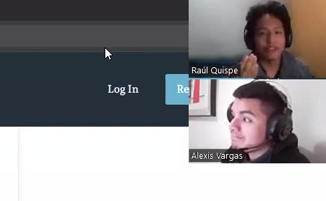
</div>
[https://upcedupe-my.sharepoint.com/:v:/g/personal/u202210582_upc_edu_pe/ETt4WB3ag2dAk43BThVMXi4BAZuPuWY1mIHATRPL5nr6mQ?e=wF5J3Y&nav=eyJyZWZlcnJhbEluZm8iOnsicmVmZXJyYWxBcHAiOiJTdHJlYW1XZWJBcHAiLCJyZWZlcnJhbFZpZXciOiJTaGFyZURpYWxvZy1MaW5rIiwicmVmZXJyYWxBcHBQbGF0Zm9ybSI6IldlYiIsInJlZmVycmFsTW9kZSI6InZpZXcifX0%3D](https://upcedupe-my.sharepoint.com/:v:/g/personal/u202210582_upc_edu_pe/ETt4WB3ag2dAk43BThVMXi4BAZuPuWY1mIHATRPL5nr6mQ?e=wF5J3Y&nav=eyJyZWZlcnJhbEluZm8iOnsicmVmZXJyYWxBcHAiOiJTdHJlYW1XZWJBcHAiLCJyZWZlcnJhbFZpZXciOiJTaGFyZURpYWxvZy1MaW5rIiwicmVmZXJyYWxBcHBQbGF0Zm9ybSI6IldlYiIsInJlZmVycmFsTW9kZSI6InZpZXcifX0%3D)

Manuel Alexis Vargas considera suscribirse a la plataforma por el hecho de que sí le ve buen futuro y uso. También recomendó sugerencias de mejoras, aunque también comentó que la interfaz tiene buenos colores que le acomodan bien la vista, al igual que el manejo y recorrido, es sencilla, justo para facilitar para aquellos a quienes se les complica.

### 5.3.3. Evaluaciones según heurísticas
Con base en diversas opiniones recogidas durante las entrevistas a clientes empresariales y técnicos afiliados, se ha determinado lo siguiente:
 - La aplicación destaca por su facilidad de uso y su diseño intuitivo.
 - La navegación es fluida, permitiendo a los usuarios cambiar de una vista a otra sin dificultad.
 - Cada vista proporciona toda la información necesaria de cada librerua.
 - La sección de foros se considera un punto sobresaliente, ya que facilita la interacción y la resolución de dudas entre los usuarios.
 - La información presentada en la aplicación es clara y completa.
 - La mayoría de los entrevistados se muestran dispuestos a suscribirse o registrarse en NexaLibery.

## 5.4. Video About-the-Product
[https://upcedupe-my.sharepoint.com/:v:/g/personal/u202210582_upc_edu_pe/EfD0A1l1rO5Pm-gSYvu3C5EBYLtgmZE1Mo2fL2N5Fk5Aww?nav=eyJyZWZlcnJhbEluZm8iOnsicmVmZXJyYWxBcHAiOiJTdHJlYW1XZWJBcHAiLCJyZWZlcnJhbFZpZXciOiJTaGFyZURpYWxvZy1MaW5rIiwicmVmZXJyYWxBcHBQbGF0Zm9ybSI6IldlYiIsInJlZmVycmFsTW9kZSI6InZpZXcifX0%3D&e=uqfazC](https://upcedupe-my.sharepoint.com/:v:/g/personal/u202210582_upc_edu_pe/EfD0A1l1rO5Pm-gSYvu3C5EBYLtgmZE1Mo2fL2N5Fk5Aww?nav=eyJyZWZlcnJhbEluZm8iOnsicmVmZXJyYWxBcHAiOiJTdHJlYW1XZWJBcHAiLCJyZWZlcnJhbFZpZXciOiJTaGFyZURpYWxvZy1MaW5rIiwicmVmZXJyYWxBcHBQbGF0Zm9ybSI6IldlYiIsInJlZmVycmFsTW9kZSI6InZpZXcifX0%3D&e=uqfazC)
<br>


# Conclusiones y recomendaciones.
**Conclusiones**
- **Enfoque Personalizado en Multimedia Digital:** La especialización en una experiencia multimedia rica y personalizada ha permitido que NexaLibery se destaque en el mercado digital, ofreciendo una plataforma donde los usuarios no solo consumen contenido, sino que también interactúan y comparten experiencias.
- **Innovación en Recomendaciones y Listas de Reproducción:** Gracias a nuestro enfoque en recomendaciones personalizadas y listas de reproducción a medida, los usuarios pueden descubrir contenido que realmente resuena con sus intereses personales, mejorando significativamente su interacción con nuestra plataforma.
- **Creación de Comunidades:** Proporcionar espacios para que los usuarios conecten en grupos de discusión y comunidades especializadas ha enriquecido la experiencia de usuario, haciendo de NexaLibery no solo una plataforma de contenido, sino un espacio de encuentro para aficionados y expertos por igual.
- **Adopción de Tecnología de Vanguardia:** El uso continuo de tecnología avanzada para facilitar el acceso y la gestión de contenido asegura que nuestra plataforma se mantenga competitiva y relevante en un mercado en constante evolución.
  
**Recomendaciones:**
- **Fortalecimiento de Competencias en HTML y CSS:** Antes de empezar el desarrollo, es crucial tener un conocimiento sólido de HTML y CSS para garantizar que la estructura de cada página sea eficaz y estable.
- **Participación y Comunicación del Equipo:** Mantener una comunicación constante y efectiva dentro del equipo es vital para sincronizar esfuerzos y evitar desfases en la entrega del proyecto.
- **Ciclos Continuos de Feedback y Pruebas:** Integrar períodos regulares de retroalimentación y pruebas de usuario durante las etapas de desarrollo asegura que el producto final responda verdaderamente a las necesidades del usuario.
- **Aplicación de Prácticas Ágiles:** La adopción de prácticas ágiles como Scrum o Kanban facilita una gestión de proyecto dinámica y flexible, permitiendo ajustes rápidos y eficientes según las necesidades del proyecto.
- **Implementación de Herramientas de Prototipado:** Recomendamos el uso de herramientas avanzadas de diseño de prototipos, como Figma, para previsualizar y ajustar diseños antes de la codificación, lo que mejora significativamente la calidad y la usabilidad del producto final.
- **Conocimientos en Vue.js:** Es importante tener conocimientos en frameworks de JavaScript como Vue.js. Este framework te ayudará a desarrollar interfaces de usuario reactivas y componentes reutilizables, lo que facilita la construcción de aplicaciones web modernas con una estructura clara y mantenible.
- **Integración de Servicios API:** Asegúrate de integrar servicios API en tu proyecto. Esto es fundamental para conectar el front-end con el back-end, permitiendo la comunicación y el intercambio de datos. Debes saber cómo consumir y manejar APIs RESTful o GraphQL, ya que esto facilitará la creación de aplicaciones web dinámicas y ricas en funcionalidades.

# Video About-the-Team.
**Duracion:** 04:00 min
[https://upcedupe-my.sharepoint.com/:v:/g/personal/u202210582_upc_edu_pe/ESH-ohc-rpFJuqhJKHrT-UQBwVDE892_GnPuHArGQ4s_xg?nav=eyJyZWZlcnJhbEluZm8iOnsicmVmZXJyYWxBcHAiOiJTdHJlYW1XZWJBcHAiLCJyZWZlcnJhbFZpZXciOiJTaGFyZURpYWxvZy1MaW5rIiwicmVmZXJyYWxBcHBQbGF0Zm9ybSI6IldlYiIsInJlZmVycmFsTW9kZSI6InZpZXcifX0%3D&e=YHexBf](https://upcedupe-my.sharepoint.com/:v:/g/personal/u202210582_upc_edu_pe/ESH-ohc-rpFJuqhJKHrT-UQBwVDE892_GnPuHArGQ4s_xg?nav=eyJyZWZlcnJhbEluZm8iOnsicmVmZXJyYWxBcHAiOiJTdHJlYW1XZWJBcHAiLCJyZWZlcnJhbFZpZXciOiJTaGFyZURpYWxvZy1MaW5rIiwicmVmZXJyYWxBcHBQbGF0Zm9ybSI6IldlYiIsInJlZmVycmFsTW9kZSI6InZpZXcifX0%3D&e=YHexBf)
<br>
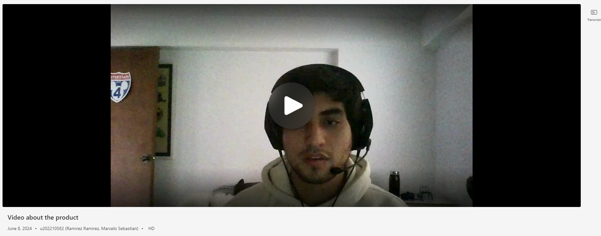

# Bibliografía
Eslava, D. C. (2024, 14 marzo). Las bibliotecas digitales y sus esfuerzos por reducir brechas.
       ELESPECTADOR.COM. https://www.elespectador.com/el-magazin-cultural/bibliotecas-digitales-un-nuevo-acceso-a-la-educacion-y-al-patrimonio-de-colombia-noticias-hoy/

De Quijano, F. D. (2024, 2 abril). La venta de libros digitales creció un 9% en 2023 y se duplicó la destinada a préstamos en bibliotecas. El Español. https://www.elespanol.com/el-cultural/letras/20240402/venta-libros-digitales-crecio-duplico-destinada-prestamos-bibliotecas/844665801_0.html

# Anexos

Video Grabacion TB1: <br>
**Duracion:** 30:29 min <br>
[https://upcedupe-my.sharepoint.com/:v:/g/personal/u202210582_upc_edu_pe/EYXxGwNagKZCvauw2GAnB-UBiCFuxF0Bq0Ln0o6oKrcGxA?e=meG7X1&nav=eyJyZWZlcnJhbEluZm8iOnsicmVmZXJyYWxBcHAiOiJTdHJlYW1XZWJBcHAiLCJyZWZlcnJhbFZpZXciOiJTaGFyZURpYWxvZy1MaW5rIiwicmVmZXJyYWxBcHBQbGF0Zm9ybSI6IldlYiIsInJlZmVycmFsTW9kZSI6InZpZXcifX0%3D](https://upcedupe-my.sharepoint.com/:v:/g/personal/u202210582_upc_edu_pe/EYXxGwNagKZCvauw2GAnB-UBiCFuxF0Bq0Ln0o6oKrcGxA?e=oes3YM&nav=eyJyZWZlcnJhbEluZm8iOnsicmVmZXJyYWxBcHAiOiJTdHJlYW1XZWJBcHAiLCJyZWZlcnJhbFZpZXciOiJTaGFyZURpYWxvZy1MaW5rIiwicmVmZXJyYWxBcHBQbGF0Zm9ybSI6IldlYiIsInJlZmVycmFsTW9kZSI6InZpZXcifX0%3D)

Video Grabacion TP: <br>
**Duracion:** 06:30 min <br>
[https://upcedupe-my.sharepoint.com/:v:/g/personal/u202210582_upc_edu_pe/EUj0JK-wd9tGgEcBm7_ss4gBnz-8Z5WOsNxxHMBqkrMlDA?nav=eyJyZWZlcnJhbEluZm8iOnsicmVmZXJyYWxBcHAiOiJTdHJlYW1XZWJBcHAiLCJyZWZlcnJhbFZpZXciOiJTaGFyZURpYWxvZy1MaW5rIiwicmVmZXJyYWxBcHBQbGF0Zm9ybSI6IldlYiIsInJlZmVycmFsTW9kZSI6InZpZXcifX0%3D&e=ccMYpE](https://upcedupe-my.sharepoint.com/:v:/g/personal/u202210582_upc_edu_pe/EUj0JK-wd9tGgEcBm7_ss4gBnz-8Z5WOsNxxHMBqkrMlDA?nav=eyJyZWZlcnJhbEluZm8iOnsicmVmZXJyYWxBcHAiOiJTdHJlYW1XZWJBcHAiLCJyZWZlcnJhbFZpZXciOiJTaGFyZURpYWxvZy1MaW5rIiwicmVmZXJyYWxBcHBQbGF0Zm9ybSI6IldlYiIsInJlZmVycmFsTW9kZSI6InZpZXcifX0%3D&e=ccMYpE)

Video Grabacion TB2: <br>
**Duracion:** 12:17 min <br>
[https://upcedupe-my.sharepoint.com/:v:/g/personal/u202210582_upc_edu_pe/EWuxP6ZvByNLrx47177y1aIB7dFAV_cupzvLIroO-Q4vfw?nav=eyJyZWZlcnJhbEluZm8iOnsicmVmZXJyYWxBcHAiOiJTdHJlYW1XZWJBcHAiLCJyZWZlcnJhbFZpZXciOiJTaGFyZURpYWxvZy1MaW5rIiwicmVmZXJyYWxBcHBQbGF0Zm9ybSI6IldlYiIsInJlZmVycmFsTW9kZSI6InZpZXcifX0%3D&e=taXDTa](https://upcedupe-my.sharepoint.com/:v:/g/personal/u202210582_upc_edu_pe/EWuxP6ZvByNLrx47177y1aIB7dFAV_cupzvLIroO-Q4vfw?nav=eyJyZWZlcnJhbEluZm8iOnsicmVmZXJyYWxBcHAiOiJTdHJlYW1XZWJBcHAiLCJyZWZlcnJhbFZpZXciOiJTaGFyZURpYWxvZy1MaW5rIiwicmVmZXJyYWxBcHBQbGF0Zm9ybSI6IldlYiIsInJlZmVycmFsTW9kZSI6InZpZXcifX0%3D&e=taXDTa)

Video Grabacion TF: <br>
**Duracion:** 09:37 min <br>
[https://upcedupe-my.sharepoint.com/:v:/g/personal/u202210582_upc_edu_pe/EfCGh3nUXABGhBX92H-D6WYBbGIp9id0YFh3yt848nYvAw?e=KBcamt&nav=eyJyZWZlcnJhbEluZm8iOnsicmVmZXJyYWxBcHAiOiJTdHJlYW1XZWJBcHAiLCJyZWZlcnJhbFZpZXciOiJTaGFyZURpYWxvZy1MaW5rIiwicmVmZXJyYWxBcHBQbGF0Zm9ybSI6IldlYiIsInJlZmVycmFsTW9kZSI6InZpZXcifX0%3D](https://upcedupe-my.sharepoint.com/:v:/g/personal/u202210582_upc_edu_pe/EfCGh3nUXABGhBX92H-D6WYBbGIp9id0YFh3yt848nYvAw?e=KBcamt&nav=eyJyZWZlcnJhbEluZm8iOnsicmVmZXJyYWxBcHAiOiJTdHJlYW1XZWJBcHAiLCJyZWZlcnJhbFZpZXciOiJTaGFyZURpYWxvZy1MaW5rIiwicmVmZXJyYWxBcHBQbGF0Zm9ybSI6IldlYiIsInJlZmVycmFsTW9kZSI6InZpZXcifX0%3D)

Video Grabacion Entrevistas 2: <br>
**Duracion:** 25:37 min  <br>
[https://upcedupe-my.sharepoint.com/:v:/g/personal/u202111451_upc_edu_pe/EdRi8rYe-yxNuZQLYk7OhUcBHfLH61NT3FmFhtoCo81LHQ?e=I6EEqZ](https://upcedupe-my.sharepoint.com/:v:/g/personal/u202111451_upc_edu_pe/EdRi8rYe-yxNuZQLYk7OhUcBHfLH61NT3FmFhtoCo81LHQ?e=I6EEqZ)
